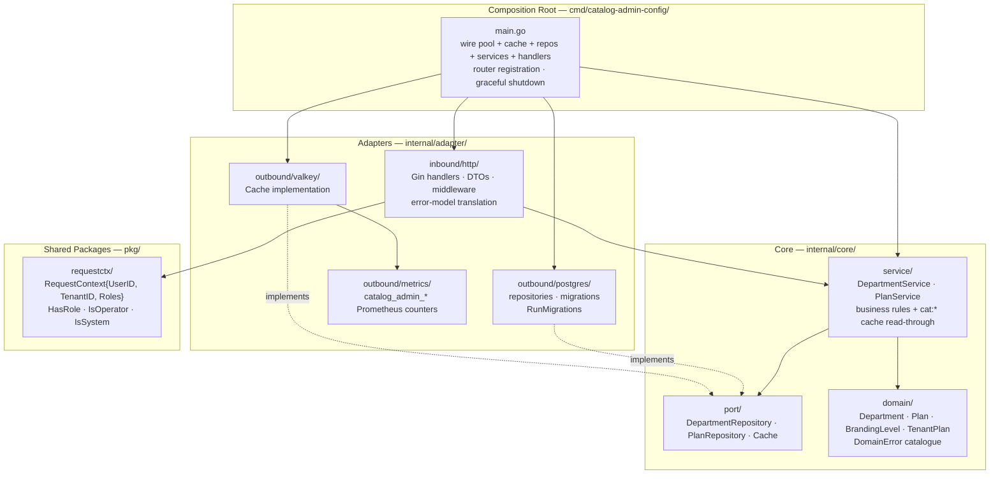
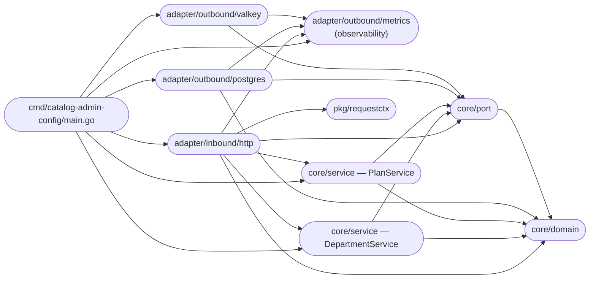
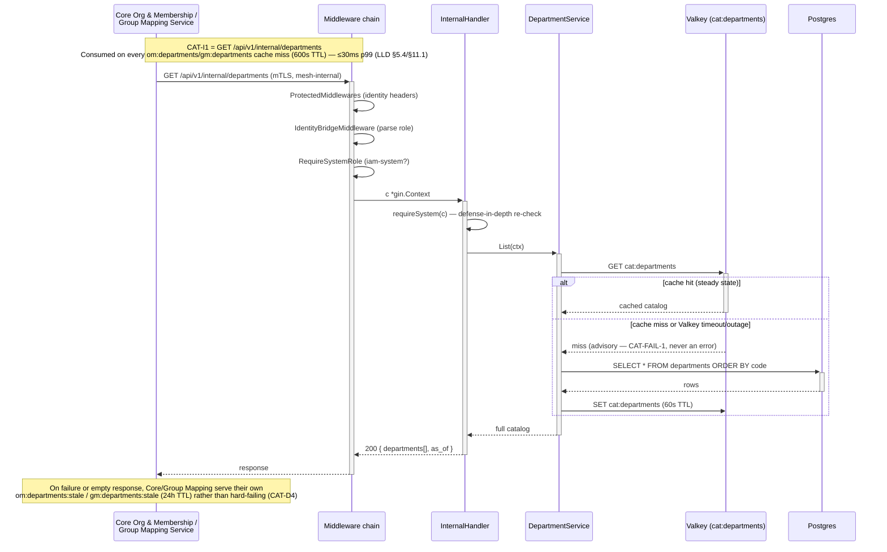
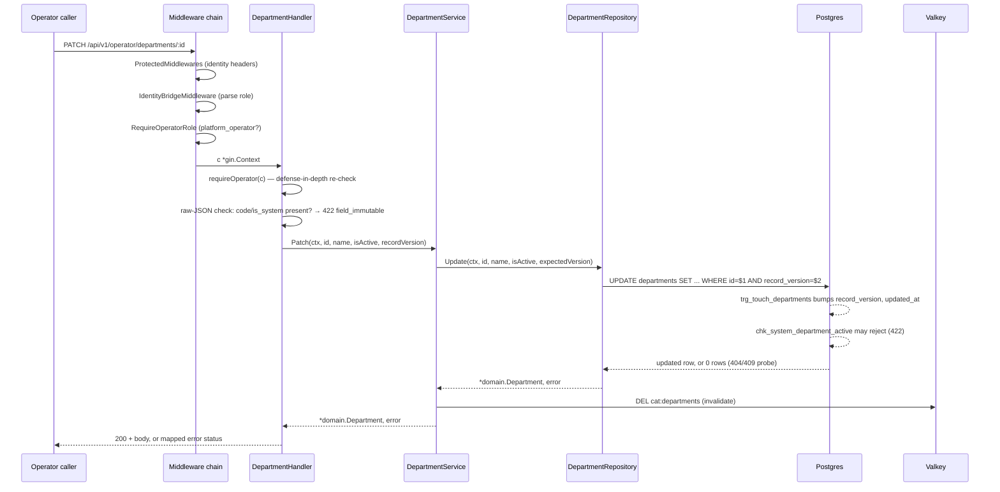
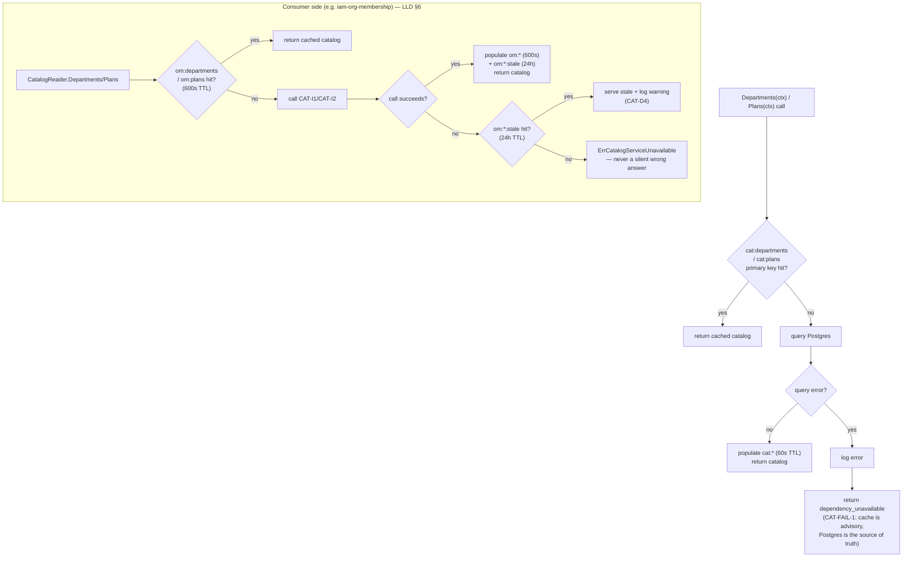

# Architecture

This document describes the internal structure, dependency rules, and runtime data flows of `iam-catalog-admin`.

`iam-catalog-admin` is a **private Go service** (`github.com/BCBP-SOLUTIONS-FZC-LLC/iam-catalog-admin`, Go 1.26.6) deployed as a containerised microservice (HPA 2–4 replicas), refining the platform's decomposition ADR-0007 (LLD v1.35, `docs/lld/iam-lld-catalog-admin-config-service.md`). It owns the platform's two **global, non-tenant-scoped** reference catalogs — the department catalog (`departments`) and the plan entitlement catalog (`plans`) — extracted from Org & Membership (`iam-org-membership`) per ADR-0007 Wave 1, the lowest-risk cut of that decomposition (neither table ever carried a `tenant_id`, neither was RLS-protected, neither participated in Core's I-8 hot-path join). It ships as **one binary, one process**: `cmd/catalog-admin-config` serves the entire HTTP surface — public, operator, and mesh-internal — with no background worker, no CronJob, no second binary.

**Does not own:** the per-tenant feature-flag override delta (`tenants.feature_flags` — stays on Core's own `tenants` row; this service supplies only the baseline `plans.feature_set`, and Core merges the two at I-8 read time); pricing/billing (Billing Service); usage metering against the entitlement ceilings this service defines (Usage & Metering Service); I-8 hot-path entitlement resolution (AuthZ Enrichment, via Core — this service has no relationship with AuthZ Enrichment at all, direct or indirect); tenant-facing department/plan *management* (`GET /api/v1/tenants/:id/departments` stays in Core); credentials, MFA, JWT issuance (Keycloak, via Realm Provisioner).

---

## Layer model

Clean/hexagonal architecture, same convention as `iam-org-membership`, scaled down to two aggregates and no tenant context. Inner layers have **zero knowledge** of outer layers; dependencies always point inward.

> Source: [`docs/architecture/mermaid/layer-model.mmd`](docs/architecture/mermaid/layer-model.mmd)



**Rule:** `domain` ← `port` ← `service` ← `adapter` ← `cmd`. Nothing in `internal/core/` imports
`internal/adapter/`. Enforced in CI via `go-arch-lint` (`.go-arch-lint.yml`,
`.github/scripts/arch-lint.sh`), not just review. `deepScan: false` is deliberate — a deep scan
would flag `main.go`'s composition-root wiring (constructing an adapter and passing it into a
service constructor) as a cross-layer violation, which is how Clean Architecture is supposed to
work at that one seam, not a defect. Eight components in total: `domain`, `port`, `service`,
`requestctx`, `observability` (`adapter/outbound/metrics` — cross-cutting, imported by both the
inbound HTTP adapter and the outbound Valkey adapter), `adapters_inbound`, `adapters_outbound`,
`docs_swagger`, `cmd`.

---

## Package dependency graph

Arrows represent Go `import` relationships (module-internal only) — this graph mirrors
`.go-arch-lint.yml` component-by-component, at a finer grain than the layer model above.

> Source: [`docs/architecture/mermaid/package-dependencies.mmd`](docs/architecture/mermaid/package-dependencies.mmd)



`core/domain` is the dependency sink (no internal imports at all — not even `port`). `core/port`
depends on `domain` only. `requestctx` is a standalone leaf with no internal deps of its own.
`test/`, `scripts/`, and `deploy/` are outside the linter's scope entirely, so `test/e2e`'s import
of `internal/adapter/inbound/http` (to call the same `NewRouter` production uses) is not part of
the checked runtime graph.

---

## Request flow

Every route sits behind the same middleware chain before reaching a handler: gateway-injected
identity headers (`x-user-id`/`x-tenant-id`/`x-tenant-roles`, no JWT parsing in this service — see
`middleware.go`), an `IdentityBridgeMiddleware` role parse, and a route-group role gate
(`RequireOperatorRole`/`RequireSystemRole` where applicable) plus an in-handler defense-in-depth
re-check. `/api/v1/internal/*` additionally requires the `iam-system` role and is reachable only
over the mesh (NetworkPolicy).

The flow below is CAT-I1, the read this service's two real consumers (Core Org & Membership,
Group Mapping Service) depend on to populate their own local caches — the closest thing this
service has to a "hot path," even though it carries none of I-8's latency pressure (≤30ms p99
budget, consulted only on a consumer-side cache miss at 600s TTL, LLD §5.4/§11.1).

> Source: [`docs/architecture/mermaid/request-flow.mmd`](docs/architecture/mermaid/request-flow.mmd)



Route table, exactly as registered in `router.go`'s `NewRouter` (the single source of truth both
`main.go` and `test/e2e`'s harness call into):

```
GET    /healthz                          (unconditional 200, gincommon.HealthHandler())
GET    /readyz                           (checks Postgres + Valkey health)
GET    /swagger/*any                     (Swagger UI; active outside `production`, opt-in +
                                           bearer-token-gated via DOCS_ENABLED/DOCS_AUTH_TOKEN
                                           in `production`)
/api/v1  [ProtectedMiddlewares, IdentityBridgeMiddleware, RequireJSONContentType]
  GET    /departments                    CAT-6, any authenticated caller
  GET    /departments/:id                CAT-7, any authenticated caller
  /operator  [RequireOperatorRole]
    POST   /departments                  CAT-1
    PATCH  /departments/:id              CAT-2
    DELETE /departments/:id              CAT-3 (always 405)
    GET    /plans                        CAT-4
    GET    /plans/:code                  CAT-4
    PATCH  /plans/:code                  CAT-5
  /internal  [RequireSystemRole]
    GET    /departments                  CAT-I1, mesh-only
    GET    /plans                        CAT-I2, mesh-only
```

`/metrics` is **not** on this router — it's served by a second, independent `http.Server` on its
own `METRICS_PORT` (default `9090`), wired directly in `main.go`, so a NetworkPolicy scrape grant
doesn't also open the API port.

---

## Write flow

Every write commits its business-table change and invalidates the affected `cat:*` key — there is
no outbox, no event, and no second system to keep in sync (see "Event and outbox flow" below).
Unlike `iam-org-membership`, a write here never opens more than one transaction and never has an
external effect to sequence after the commit.

> Source: [`docs/architecture/mermaid/write-flow.mmd`](docs/architecture/mermaid/write-flow.mmd)



`Update()` (`internal/adapter/outbound/postgres/department_repository.go` /
`plan_repository.go`) delegates to a `deptUpdateFromTx`/`planUpdateFromTx` helper — the same
function the white-box test suite exercises directly — so the tested code path and the shipped
code path are structurally identical, not two copies that could silently diverge.

## Provisioning flow

**None.** This service has no entity lifecycle to provision — `departments` and `plans` are
seeded once, at migration time (5 system departments, 3 plan tiers), and every row after that is
either an operator-created department (CAT-1) or an edit to an existing row. There is no signup,
trial, or realm-creation flow analogous to `iam-org-membership`'s Provisioning flow for this
service to diagram.

## Delegation touchpoints

**None.** This service has no concept of a user, a delegate, or an out-of-office coordination —
neither table carries a `user_id` or any per-tenant actor at all. Delegation-adjacent concerns
(who may act on whose behalf) are entirely out of scope here; see "Does not own" above.

---

## Cache strategy

Valkey is **advisory-only** (CAT-FAIL-1) end to end — a miss, timeout, or outage always falls
through to Postgres; it never becomes the source of truth for a request. `valkey.New` hardcodes
tight timeouts (100 ms dial, 50 ms read/write) rather than reading an env var, on the theory that
a slow cache must degrade to a fast miss, not stall the request.

> Source: [`docs/architecture/mermaid/cache-strategy.mmd`](docs/architecture/mermaid/cache-strategy.mmd)



Full key/TTL/invalidation table: `CACHE_DESIGN.md`. The short version: this service's own cache
(`cat:*`, 60s) exists only to shield its own Postgres from `GET /departments` traffic; it is never
the reason a write becomes visible or invisible. The two-tier consumer-side pattern
(`om:*`/`om:*:stale`) is a genuinely new pattern introduced by this extraction — nothing in
`iam-org-membership` had a stale-if-error fallback before this.

---

## Data model overview

```sql
-- departments (5 system rows seeded by migration; operator-added rows have is_system=false)
id, code (unique, immutable), name, is_system (immutable), is_active,
record_version, created_at, updated_at
-- triggers: touch_row, prevent_department_delete, prevent_department_code_change,
--           prevent_system_department_name_change

-- plans (exactly 3 rows: starter/pro/enterprise — PK is the code, no create/delete)
code (PK), display_name, workflow_template_limit (nullable = unlimited),
tender_limit (nullable = unlimited), trial_duration_days, sso_enabled,
custom_branding (none|logo), feature_set (jsonb), record_version, created_at, updated_at
-- trigger: touch_row
```

Full DDL: `internal/adapter/outbound/postgres/migrations/000001_init_schema.up.sql` — one
consolidated migration (tables + seed data, lifecycle-enforcement triggers, and the single
`catalog_admin_app` DB role — `SELECT`/`INSERT`/`UPDATE`, no `DELETE`, no `BYPASSRLS` grant since
there is nothing to bypass). Kept as a single file while this service remains pre-production and
no environment has applied an earlier multi-file history that needs preserving.

Both tables are **standalone, with no foreign key to each other or to any tenant-scoped table** —
the direct consequence of neither carrying a `tenant_id`. The two soft relationships a reader might
expect (`tenant_departments.department_id`, `tenants.plan`) are Core's own app-level checks against
its cached `om:departments`/`om:plans` copies, not database foreign keys — this service's own
schema encodes neither.

---

## Event and outbox flow

**None.** This service publishes no events and consumes no events (LLD §7, invariants
CAT-EVT-1..5). No outbox table, no outbox-runner goroutine, no SNS publisher, no SQS consumer, no
`processed_events` dedup ledger, no AsyncAPI spec, no `platform-events` dependency in `go.mod`. A
write becomes visible to consumers purely through the cache-TTL mechanism above — there is no
faster, event-driven path, by design. Confirmed compatible with every named consumer (O&M, AuthZ
Enrichment, Realm Provisioner, Billing, Workflow) — none has ever subscribed to a `departments`/
`plans`-adjacent event, because none has ever existed.

---

## Observability stack

Two observability concerns run per request: Prometheus metrics (synchronous, in-process) and
OpenTelemetry spans (async, OTLP export, gated on `OTEL_EXPORTER_OTLP_ENDPOINT`).
`gincommon.ObservabilityMiddlewares` and `catmetrics.Register()` are wired once in
`cmd/catalog-admin-config/main.go`, before any collector registration, so business + pgcommon
metrics land on the same `gincommon.MetricsRegisterer()` and one `/metrics` scrape (on the
dedicated `METRICS_PORT`, never sharing a listener with the API surface) serves HTTP + business +
pg collectors together.

- **Metrics** — `catalog_admin_requests_total{route,status}` /
  `catalog_admin_request_duration_seconds{route}` (LLD §11.2's own business-level request
  rollup, a Histogram feeding both the §11.1 SLOs and `deploy/monitoring/slo-rules.yml`'s
  burn-rate alerts — CAT-D13, §16, recorded by `requestMetricsMiddleware`),
  `catalog_admin_writes_total{table,op}`,
  `catalog_admin_optimistic_lock_conflicts_total{table}` (feeds the §11.5 alert),
  `catalog_admin_cache_hits_total{key}` / `catalog_admin_cache_misses_total{key}`
  (`internal/adapter/outbound/metrics`), plus the generic per-route HTTP metrics
  (`http_requests_total`/`http_request_duration_seconds`) `platform-gincommon` registers for free
  and `pgcommon_*` pool/query instruments from `pgmetrics.InitWithRegisterer` — all on
  `gincommon.MetricsRegisterer()`.
  Prefixed `catalog_admin_`, matching the fleet's `{service-name}_*` convention (e.g.
  `iam-tender-acl`'s `tender_acl_*`) — distinguished from siblings by Prometheus scrape target/job
  label, not by name, the same way the generic `http_*` metrics already are.
- **Tracing** — OTel via `gincommon.InitTracingFromEnv()` (always installed; OTLP export is a
  no-op until `OTEL_EXPORTER_OTLP_ENDPOINT` is set), plus a `db.query` span per query via
  `NewOTelTracer`.
- **Logs** — structured (Zap), via `platform-gincommon/pkg/logger`.
- **Dashboards** — `deploy/monitoring/dashboards/catalog-admin-requests-writes.json` (request
  rate/latency per route, `cat:departments`/`cat:plans` cache hit ratio, optimistic-lock-conflict
  rate) is the one dashboard this repository builds; the more important signal for diagnosing a
  degraded caller is **consumer-side** `om:departments`/`om:plans`/`gm:departments` cache-miss rate
  and stale-if-error activation count, which live in Core's/Group Mapping's own dashboards, not
  here — this service's own dashboards can look entirely healthy while a consumer is already
  degraded onto its stale-if-error fallback.
- **SLO burn-rate alerting** — `deploy/monitoring/slo-rules.yml`, a standalone multi-window
  burn-rate rule file (mirroring `iam-org-membership`'s own `slo-rules.yml` pattern) computed from
  `catalog_admin_request_duration_seconds_bucket`, grouped by route class exactly as LLD §11.1's
  own SLO table groups them (public department reads at 40ms, internal bulk reads at 30ms,
  operator routes at 100ms).

---

## Row-Level Security (RLS) and GUC injection

**None — by design, not by omission.** Neither `departments` nor `plans` carries a `tenant_id`;
there is no RLS policy on either table, no `app.tenant_id` GUC to inject, and no `GUCProvider`
passed to `pgcommon.NewPool`. This is the one IAM service in the stack with no RLS layer at all,
because both tables are global reference data, not tenant-scoped rows. `x-tenant-id` is still a
required, 401-enforced gateway-injected header on every route (consistency with every other IAM
service's identity-header contract, CAT-D12) — but the parsed value is never read anywhere in this
service's code, confirmed by a repo-wide `grep -rn "\.TenantID\b"` finding only the one parse site
in `IdentityBridgeMiddleware`.

---

## Concurrency and optimistic locking

Both tables carry `record_version`, bumped by the shared `touch_row()` `BEFORE UPDATE` trigger.
Writers pass back the version they last read; a mismatch returns 0 rows affected, which the
repository probes to disambiguate a `404` (row no longer exists) from a `409
optimistic_lock_conflict` (someone else won) — the response body's `record_version` field lets the
caller re-read and retry without a second round trip:

```go
tag, err := tx.Exec(ctx,
    "UPDATE departments SET name=$1 WHERE id=$2 AND record_version=$3",
    newName, departmentID, expectedVersion,
)
if tag.RowsAffected() == 0 {
    // probe: does the row still exist? if so, it's a conflict, not a 404
    return domain.NewError(domain.ErrOptimisticLockConflict, "...").WithDetails(...)
}
```

Given how rare writes are on this service (operator-driven, not request-rate-scaled), a sustained
nonzero `catalog_admin_optimistic_lock_conflicts_total` rate is itself diagnostic of a caller
retry-storm or a tooling bug, not expected contention (LLD §9.1).

---

## Failure domains

**Consistency invariants:**
- **Every write is single-row, single-table** (CAT-FAIL-3) — there is no multi-row transaction in
  this service's write surface, and therefore no `TxRunner` abstraction anywhere in this codebase,
  unlike `iam-org-membership`.
- **A Catalog Service outage never produces an incorrect authorization or entitlement decision
  downstream** (CAT-FAIL-2) — at worst it produces a *stale* one (bounded by TTL, then by the 24h
  stale-if-error ceiling), because every consumer treats this service's data as a cached snapshot,
  never a live dependency of the request path it protects.

**Failure invariants:**
- **CAT-FAIL-1** — Cache is advisory; Postgres is the source of truth. A cache miss or Valkey
  outage falls through, never to a wrong answer.
- **CAT-FAIL-4** — No outbox, no SNS publisher, no SQS consumer — the entire "outbox
  crash/redelivery/DLQ" failure class that applies elsewhere in the IAM stack does not exist here.
- **`/readyz` fails on a Valkey-only outage** (CAT-D11) even though the cache is otherwise
  advisory — a *sustained* outage, unmonitored, would otherwise silently amplify load onto
  Postgres with no external signal until it too degrades; `readyz` failing fast surfaces the
  problem instead, at the cost of pulling a pod from rotation over what is, per-request, a
  harmless miss.

**Dependency degradation matrix** — this service has no synchronous outbound dependency of its
own to degrade against (it is a pure leaf); every row below describes the posture **its two
consumers** take on a call *to* this service:

| Operation | Caller | Posture | On failure |
|---|---|---|---|
| `GET /api/v1/internal/plans` (CAT-I2) | Core (I-8 projection layer) | cache + last-known-good | Warm cache → zero impact; cold + this service down → Core serves `om:plans:stale`, never blocks I-8 |
| `GET /api/v1/internal/departments` (CAT-I1) | Core (admin/JIT writes) | cache + last-known-good | Admin/JIT write path degrades; never on I-8 |
| `GET /api/v1/internal/departments` (CAT-I1) | Group Mapping (JIT writes) | cache + last-known-good | Same posture as Core's own use |

---

## Key invariants

| Invariant | Where enforced |
|---|---|
| Cache is never the source of truth (CAT-FAIL-1) | Every read path falls through to Postgres on a miss/timeout/outage |
| Every write is single-row, single-table (CAT-FAIL-3) | No multi-row transaction, no partial-write failure mode beyond standard Postgres semantics |
| No events published or consumed (CAT-EVT-1..5) | No outbox, no dedup ledger, no schema-gov registration (LLD §7) |
| Department `code` is globally unique and immutable after creation (D-2/D-10) | Enforced by DB trigger (`prevent_department_code_change`), not Go |
| Departments are never hard-deleted (D-4/OP-3) | `DELETE` always returns `405`; retirement is `is_active=false` only |
| `plans` is PATCH-only — no create/delete API (PLAN-4) | The tier set is fixed to the `tenant_plan` ENUM |
| `NULL` = unlimited for `workflow_template_limit`/`tender_limit` (CAT-D6) | A nullable-limit representation, not a `-1` sentinel |
| `catalog_admin_app` never holds `BYPASSRLS` | Nothing to bypass — verified by `TestRoles_AppRoleHasNoBYPASSRLS`, not just asserted |
| Optimistic lock version is monotonic and DB-owned | `touch_row()` trigger increments `record_version`; the client never sets it directly |
| Secret material never touches this service beyond three connection strings | `DATABASE_URL`, `MIGRATION_DATABASE_URL`, `VALKEY_URL` — no Keycloak admin credential, no IdP secret |

---

## Deployment

### Container image

Single binary (`bin/catalog-admin-config`), one process, no second process to give a background
job to (there is nothing here to reconcile). Distroless final stage (`Dockerfile`, non-root UID
65532), same base-image-pinning convention as `iam-org-membership`. `docker-compose.yml` is
local-dev-only (plain Postgres + Valkey containers, no PgBouncer/LocalStack — this service needs
neither).

### Helm chart

`deploy/helm/` renders one `Deployment` — no `CronJob` template, unlike `iam-org-membership`'s
seven. HPA: `minReplicas: 2` / `maxReplicas: 4`, CPU 70% / memory 75% (no custom RPS metric —
checked directly against `iam-user-profile`'s own `prometheus-adapter-rule.yaml` and found this
service's read-heavy/write-rare MVP scale doesn't warrant one). PDB `minAvailable: 1`.
`terminationGracePeriodSeconds: 45` (30s HTTP drain + 15s buffer — no outbox to drain, unlike
`iam-org-membership`'s 75s). A writable `/tmp` `emptyDir` is mounted despite
`readOnlyRootFilesystem: true`, since anything in the process or its dependencies that assumes a
writable temp dir would otherwise fail at the syscall. NetworkPolicy is scoped to the ingress
controller's namespace plus a `monitoring`-namespace `prometheus` scrape on the metrics port; no
egress rule exists for any other IAM service or AWS regional endpoint, since this service calls
neither.

### Migration safety

Since this service has never been deployed, the schema is one consolidated `000001_init_schema`
migration rather than an incremental history with dead expand/contract steps to carry forward.
`MIGRATION_DATABASE_URL` (a direct, non-PgBouncer DSN) is required whenever `PG_BOUNCER_MODE=true`,
because the migration runner's `pg_advisory_lock` is session-scoped and breaks under transaction
pooling. `RunMigrations` runs under its own 60s timeout (not the process's unbounded background
context) so a wedged advisory lock from a prior crashed pod fails fast with a diagnosable log line
rather than hanging until Kubernetes' startup-probe budget eventually kills the pod.

---

## Testing strategy

Three tiers — see the root `README.md`'s **Testing** section for the full breakdown and how to run
each. In one line: `test/unit` (fakes, no I/O) → `internal/**/*_test.go` (white-box, same tiers) →
`test/postgres` (real Postgres, doubles as the migration test) → `test/e2e` (real Postgres + real
Valkey + the actual production router, driven over `net/http`). Every test in the Postgres and e2e
tiers calls `t.Parallel()` — each already provisions its own fully isolated container, so
concurrent execution is safe and turns the per-test container-boot cost from a serial tax into a
parallel one (measured ~4x wall-time improvement on a 10-CPU box).

Coverage is measured over `./internal/...,./pkg/...` via `make cover-func`/`make cover`, merged
across all three tiers (`scripts/merge_coverage.py`, max-count strategy — a Postgres-only file
only shows real coverage once `test/postgres`'s profile is merged with `test/unit`'s).
`.github/scripts/coverage-gate.sh` enforces **≥ 98%**, `validate-test.yml`'s `Coverage threshold
gate` step pins that number explicitly — currently at 100.0%.

---

## Consumer conformance checklist

Before a downstream service integrates against `GET /api/v1/internal/departments` (CAT-I1) or
`GET /api/v1/internal/plans` (CAT-I2), verify the following. Both of this service's real consumers
today — Core Org & Membership and the Group Mapping Service — already conform to this shape;
listed here so a third consumer (or a future refactor of either existing one) has something to
check itself against.

**Transport**
- [ ] Call over the mesh only — mTLS, `iam-system` role header, reachable via NetworkPolicy. There
      is no public route to either endpoint and none is planned.
- [ ] Budget ≤30ms p99 for the call itself — both endpoints are a single unindexed `SELECT *` with
      no joins, behind this service's own 60s `cat:*` cache.

**Caching (the caller's own responsibility, not this service's)**
- [ ] Maintain a primary cache key (`om:departments`/`om:plans`-style) with a TTL sized to the
      catalog's actual change rate — 600s is what both existing consumers use, matched to
      "operator-driven, rare" writes, not a hard requirement this service enforces.
- [ ] Maintain a longer-TTL stale-if-error fallback key (24h), served only when the primary key
      has expired **and** the live call to this service fails — this is what converts "this
      service is down and my cache just expired" from a hard failure into a serve-stale-with-a-
      logged-warning outcome (CAT-D4).
- [ ] Never treat a `200` response's `record_version`/`record_versions` field as anything other
      than "was my cached copy stale" — it is not a lock token from the caller's perspective, only
      from this service's own write path.

**Correctness**
- [ ] Treat every field in the response as read-only — neither endpoint accepts a write, and there
      is no PATCH-through-cache pattern to reason about.
- [ ] Do not gate the I-8-equivalent hot-path read on either call — both existing consumers
      consult their own cached copy at the projection layer, never inside a request-path join;
      a new consumer should follow the same pattern rather than introducing a new synchronous
      dependency on this service's own tightest-latency assumption (≤30ms) becoming load-bearing
      for something hotter than an admin/JIT write.

**Observability**
- [ ] Alert on your own cache-miss rate and stale-if-error activation count — this service's own
      dashboards cannot see either signal (see "Observability stack" above); a consumer that
      doesn't watch its own cache health has no way to know it's degraded until a downstream
      symptom appears.

---

## Schema lifecycle

**Not applicable.** This service publishes no events and is not registered with
`platform-schemagov` — there is no `api/asyncapi.yaml`, no embedded JSON Schema directory, and no
AWS Glue Schema Registry entry to govern. See "Event and outbox flow" above for the full reasoning.

---

## Threat model

STRIDE analysis of `iam-catalog-admin`. Every row is grounded in a real mechanism in this repo,
scaled to a service with no tenant data, no PII, and no cross-service outbound call.

| STRIDE | Threat | Component | Mitigation |
|--------|--------|-----------|------------|
| **Spoofing** | A forged caller reaches `/api/v1/internal/*` and reads the full catalog, or spoofs the `iam-system` principal | HTTP inbound (`RequireSystemRole`) | Mesh mTLS + NetworkPolicy is the primary boundary (no public route to `/internal/*`); `RequireSystemRole` plus an in-handler `requireSystem` re-check is defense-in-depth — but since the catalog is global reference data with no confidentiality requirement, the actual harm ceiling of a bypass is low compared to a tenant-scoped IAM service |
| **Spoofing** | A gateway-injected identity header is forged to impersonate an operator | `IdentityBridgeMiddleware` / `RequireOperatorRole` | The gateway strips client-supplied identity headers before mesh entry; this service validates header shape and role membership but does not itself re-authenticate — a compromised gateway is out of this service's blast-radius control, consistent with the platform-wide mesh-mTLS model |
| **Tampering** | A write updates a row concurrently with another, silently discarding one change | `record_version` optimistic locking | `UPDATE ... WHERE record_version=$N` returns 0 rows on a stale write → `409 optimistic_lock_conflict`, never a silent last-write-wins |
| **Tampering** | A system department's `code`/`name`/lifecycle state is mutated outside its immutability contract | DB triggers + service-layer checks | `prevent_department_code_change`/`prevent_system_department_name_change` triggers plus `chk_system_department_active` CHECK are DB-level backstops for the same rule the handler already enforces at the request-shape level (raw-JSON pre-check on `code`/`is_system`) |
| **Repudiation** | An operator write with no auditable actor | CAT-1/CAT-2/CAT-5 writes | Structured request logging (`gincommon.ObservabilityMiddlewares`) carries `trace_id`/`request_id`/the operator principal's `sub` — this service has no durable audit-log integration of its own pending the platform's Audit Log Service publishing a direct-write contract (CAT-D10, CAT-Q7, a known, tracked, non-blocking gap) |
| **Information Disclosure** | Cache poisoning — a compromised `cat:departments`/`cat:plans` entry serves fabricated data | Valkey (`cat:*`) | Advisory-only (CAT-FAIL-1): every consumer already treats this service's data as a cached snapshot bounded by TTL, and a fabricated cache entry here would propagate no further than any other stale-data scenario this service's design already tolerates |
| **Information Disclosure** | Neither table holds PII, so there is no cross-tenant or cross-user leakage surface at all | N/A | Confirmed structurally: neither `departments` nor `plans` carries a `tenant_id` or a `user_id` column |
| **Denial of Service** | A caller floods CAT-1/CAT-2/CAT-5 writes | `RequireOperatorRole` + the platform's rate limiting upstream | Writes are operator-only and rare by design; a sustained nonzero `catalog_admin_optimistic_lock_conflicts_total` rate is itself the early-warning signal for this pattern (LLD §9.1) |
| **Denial of Service** | A slow/hung query holds a pool connection for the full HTTP deadline | `PG_STATEMENT_TIMEOUT` | Server-side `statement_timeout` releases the connection regardless of client behavior |
| **Denial of Service** | A sustained Valkey outage silently amplifies load onto Postgres with no external signal | `/readyz` checks Valkey independently (CAT-D11) | `/readyz` fails fast on a Valkey-only outage, pulling the pod from rotation before every cache miss compounds DB load platform-wide — an explicit, documented trade-off against the "cache is advisory" framing elsewhere |
| **Elevation of Privilege** | An authenticated caller without the `platform_operator` role reaches a write endpoint | `RequireOperatorRole` + in-handler `requireOperator` re-check | Every write route is gated twice — at the route-group middleware level and again inside the handler — so a route registered under the wrong group would still be caught by the second check |

**Out of scope (platform controls):** JWT issuance, MFA credential validation, Keycloak session
management — owned by Keycloak itself and by Realm Provisioner administratively. Per-tenant
entitlement override and the I-8 merge — owned by Core Org & Membership. AWS account-level IAM,
VPC, and NetworkPolicy enforcement — owned by platform infrastructure.

---

## Developer tools

This service exposes an interactive Swagger UI (9 endpoints — small enough that a hand-maintained
`README.md` API table would also work, but the fleet-wide convention is Swagger for every service
with a REST surface).

| Handler | Route | Gating | Purpose |
|---|---|---|---|
| `ginSwagger.WrapHandler` (custom BCBP theme override) | `GET /swagger/*any` | `DocsConfig.active()` | Interactive Swagger UI, generated from handler annotations via `make swag` |

`DocsConfig.active()` is `Environment != "production" || Enabled` — the docs surface is always
mounted outside production, and in production is opt-in via `DOCS_ENABLED`. When mounted in
production **and** `DOCS_AUTH_TOKEN` is set, the route is wrapped in a constant-time bearer-token
check (`crypto/subtle.ConstantTimeCompare`); outside production, or with no token configured,
there is no auth gate. The route gets `X-Frame-Options: DENY`, `X-Content-Type-Options: nosniff`,
and a `Content-Security-Policy` header regardless of environment.

`docs/swagger/swagger.yaml`/`swagger.json`/`docs.go` are generated by `make swag` from handler
`@Summary`/`@Router` annotations, not hand-authored — `make swag-check`, wired into
`validate-test.yml`, fails a PR that edited a handler without regenerating them (previously
documented as a CI gate but not actually wired into any workflow until this was found and closed).

---

## Session-specific decisions

A small number of judgment calls were made where the LLD was silent on an internals-only detail,
or where a later reconciliation pass changed an earlier decision. Each is recorded in full in the
LLD's own Decision Register (`docs/lld/iam-lld-catalog-admin-config-service.md` §16, CAT-D1–CAT-D13)
— the handful most worth surfacing here:

1. **CAT-D13 — `catalog_admin_request_duration_seconds` converted from a Summary to a Histogram.**
   The original design (v1.6) chose a Summary because the LLD's own metrics bullet named the label
   `quantile`. Reversed after a direct comparison against `iam-org-membership`'s own
   `deploy/monitoring/slo-rules.yml`: a Summary's client-side quantiles can't answer "what fraction
   of requests were under 40ms" or be aggregated across routes with `histogram_quantile()`, both of
   which a genuine error-budget burn-rate SLO needs. Bucket boundaries land exactly on the LLD's own
   SLO thresholds so a burn-rate query's `le` selector is exact, not interpolated.
2. **CAT-D8 — CAT-I1/CAT-I2 keep the `/api/v1` prefix.** The original v1.0/v1.1 design specified a
   prefix-free `/internal/*` mesh-internal namespace; discovered during a code-vs-LLD comparison
   that `iam-org-membership`'s already-built and deployed `CatalogAdminClient` calls
   `/api/v1/internal/departments`/`.../plans` verbatim. Retroactively blessed the shipped path as
   the specification rather than breaking a live, integrated cross-service contract — "mesh-only"
   is an authorization/network property (`iam-system` role + NetworkPolicy), not a URL-namespace
   property, so no isolation guarantee was actually lost.
3. **CAT-D10 — no local stand-in for the Audit Log Service's direct-write contract.** A local
   `audit_log` table was briefly built (v1.9) and then removed (v1.10) after discovering that no
   LLD on the platform — including `iam-org-membership`'s own, checked directly — specifies how a
   service actually performs a "direct audit write." Building a one-off table against no known
   contract risked being the wrong shape once the real one is specified; this document's job is to
   describe what's actually integrated, not paper over a platform-wide gap.
4. **A migration-DSN bug, found by a fresh production-readiness review, not by the original design.**
   `ApplyStatementTimeout` unconditionally appended `&options=...` to any DSN, which is safe for the
   app DSN (always built by `pgcommon.ConfigFromEnv` with `?sslmode=...` already present) but not
   for `MigrationDSNFromEnv()`'s raw `MIGRATION_DATABASE_URL`, which an operator could plausibly set
   with no query string at all — producing a malformed `...db&options=...` DSN that would have
   broken migrations at startup. Fixed to pick `?` vs `&` based on whether the DSN already has a
   query string; the exact untested failure case now has a dedicated regression test.
5. **Two dead-code removals found the same review pass.** `DepartmentRepository.FindByCode` was
   fully implemented and tested but never called by any use case (departments are looked up by ID,
   never by code, in every real endpoint) — deleted from the port, the adapter, and every fake.
   Separately, `deptUpdateFromTx`/`planUpdateFromTx` existed with their own dedicated white-box
   tests while `Update()` duplicated the same logic inline — the tested path and the shipped path
   had silently diverged. `Update()` now delegates to the tested function directly.

---

## Documentation assets

Architecture diagrams live as standalone Mermaid source files under `docs/architecture/mermaid/`
and are embedded into this document as fenced code blocks; each section above carries a
`> Source:` link back to its `.mmd` file. Keep both in sync by hand when either changes — there is
no automated sync script for a repo this size (unlike `iam-org-membership`'s `docs-sync` Makefile
target, which exists because that repo also syncs a checked-in AsyncAPI spec — not applicable
here, this service has no events).

> Source: [`docs/architecture/README.md`](docs/architecture/README.md)

| Document | Description |
|----------|-------------|
| [`.claude/CLAUDE.md`](.claude/CLAUDE.md) | Directory tree, shared library integration, dependency rules, key files |
| [`.claude/database.md`](.claude/database.md) | Tables, roles/grants, migrations, triggers |
| [`.claude/api-and-events.md`](.claude/api-and-events.md) | Endpoints, cache keys, why this service has no events |
| [`.claude/flows-and-concurrency.md`](.claude/flows-and-concurrency.md) | Write flows, optimistic locking, the Wave-1 migration history |
| [`.claude/operations.md`](.claude/operations.md) | Security, observability, configuration, CI/CD |
| [`.claude/development-guide.md`](.claude/development-guide.md) | Design decisions, extending, workflow, troubleshooting, error codes |
| [`docs/architecture/README.md`](docs/architecture/README.md) | Standalone Mermaid diagram set index (the `.mmd` files embedded above) |
| [`docs/lld/iam-lld-catalog-admin-config-service.md`](docs/lld/iam-lld-catalog-admin-config-service.md) | Full LLD (v1.35) — §16 Decision Register + open-question sign-off register, §17 error taxonomy, §19 migration strategy |
| [`README.md`](README.md) | API overview, local dev, environment variables |
| [`CACHE_DESIGN.md`](CACHE_DESIGN.md) | Cache keys, TTLs, invalidation |

Render a diagram locally: open any `.mmd` file in a Mermaid-aware IDE (VS Code + Mermaid Preview,
IntelliJ + Mermaid plugin) or paste into [mermaid.live](https://mermaid.live).
