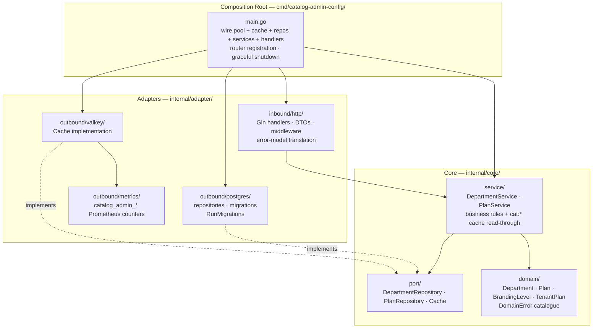
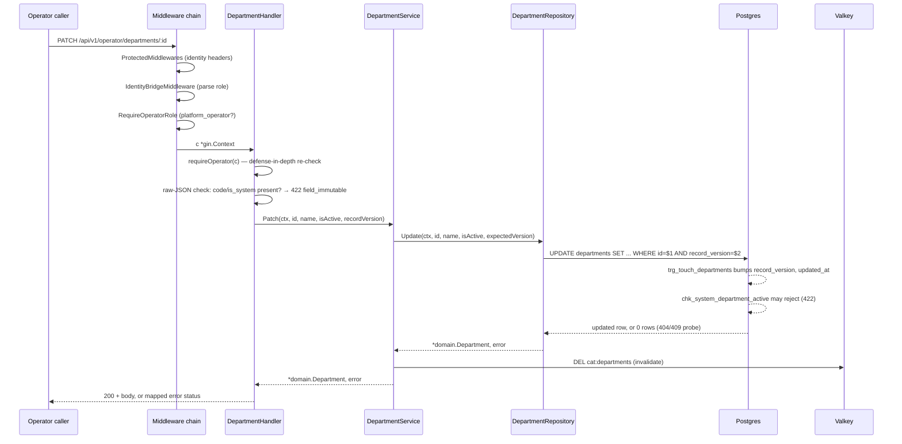

# Architecture

## Layer model

Clean/hexagonal architecture, same convention as `iam-org-membership`, scaled down to two
aggregates and no tenant context. Inner layers have zero knowledge of outer layers; dependencies
point inward only.



**Rule:** `domain` ← `port` ← `service` ← `adapter` ← `cmd`. Nothing in `internal/core/` imports
`internal/adapter/`. Enforced in CI via `go-arch-lint` (`.go-arch-lint.yml`,
`.github/scripts/arch-lint.sh`), not just review.

## Composition root — `cmd/catalog-admin-config/main.go`

Startup order:

1. **Logger** — `platform-gincommon/pkg/logger`, Zap, dev/prod mode from `APP_ENV`.
2. **Metrics** — `catmetrics.Register()`, before anything else touches the default Prometheus registry.
3. **Tracing** (opt-in) — only if `OTEL_EXPORTER_OTLP_ENDPOINT` is set; otherwise a no-op shutdown func.
4. **Database** — `pgcommon.NewPool` with **no `GUCProvider`** (there is no RLS/tenant GUC to bridge —
   see "What this service deliberately does not have" below), then `RunMigrations`.
5. **Cache** — Valkey client (`internal/adapter/outbound/valkey`), 100ms dial / 50ms read/write
   timeouts so a slow cache degrades to a fast miss, never a stalled request.
6. **Repositories → services → handlers** — plain constructor injection, no DI framework:
   `pgadapter.NewDepartmentRepository(pool)` → `service.NewDepartmentService(repo, cache)` →
   `httpadapter.NewDepartmentHandler(svc)`.
7. **Router** — see "Request lifecycle" below for the exact middleware order and route table.
8. **Graceful shutdown** — `srv.Shutdown` (30s) → metrics-server `Shutdown` → cancel background
   context → `shutdownTracing` → `gincommon.Shutdown`. No outbox/SQS-consumer drain step, because
   there is neither (see "Event architecture" below).

## Shared platform libraries

Same technology baseline as every other IAM service (`platform-gincommon`, `platform-pgcommon`),
used identically:

- `gincommon.ObservabilityMiddlewares` — panic recovery, request-ID, tracing, correlation headers,
  metrics, structured logging. Registers the generic per-route HTTP latency/count metrics
  automatically.
- `gincommon.ProtectedMiddlewares` — validates the gateway-injected `x-user-id`/`x-tenant-id`
  headers are present and well-formed. **No JWT parsing happens in this service, or in the shared
  library** — cryptographic verification is the gateway's job upstream; this middleware only
  checks that the trusted gateway did its job and forwarded the result.
- `pgcommon.NewPool` / `pgcommon.RunInTx` — pooling, slow-query logging, OTel query tracing. Used
  **without** the `GUCProvider` option (see below).

**Not used, deliberately:** `platform-events` (outbox/SNS/SQS — this service publishes and
consumes nothing).

## Domain layer — `internal/core/domain/`

Two entities, both framework-free (no adapter/service imports):

- `Department{ID, Code, Name, IsSystem, IsActive, RecordVersion, CreatedAt, UpdatedAt}` — `Code`
  and `IsSystem` are immutable after creation (enforced by DB triggers, not Go code).
- `Plan{Code, DisplayName, WorkflowTemplateLimit *int, TenderLimit *int, TrialDurationDays,
  SSOEnabled, CustomBranding, FeatureSet map[string]any, RecordVersion, ...}` — `Code` is one of
  the fixed `TenantPlan` enum values (`starter`/`pro`/`enterprise`); `WorkflowTemplateLimit`/
  `TenderLimit` are `nil` for "unlimited" (CAT-D6 — a nullable-limit representation chosen over a
  `-1` sentinel).
- `DomainError` — a sentinel-wrapped error type (`Code`, `Message`, `Cause`, `Details`), same
  pattern as every other IAM service: `domain.NewError(domain.ErrDepartmentNotFound, "...")`, then
  a single `domainErrorStatus` switch in the HTTP adapter maps sentinels to status codes.

## Port layer — `internal/core/port/`

Three interfaces, each small and focused:

- `DepartmentRepository` — `List`, `FindByID`, `FindByCode`, `Insert`, `Update`.
- `PlanRepository` — `List`, `FindByCode`, `Update` (no `Insert`/`Delete` — PLAN-4, the tier set is
  fixed to the ENUM).
- `Cache` — `Get`, `Set`, `Delete`, `Health`, `Close`. Advisory only (CAT-FAIL-1): every
  implementation must treat a miss, timeout, or outage as "fall through to Postgres," never as an
  error the caller has to handle specially.

## Service layer — `internal/core/service/`

- **`DepartmentService`** — `List`/`Get` (read side, `cat:departments` read-through cache),
  `Create`/`Patch` (write side, cache-invalidating), `DeleteBlocked` (always returns the fixed
  405-equivalent domain error — departments are never hard-deleted).
- **`PlanService`** — same shape: `List`/`GetByCode` (read, `cat:plans` cache), `Patch` (write,
  invalidates). `Patch` mirrors every DB `CHECK` constraint in Go first (non-negative limits,
  known branding values, scalar-only `feature_set` values) so a bad request surfaces as `400
  validation_error`, never a raw 500 from a database constraint violation.

Both services cache the **whole catalog** as one JSON blob per table (`cat:departments`/`cat:plans`,
60s TTL) — there is no per-ID cache key. `DepartmentByID`-shaped reads aren't a thing this service
exposes internally; `Get`/`GetByCode` go straight to Postgres, since the catalog is a handful of
rows and a per-ID cache would add complexity for no measurable benefit. See `CACHE_DESIGN.md` for
the full key/TTL/invalidation table.

## Adapter layer — `internal/adapter/`

- **Inbound HTTP** (`inbound/http/`) — `DepartmentHandler`, `PlanHandler`, `InternalHandler`, plus
  `middleware.go` (role-check middleware, the shared `HandleError`/`domainErrorStatus` translation,
  `NormalizeAuthErrors` for `platform-gincommon`'s bare 401 body) and `dto.go` (request/response
  shapes). `department_handler.go`'s `Patch` re-reads the raw JSON body specifically to reject
  `code`/`is_system` with `422 field_immutable` — a DTO struct alone would silently drop those
  fields rather than rejecting them, which is the wrong behavior for an immutability contract.
- **Outbound Postgres** (`outbound/postgres/`) — `DepartmentRepository`, `PlanRepository`,
  `migrate.go` (`//go:embed migrations/*.sql` + `platform-pgcommon/pkg/migrate.Runner`), `db.go`
  (`withPool` — every repository call runs in its own single-statement transaction; there is no
  multi-statement write in this service's surface, so there is no higher-level `TxRunner`
  abstraction to speak of, unlike `iam-org-membership`; `DSNFromEnv` skips `ApplyStatementTimeout`'s
  DSN append when `DATABASE_URL` is set, matching `iam-org-membership`/`iam-user-profile`'s
  identically-named helper).
- **Outbound Valkey** (`outbound/valkey/`) — thin `go-redis` wrapper, records cache hit/miss
  metrics at this layer (not in `core/service`) so the hexagonal boundary stays clean.
- **Outbound metrics** (`outbound/metrics/`) — two `CounterVec`s, pre-initialized label values so
  dashboards show `0` instead of "no data" before the first request.

## Request lifecycle — a write (CAT-2)



Route table, exactly as registered in `router.go`'s `NewRouter` (the single source of truth both
`main.go` and `test/e2e`'s harness call into):

```
GET    /healthz                          (unconditional 200, gincommon.HealthHandler())
GET    /readyz                           (checks Postgres + Valkey health)
GET    /swagger/*any                     (Swagger UI; active outside `production`, opt-in +
                                           bearer-token-gated via DOCS_ENABLED/DOCS_AUTH_TOKEN
                                           in `production`)
/api/v1  [ProtectedMiddlewares, IdentityBridgeMiddleware, RequireJSONContentType]
  GET    /departments                    CAT-6, any authenticated caller
  GET    /departments/:id                CAT-7, any authenticated caller
  /operator  [RequireOperatorRole]
    POST   /departments                  CAT-1
    PATCH  /departments/:id              CAT-2
    DELETE /departments/:id              CAT-3 (always 405)
    GET    /plans                        CAT-4
    GET    /plans/:code                  CAT-4
    PATCH  /plans/:code                  CAT-5
  /internal  [RequireSystemRole]
    GET    /departments                  CAT-I1, mesh-only
    GET    /plans                        CAT-I2, mesh-only
```

`/metrics` is **not** on this router — it's served by a second, independent `http.Server` on its
own `METRICS_PORT` (default `9090`), wired directly in `main.go`, so a NetworkPolicy scrape grant
doesn't also open the API port.

## Cache design


Full key/TTL/invalidation table: `CACHE_DESIGN.md`. The short version: this service's own cache
(`cat:*`, 60s) exists only to shield its own Postgres from `GET /departments` traffic; it is never
the reason a write becomes visible or invisible. The two-tier consumer-side pattern
(`om:*`/`om:*:stale`) is a genuinely new pattern introduced by this extraction — nothing in
`iam-org-membership` had a stale-if-error fallback before this.

## Concurrency and failure handling

- **Optimistic locking** — every write (`CAT-2`, `CAT-5`) takes `record_version` in the request
  body and the `UPDATE ... WHERE id = $1 AND record_version = $2` pattern; zero rows affected
  triggers a probe query to disambiguate `404 department_not_found`/`plan_not_found` from `409
  optimistic_lock_conflict`.
- **No multi-row transactions.** Every write is single-row, single-table (`CAT-FAIL-3` in the
  LLD) — there is no partial-write failure mode to reason about beyond standard Postgres
  transaction semantics, and therefore no `TxRunner` abstraction anywhere in this codebase.
- **Cache failure is never request failure.** A cache `Get`/`Set`/`Delete` error is logged and
  swallowed; the service falls through to Postgres. `/readyz` still fails if Valkey is down
  (removes the pod from rotation before misses pile DB load), but a live request never 5xxs
  because of a Valkey blip.

## Data model

```sql
-- departments (5 system rows seeded by migration; operator-added rows have is_system=false)
id, code (unique, immutable), name, is_system (immutable), is_active,
record_version, created_at, updated_at
-- triggers: touch_row, prevent_department_delete, prevent_department_code_change,
--           prevent_system_department_name_change

-- plans (exactly 3 rows: starter/pro/enterprise — PK is the code, no create/delete)
code (PK), display_name, workflow_template_limit (nullable = unlimited),
tender_limit (nullable = unlimited), trial_duration_days, sso_enabled,
custom_branding (none|logo), feature_set (jsonb), record_version, created_at, updated_at
-- trigger: touch_row
```

Full DDL: `internal/adapter/outbound/postgres/migrations/000001_init_schema.up.sql` — one
consolidated migration (tables + seed data, lifecycle-enforcement triggers, and the single
`catalog_admin_app` DB role — `SELECT`/`INSERT`/`UPDATE`, no `DELETE`, no `BYPASSRLS` grant since
there is nothing to bypass). Kept as a single file while this service remains pre-production and
no environment has applied an earlier multi-file history that needs preserving.

## Event architecture

**None.** This service publishes no events and consumes no events (LLD §10, invariants
CAT-EVT-1..5). No outbox table, no outbox-runner goroutine, no SNS publisher, no SQS consumer, no
`processed_events` dedup ledger, no AsyncAPI spec, no `platform-events` dependency in `go.mod`. A
write becomes visible to consumers purely through the cache-TTL mechanism above — there is no
faster, event-driven path, by design. Confirmed compatible with every named consumer (O&M, AuthZ
Enrichment, Realm Provisioner, Billing, Workflow) — none has ever subscribed to a `departments`/
`plans`-adjacent event, because none has ever existed.

## What this service deliberately does not have

Worth stating explicitly, since every sibling IAM service has most of these and their absence here
is a design decision, not an oversight:

| Missing from every other IAM service | Why it's absent here |
|---|---|
| Row-Level Security | Neither table has a `tenant_id` — there is no tenant to isolate |
| Tenant-context GUC bridge | Nothing to bridge into — no RLS, no per-request tenant scope |
| Transactional outbox | No events are ever published (LLD §10) |
| SQS consumer / `processed_events` | No events are ever consumed |
| `TxRunner` / multi-statement transactions | Every write is single-row, single-table (CAT-FAIL-3) |
| A second binary (reconciler/batch jobs) | Nothing to reconcile — writes are operator-driven and immediate |
| Outbound synchronous calls to other IAM services | This service is a pure leaf (LLD §4) |

## Cross-service dependencies

This service has none outbound. Inbound: operator tooling (CAT-1..5), `iam-org-membership`
(CAT-I1/CAT-I2, via its own `CatalogService` caching decorator), and — once Wave 2 ships — the
Group Mapping Service (CAT-I1 only). See the root `README.md`'s "Cross-service dependencies"
table.

## Observability

- **Metrics** — `catalog_admin_requests_total{route,status}` /
  `catalog_admin_request_duration_seconds{route,quantile}` (LLD §13.2's own business-level request
  rollup, recorded by `requestMetricsMiddleware`), `catalog_admin_writes_total{table,op}`,
  `catalog_admin_optimistic_lock_conflicts_total{table}` (feeds the §13.5 alert),
  `catalog_admin_cache_hits_total{key}` / `catalog_admin_cache_misses_total{key}`
  (`internal/adapter/outbound/metrics`), plus the generic per-route HTTP metrics
  (`http_requests_total`/`http_request_duration_seconds`) `platform-gincommon` registers for free.
  Prefixed `catalog_admin_`, matching the fleet's `{service-name}_*` convention (e.g.
  `iam-tender-acl`'s `tender_acl_*`) — distinguished from siblings by Prometheus scrape target/job
  label, not by name, the same way the generic `http_*` metrics already are.
- **Tracing** — OTel, opt-in (`OTEL_EXPORTER_OTLP_ENDPOINT`), no-op otherwise.
- **Logs** — structured (Zap), via `platform-gincommon/pkg/logger`.
- **Dashboards worth building** (LLD §13): request rate/latency per endpoint, `cat:departments`/
  `cat:plans` cache hit ratio, and — the more important signal — **consumer-side**
  `om:departments`/`om:plans` cache-miss rate and stale-if-error activation count, since that's
  what tells you this service is degraded from a caller's perspective even when its own dashboards
  look healthy.

## Deployment

Single binary (`bin/catalog-admin-config`), no second process. Distroless image (`Dockerfile`),
same base-image-pinning convention as `iam-org-membership`. `docker-compose.yml` is local-dev-only
(plain Postgres + Valkey containers, no PgBouncer/LocalStack — this service needs neither).

## Testing strategy

Three tiers — see the root `README.md`'s **Testing** section for the full breakdown and how to run
each. In one line: `test/unit` (fakes, no I/O) → `internal/**/*_test.go` (white-box, same tiers) →
`test/postgres` (real Postgres, doubles as the migration test) → `test/e2e` (real Postgres + real
Valkey + the actual production router, driven over `net/http`).

## Key invariants (summary)

| # | Invariant |
|---|---|
| CAT-FAIL-1 | Cache is advisory; Postgres is the source of truth. A cache miss or Valkey outage falls through, never to a wrong answer. |
| CAT-FAIL-3 | Every write is single-row, single-table — no multi-row transaction, no partial-write failure mode. |
| CAT-EVT-1..5 | No events published or consumed, no outbox, no dedup ledger, no schema-gov registration (LLD §10). |
| D-2/D-10 | Department `code` is globally unique and immutable after creation (enforced by DB trigger, not Go). |
| D-4/OP-3 | Departments are never hard-deleted — `DELETE` always returns `405`; retirement is `is_active=false` only. |
| PLAN-4 | `plans` is PATCH-only — no create/delete API; the tier set is fixed to the `tenant_plan` ENUM. |
| CAT-D6 | `NULL` = unlimited for `workflow_template_limit`/`tender_limit`, not a `-1` sentinel. |

## See also

- `catalog-admin-config-service-lld.md` — the authoritative design document every §-reference above points to.
- `README.md` — API overview, local dev, environment variables.
- `CACHE_DESIGN.md` — cache keys, TTLs, invalidation.
