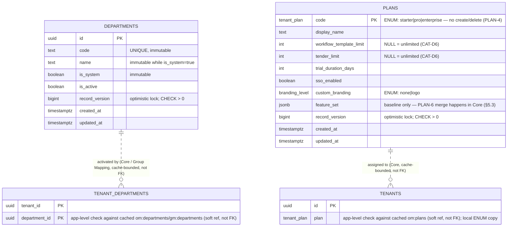
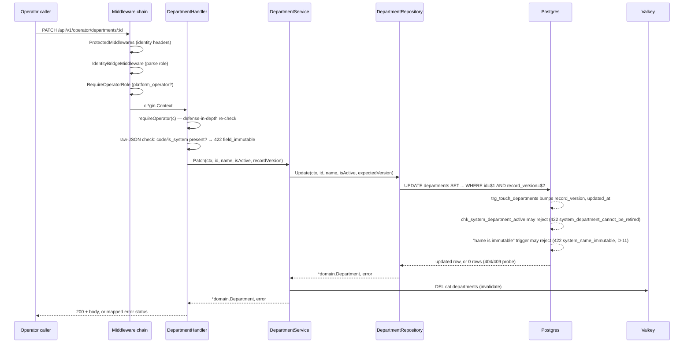
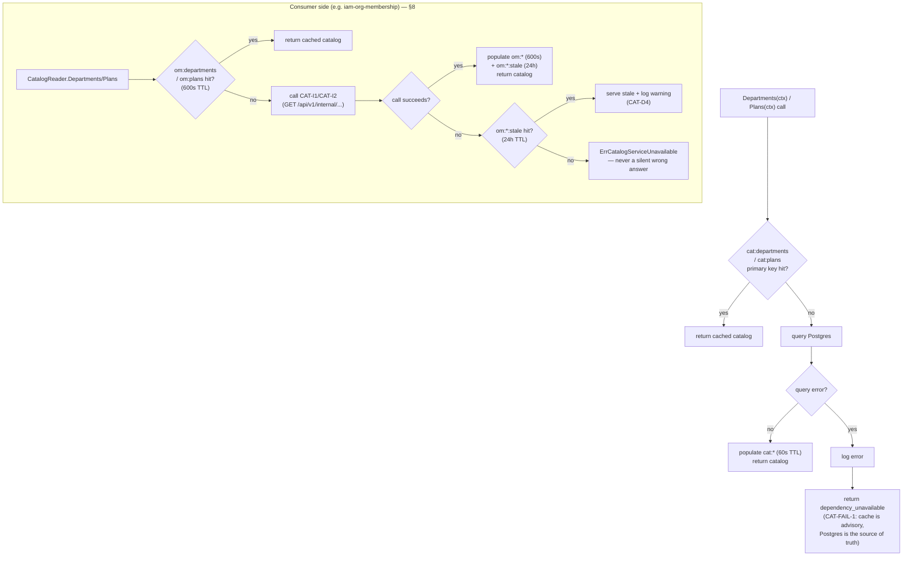

# Catalog / Admin Config Service — Low-Level Design

## Tender Management SaaS Platform — IAM Subsystem

| Field | Value |
|---|---|
| Document Type | Low-Level Design (LLD) |
| Service | Catalog / Admin Config Service (`catalog-admin-config`) |
| Parent decision | ADR-0007 (Option B), extracted from `org_membership_lld_5.md` |
| Subsystem | Identity & Access Management |
| Wave | 1 of 3 (lowest risk, first to ship) |
| Version | 1.23 |
| Date | 2026-08-20 |
| Status | Approved for implementation |
| Audience | Platform/billing-admin engineering, Core Org & Membership and Group Mapping Service teams (as `CAT-I1`/`CAT-I2` consumers), SRE |
| Owner database | RDS PostgreSQL `catalog_admin` |

### Revision history

| Version | Date | Notes |
|---|---|---|
| 1.0 | 2026-08-13 | Initial extraction draft against `org_membership_lld_5.md`'s `departments`/`plans` sections and ADR-0007 (Document 1, `01-hld-delta-decomposition.md`). Approved for implementation. |
| 1.1 | 2026-08-13 | Sign-off review pass against `org_membership_lld_5.md`, cross-checked against Document 1: corrected the `om:departments` cache-key continuity claim (§8), reconciled the two plans-propagation-delay figures and added the `om:memberships` second-hop note (§8), added the department-retirement staleness implication and **CAT-D7** (§8, §14), completed the CAT-2 error-code list (§6), added explicit OP-1–OP-7/PLAN-1–PLAN-6 invariant-transfer statements (§5.1, §5.2), and fixed a typo in §13. This revision additionally brings the document's structure up to the standard set by `iam-lld-realm-provisioner-v1_1.md`: added this revision history, a table of contents, and enriched header fields; expanded §12 (migration invariants / zero-downtime / backward-compatibility subsections) and §13 (now **Observability**, with an SLO table, metrics list, tracing/logging, dashboards, and an alert table); and added new §15–§22 (Configuration, Deployment and Scaling, Testing Strategy, GDPR/Data Lifecycle/Compliance, Open Questions and Sign-off Register, and Appendices A–C). No section numbered ≤14 was renumbered, so Document 1's existing cross-references into this document (e.g. "Document 2 §2") remain valid. |
| 1.2 | 2026-08-13 | Corrected against the actual `iam-catalog-admin` implementation: **CAT-I1**/**CAT-I2** are restated throughout (§6, §7.1, §7.2, §9, §13.1, §16.1, §21) as `GET /api/v1/internal/departments`/`GET /api/v1/internal/plans` — this document previously specified these as `GET /internal/departments`/`GET /internal/plans` (no `/api/v1` prefix), a mesh-internal convention that was never actually implemented and, critically, does not match `iam-org-membership`'s already-built and deployed `CatalogAdminClient`, which calls the prefixed path verbatim. Retroactively changing the code to match this document's original convention would be a breaking, two-repo change against a live integration, not a documentation nit — see new decision register entry **CAT-D8** (§14). No other behavior changed; "mesh-only" continues to mean auth- and NetworkPolicy-enforced (`iam-system` role, `RequireSystemRole`), never path-based. |
| 1.3 | 2026-08-13 | Structural gap-fill against the standard set by `iam-lld-user-profile v1.md`: added a **Document Overview** front-matter section (source-document relationship table); renamed §4 to **"Architecture and Package Layout"** and added **§4.1 Shared library dependencies**, **§4.2 Dependency rules**, and **§4.3 Shared library integration scope** (with `platform-gincommon`/`platform-pgcommon`/`platform-events` sub-subsections); added an **entity-relationship diagram** (§5.5); added an explicit **AWS Glue Schema Registry** non-participation statement (§10.5, for parity with services that do publish events); and added a **Key request flows** subsection with sequence/flow diagrams (§6.1, sourced from the shipped implementation's own `ARCHITECTURE.md`, not fabricated). No section numbered ≤14 was renumbered — all additions are new subsections of existing sections, so every existing cross-reference (including Document 1's "Document 2 §2") remains valid. Confirmed also-present, just under different headings than the reference template: Service Responsibilities and Boundaries (split across §2/§3), API Contract (§6/§7), Caching Design (§8), Concurrency/Consistency/Failure Handling (§11), Security (§9) — no change needed to these. |
| 1.4 | 2026-08-17 | Two doc-only fixes from a code-vs-doc reconciliation pass against the shipped implementation: (1) **§20** was missing `duplicate_code` (409) — a real, exercised CAT-1 error (unique violation on `uq_departments_code`, D-10) already documented in the handler's own Swagger annotation but never copied into this "single consolidated lookup"; added. (2) **§5.2**'s DDL snippet declared `workflow_template_limit int NOT NULL CHECK (... IS NULL OR ... >= 0)` — `NOT NULL` plus a CHECK explicitly allowing `NULL` is self-contradictory, and would make CAT-D6's "`NULL` = unlimited" requirement impossible under a literal read; removed the erroneous `NOT NULL`, matching `tender_limit`'s own line in the same block and the shipped migration (`000001_init_schema.up.sql`), which was already correct. No behavior changed in either case — both are corrections to this document's text, not to the implementation. |
| 1.5 | 2026-08-17 | **§7.2**'s example response was missing each plan item's own `record_version` — present in the shipped payload because `InternalHandler.Plans` reuses CAT-4's `PlanResponse` DTO rather than a second, near-identical one, but the example only showed the top-level `record_versions` map, inconsistent with §7.1's own CAT-I1 example (which already shows a per-item `record_version`). Updated the example to match; added a sentence explaining the field is redundant with the map but harmless/backward-compatible, so a consumer may use either. No behavior changed — the field was already being sent; this corrects the example to describe it, following the same "code is correct, doc's example was incomplete" precedent as **CAT-D8**. |
| 1.6 | 2026-08-17 | Two more reconciliations against the shipped `internal/adapter/outbound/metrics` package: (1) **§13.2** named a single `catalog_admin_cache_hit_ratio{key}` gauge that was never built; the shipped design instead emits `catalog_admin_cache_hits_total{key}`/`catalog_admin_cache_misses_total{key}` and derives the ratio via a one-line PromQL query, since a third gauge alongside two counters already carrying the same information would just be redundant series to keep in sync — this document's bullet is corrected to describe that design, with the PromQL derivation spelled out. §13.4's dashboard panel and §16.3's scaling-trigger table, which both say "cache hit ratio" as a monitoring concept rather than a specific metric name, needed no change. (2) **§4**'s package-layout diagram still said `catadmin_* Prometheus counters` — a leftover from before the prefix was corrected to `catalog_admin_` (this document's own convention since v1.0); updated to match. No behavior changed in either case. |
| 1.7 | 2026-08-17 | **§20**'s `duplicate_code` row now documents a pre-existing wire-shape quirk: the response body's `error` field reads the generic sentinel `"conflict"` while `code` carries the more specific `"duplicate_code"` — the only entry in this table where the two disagree, because a handler-level sub-code (`WithDetails`) overwrites `code` after `error` has already been set from the sentinel alone. Not introduced by this document's reconciliation passes (v1.4–v1.6) and not fixed in code here; added new open-question entry **CAT-Q6** (§19, Group D) to track whether the same asymmetry exists at other `WithDetails({"code": ...})` call sites and whether it's worth a small code fix later. No behavior changed. |
| 1.8 | 2026-08-17 | Unlike v1.4–v1.7 (doc-only), this revision follows an actual code fix: `errorResponseWithDetails` (`internal/adapter/inbound/http/middleware.go`) now re-syncs `error` to the final, post-`WithDetails` `code` for every error response, closing v1.7's `duplicate_code` quirk and the equivalent `invalid_uuid` case (`parseUUIDParam`, over the `validation_error` sentinel) found in the same pass — both previously left `error` on the generic sentinel. Fixed once at the shared envelope builder rather than per call site. **§20** dropped the quirk note from `duplicate_code`'s row (no longer true) and gained a table-level note explaining what was fixed and why; **CAT-Q6** (§19) is resolved and folded into new decision-register entry **CAT-D9** (§14) rather than left open. A regression test (`TestHandleError_SubCodeOverride_SyncsErrorField`) covers both cases going forward. |
| 1.9 | 2026-08-18 | A follow-up audit against the code shipped through v1.8 found two more gaps, one doc and one code: (1) **§10.7/§18.4** still described the audit trail (added at v1.4's HIGH-severity gap fix) as shipping "to the platform's Audit Log service... via whatever synchronous or async audit-write path the shared `platform-gincommon` middleware already provides." Checked against the HLD directly (`iam-hld-tender-saas-v1.41.md`): the Audit Log Service is real (§5.7 — its own database, replicas, SNS-consumer architecture) and its §9.4 catalog-scope note names a "direct audit write" category (`TenantSettingChanged` and siblings) that CAT-1/2/5 belongs to by the same pattern — but no LLD on the platform specifies that mechanism's actual contract, and no `iam-audit-log` repository exists to call. Cross-checked against `org_membership_lld_5.md` (the platform's most mature, self-audited LLD, which documents three outbound client ports in full and explicitly audited port-completeness in its own rev 1.25) — it too has no audit client despite referencing `TenantSettingChanged` audit entries dozens of times, confirming this is a platform-wide gap, not one specific to this document. §10.7 is corrected to describe the shipped `audit_log` table as a durable **interim** mechanism pending that contract, not a claim of integration with a service nothing yet calls; §18.4's retention-table owner column corrected to match; new decision-register entry **CAT-D10** (§14) records the full reasoning. **§12.4** ("no ledger tables here") was also stale now that `audit_log` is exactly such a table — corrected to say so, with no retention/pruning job defined yet (flagged, not resolved). (2) **§11.1**'s failure-matrix claim that a cache `DEL` failure on write is "logged error, post-commit" was not true — `valkeyadapter.Cache.Delete` (`internal/adapter/outbound/valkey/cache.go`) silently discarded the error. Fixed in code: `Delete` now logs the failure (still advisory — the caller continues to swallow it, self-heals within the TTL, CAT-FAIL-1) so §11.1's claim now holds; covered by `TestCache_Delete_FailureIsLogged`. |
| 1.10 | 2026-08-18 | **Reversed v1.9's local `audit_log` table.** After documenting it as an interim mechanism pending the real Audit Log Service's direct-write contract (v1.9, CAT-D10), reconsidered and removed it entirely — `internal/adapter/outbound/postgres/migrations/000004_audit_log.*.sql`/`000005_audit_log_grants.*.sql`, `AuditRepository`/`AuditEntry`, the `recordAudit` calls in `DepartmentService`/`PlanService`, the `catalog_admin_audit_write_failures_total` metric, and the `RequestID`/`TraceID` fields added to `requestctx.RequestContext` solely to feed it (`internal/core/service/*.go`, `internal/adapter/outbound/metrics/metrics.go`, `pkg/requestctx/context.go`, `internal/adapter/inbound/http/middleware.go`) are all gone; `main.go`/`test/e2e/harness_test.go`/unit-test fakes reverted to their pre-audit constructor signatures. Rationale: an interim table built against no known contract risks being the wrong shape once the Audit Log Service's real ingest contract is specified, and this document's job is to describe what's actually integrated, not paper over a platform-wide gap (no service, including O&M, has a specified path to the Audit Log Service) with a one-off local table. **§10.7** rewritten to describe the gap directly rather than claim a mechanism (interim or otherwise) that doesn't exist; **§12.4**/**§18.4** reverted to their pre-v1.9 text; **CAT-D10** (§14) revised to record the decision *not* to build a local stand-in, with reasoning; new open item **CAT-Q7** (§19, Group D) tracks this until the Audit Log Service's contract exists. CAT-1/CAT-2/CAT-5 writes are, once again, covered only by structured request logging — this is the original HIGH-severity gap from the first audit pass (v1.4), now knowingly left open rather than papered over, with the reasoning for that choice on record. |
| 1.11 | 2026-08-18 | A combined production-readiness and follow-up LLD reconciliation pass. **Doc fixes:** (1) **§18.1** still said "this service's audit trail," a leftover from before v1.10 removed it — now says only "structured logs," cross-referencing §10.7/CAT-D10 instead of contradicting them within the same document. (2) **§13.5**'s alert table gained a "Shipped as" column mapping each condition to its actual alert name (or explaining why none exists yet) — the readyz-failing alert ships as `IAMCatalogAdminDown`'s scrape-absence check (the same proxy every sibling service in this platform uses; checked `iam-group-mapping`'s alert set directly — none alert on `/readyz` via a distinct mechanism), and the CAT-I1/CAT-I2 error-rate alert is newly shipped this revision (see code fixes below) rather than still-missing. (3) **§17.2** claimed `testcontainers` for both Postgres and Valkey; corrected to describe the actual `testcontainers`-for-Postgres/`miniredis`-for-Valkey split, with a note on why `miniredis` (real wire-protocol server, not a mock) is an equally valid integration-test substrate. (4) **§15** gained an explanation for why `migration.wave1SoakMinReleases`/`featureFlags.webhookInvalidation` have no code representation — both configure a migration phase/feature that hasn't executed/been built yet, so there's nothing yet to consume them; this was previously undocumented, reading as an oversight rather than a deliberate sequencing fact. **Code/config fixes** (`iam-catalog-admin`): added `IAMCatalogAdminInternalErrorRate` (both `deploy/monitoring/app-alerts.yml` and `deploy/helm/templates/prometheusrule.yaml`) — CAT-I1/CAT-I2-scoped, `catalog_admin_requests_total{route=~"/api/v1/internal/.*"}`, >10%/5m, matching §13.5 exactly; `valkey/cache.go`'s `Delete` and `middleware.go`'s unhandled-500 log line now route through a structured logger (`SetLogger`, installed from `main.go`) instead of stdlib `log.Printf`, falling back to `log.Printf` only if `SetLogger` was never called — `middleware.go` additionally attaches `trace_id`/`request_id` via `gincommon`'s own `*gin.Context` helpers (it has one); `cache.go` deliberately does not attempt the same, since those helpers require a `*gin.Context` this lower adapter layer never has, and reaching for the raw OTel API directly to reconstruct one for a single advisory log line wasn't judged worth a new import in an otherwise dependency-light package; `validateRequiredEnv` now enforces `PG_SSLMODE != disable` in production/staging, mirroring the existing Valkey `rediss://` check (previously Postgres TLS was a Helm-default convention only, not code-enforced); the two top-level server goroutines in `main.go` now `recover()` and log-then-exit on panic instead of relying on the Go runtime's unstructured crash. New tests: `main_test.go` (7 cases, first tests for the `main` package), `TestHandleError_GenericFallback_UsesStructuredLoggerWhenSet`, `TestCache_Delete_FailureUsesStructuredLoggerWhenSet`. No behavior change to the request/response contract in any of this — purely observability, defense-in-depth, and documentation accuracy. |
| 1.12 | 2026-08-18 | A follow-up pass, prompted by a fresh production-readiness and LLD-vs-code re-audit against v1.11's own changes. **Test fix:** `TestRequestMetricsMiddleware_RecordsRouteAndStatus`/`_RecordsErrorStatus` (`internal/adapter/inbound/http/request_metrics_test.go`) asserted an absolute counter value against `catalog_admin_requests_total`, a package-level global not reset between test invocations — harmless under default CI (`-count=1`) but would flake under a repeated run (`-count=N>1`). Now assert a before/after delta instead. **Doc fixes:** (1) **§19** still said the decision register ran "CAT-D1 through CAT-D7"; corrected to "CAT-D1 through CAT-D10" (three entries had been added since that line was last touched). (2) **§20**'s error taxonomy gained six real, client-facing codes `domainErrorStatus` (`middleware.go`) has mapped all along but this table never listed — `validation_error`, `invalid_uuid`, `missing_identity_headers`, `insufficient_role`, `db_unavailable`, `dependency_unavailable` — the same class of gap `duplicate_code` was at v1.4, just not caught for these until now; also added an explicit note that `cache_unavailable` is deliberately *not* listed, since it's declared and status-mapped but never actually constructed anywhere (cache failures are advisory, CAT-FAIL-1, and never surface as a client error). (3) **§9**'s claim that "CI verifies [`catalog_admin_app` has no `BYPASSRLS`] the same way MIG-3/MIG-5 verify it for O&M" was aspirational — no test or CI job in this repository actually checked this. **Code fix, not just a doc fix**: added `TestRoles_AppRoleHasNoBYPASSRLS` (`test/e2e/roles_test.go`), mirroring O&M's own `TestRLS_Case1b_AppRoleHasNoBYPASSRLS` — queries `pg_roles.rolbypassrls` against a real Postgres testcontainer; runs automatically under the existing `make test-ci`/`./test/e2e/...` CI gate with no pipeline changes needed. Verified passing live against a real container before merging. §9's text updated to point at this test by name instead of a vague cross-service comparison. |
| 1.13 | 2026-08-18 | **§12's migration-status claim was badly stale, discovered during a cross-service alignment check against `iam-org-membership`'s actual shipped code (not its own docs).** This document (and `MIGRATION_RUNBOOK.md`/`IMPLEMENTATION_GAP_ANALYSIS.md`) said "Phases 2 through 7 have not been executed... this service is not yet receiving production traffic." That was false: O&M's `cmd/server/main.go` states the cutover completed and this service is sole writer; O&M's migration `000013_drop_catalog_tables.up.sql` drops both tables and their four FKs; `operator_service.go` retains only O-4/O-7 (O-1/O-2/O-3/O-5/O-6 are gone, not disabled); no `department_repository.go`/`plan_repository.go` remain in O&M's outbound/postgres. **§12** rewritten to describe all four steps as complete (retained as historical record, not a pending plan), with the critical operational consequence made explicit: O&M now has **no local fallback** — an outage here coinciding with an empty/expired `om:departments`/`om:plans` cache (past the 24 h stale-if-error ceiling) is a hard failure for O&M's writes, not a degraded one, a fact the previous "not yet in production" framing actively obscured. §13.4's "Migration Soak" dashboard bullet and §13.5's `410 Gone` alert row updated to say the soak completed and the routes it watched were removed entirely, not merely retired-and-kept. §15's `wave1SoakMinReleases` explanation updated to match (the soak ran without ever needing this key externalized). `MIGRATION_RUNBOOK.md`'s header and per-phase status updated to ✅ throughout, distinguishing directly-verified phases (1, 4, 5, 6, 7 — each cites the specific O&M code/migration confirming it) from phases inferred complete by logical necessity (2, 3 — no direct artifact, but required precursors to what's confirmed). `IMPLEMENTATION_GAP_ANALYSIS.md`'s migration-plan section and CAT-I1 row updated to match. No code changed in this repository — this was purely a correction to what this document (and its companion files) claimed about a fact entirely outside this repository's own boundary. |
| 1.14 | 2026-08-18 | A shared-library reuse audit (`platform-gincommon v1.2.0`/`platform-pgcommon v1.1.1`, prompted by an explicit `go.mod` line review) found real duplication — this service was hand-rolling logic both libraries already provide. Two code fixes, both the more ambitious of the options presented, per explicit instruction: (1) **`pgcommon.ConfigFromEnv()` adopted** (`cmd/catalog-admin-config/main.go`) in place of a hand-rolled `PG_*` env-parsing block that had a real bug — `strconv.Atoi(PG_MAX_CONNS)`'s error was discarded, silently defaulting to a broken `0` on any malformed value instead of failing loudly. `ConfigFromEnv` returns `[]ConfigWarning` instead; a new `validatePostgresConfig` (replacing the Postgres-specific half of `validateRequiredEnv`) logs every warning unconditionally and escalates `PG_SSLMODE`/`DATABASE_URL` insecure-config warnings to a startup panic only in `production`/`staging`, preserving the prior fail-fast posture. Checked all six IAM services before deciding — **none** currently call `ConfigFromEnv` (only referenced in `iam-org-membership`'s own docs, never its code); this document's Wave-1 service adopts it first rather than waiting for platform-wide convention. `internal/adapter/outbound/postgres/db.go`'s `DSNFromEnv`/`envOrDB` are gone; `ApplyStatementTimeout`/`MigrationDSNFromEnv(appDSN)` remain as this service's own thin helpers layered on the `pgcommon`-resolved DSN, since `PG_STATEMENT_TIMEOUT` and PgBouncer-bypass routing aren't `pgcommon` concerns. Discovered along the way: `pgcommon`'s own env parsing rejects `PG_MIN_CONNS=0` as invalid (not just empty), so the previously-shipped `values.yaml`/`.env-example` explicit `PG_MIN_CONNS: "0"` would have logged a warning on every startup and silently become `2` — removed the explicit override in favor of `pgcommon`'s own default, with an explanatory comment in both files. (2) **Hand-rolled Postgres error matching replaced with `pgcommon.IsUniqueViolation`/`IsCheckViolation`/`ConstraintName`** — `department_repository.go`'s `Insert` (unique-violation → `409 duplicate_code`) and `department_service.go`'s `Patch` (check-violation → `422 system_department_cannot_be_retired`/`422 system_name_immutable`) now match structurally via `errors.As`-backed helpers instead of a local `isCheckViolation`/`contains`/`indexOf` string-search set (deleted entirely, along with its now-dead test file). `chk_system_department_name_immutable`'s trigger (`prevent_system_department_name_change`) previously raised a bare `RAISE EXCEPTION` with no SQLSTATE/constraint metadata, making it unmatchable by anything other than a message substring; new migration `000004_department_name_immutable_errcode` gives it `ERRCODE = 'check_violation'` (SQLSTATE 23514, the same symbolic name `iam-org-membership`'s own `000007_pending_invitations_expiry_guard` uses for an equivalent trigger-raised check) plus a synthetic `CONSTRAINT`/`DETAIL`, so `pgcommon.ConstraintName(err)` resolves it exactly like a real CHECK constraint. §4.1/§4.3/§4.3.1/§4.3.2 (Shared library dependencies/integration scope) updated to name every newly-adopted symbol explicitly — the integration diagram no longer just gestures at "pg-error helpers." Also swapped the hand-reimplemented `/healthz` body (`{"status":"ok"}` written by hand in `router.go`) for `gincommon.HealthHandler()` directly, found in the same audit pass; §4.3.1 now documents this by name. All changes verified: `go build`/`go vet ./...`/`go vet -tags e2e ./...`, `go test ./... -race`, the full live `-tags e2e` suite (39 tests), and manual Docker-based smoke tests of both the `ConfigFromEnv` startup path and the new migration's trigger behavior against real Postgres/Redis containers. No wire-contract change — every fix is internal to how an already-correct outcome is produced. |
| 1.15 | 2026-08-18 | A fresh full-document reconciliation pass (all 22 sections) against v1.14's own code found one self-inflicted doc bug plus three new gaps. **(0) Revision history ordering bug:** v1.14's entry had been inserted *before* v1.13's in this table (both share the 2026-08-18 date) — corrected to ascending version order; no content changed in either entry. **(1) Real code fix:** `cmd/catalog-admin-config/main.go`'s `CATALOG_TTL_SECONDS` parsing (`catalogTTLSeconds, _ := strconv.Atoi(...)`) still discarded its parse error — the identical bug class v1.14 had just fixed for `PG_MAX_CONNS` via `ConfigFromEnv`, two lines above in the same function's own explanatory comment. Blast radius was contained (`WithCacheTTL` already ignores `d <= 0`, silently falling back to the 60 s default), but it contradicted §15's "configuration is validated at startup, failing fast on an invalid... value" claim. Fixed: a parse failure now logs a warning (value + error) and falls back to 60 s explicitly, rather than silently discarding the error — matching the warn-not-panic treatment appropriate for a low-stakes cache TTL (unlike Postgres config, which fails fast in prod/staging). **(2) Doc fix:** §20's Appendix A JSON example showed only `error`/`status`/`trace_id`/`request_id`, omitting `code` and `message` — both of which `errorResponseWithDetails` (`middleware.go`) unconditionally includes on every error response, and both of which §20's own prose two paragraphs later assumes exist ("every code sets `error` and `code` to the same value"). Added both fields to the example. **(3) Doc fix:** §9 said write grants were split across "migration/app roles" (plural); the actual grants (`000003_roles_grants.up.sql`) use a single `catalog_admin_app` role for both, with the migration's own comment explaining why no split exists ("no cross-tenant data exists to read around") — corrected to describe the single-role design accurately, including the withheld `DELETE` grant. **(4) Doc fix:** §13.5's closing paragraph named only 2 of the 5 non-table-scoped alerts that exist in `deploy/monitoring/app-alerts.yml` (omitting `IAMCatalogAdminReplicasMissing`/`HighLatency`/`CriticalLatency`) — expanded to list all five explicitly. Everything else audited clean this pass: §5's DDL (departments/plans, all four triggers) matches the shipped migrations byte-for-byte; §13.2's five metrics match `metrics.go` exactly (names, labels, and the Summary-vs-Histogram "quantile" choice); §13.5's `IAMCatalogAdminInternalErrorRate`/`IAMCatalogAdminOptimisticLockConflicts` alert expressions match `app-alerts.yml` exactly; §16.1's 2-replica claim matches `values.yaml`; §17.2's testcontainers/miniredis split and §9's `TestRoles_AppRoleHasNoBYPASSRLS` claim both confirmed present; the CAT-I1/CAT-I2 Swagger `@Router` paths (which look prefix-free) resolve correctly via `swagger_info.go`'s `@BasePath /api/v1`, no bug there. Verified: `go build`/`go vet ./...`, `go test ./... -count=1`. |
| 1.16 | 2026-08-18 | **Both findings in an external gap-analysis report (GAP-01, GAP-02) checked directly against this document's and the shipped code's *current* state and confirmed false positives — recorded here so a future gap-analysis pass finds this reconciliation on record instead of re-flagging the same stale claims.** **GAP-01 ("LLD uses `catadmin_*` metrics, code uses `catalog_admin_*`; align on one name"):** false. §13.2 (above) and `internal/adapter/outbound/metrics/metrics.go` have both used the `catalog_admin_` prefix exclusively since **v1.6** (2026-08-17) — a repo-wide grep for `catadmin_` across every `.go` file returns zero matches, and the only occurrence of `catadmin_` anywhere in this document is v1.6's own revision-history entry, which describes a §4 package-layout typo *already fixed* that revision. The gap traces to a stale external gap-analysis snapshot taken before v1.6's fix, not a live discrepancy. No document or code change needed. **GAP-02 ("LLD requires audit entries for CAT-1/CAT-2/CAT-5 but no audit mechanism exists; implement it or mark it pending"):** also false — the second of those two options (mark it pending) has been done since **v1.10** (2026-08-18) and remains true today: §10.7 states plainly that "this service does not build a local stand-in for that mechanism," **CAT-D10** (§14) records the full platform-wide-gap reasoning (no Audit Log Service ingest contract exists anywhere on the platform, cross-checked against `org_membership_lld_5.md` directly), and **CAT-Q7** (§19, Group D) tracks it as an explicit open item with a stated revisit trigger. Code confirmed to match: no `audit_log` table, `AuditRepository`, or `recordAudit` call exists anywhere in the repository (removed at v1.10, per that entry). Both gaps were verified directly against source — this document's live text and a repo-wide code grep — not re-asserted from the external report. No section content changed; this entry exists purely as the on-record verification trail. |
| 1.17 | 2026-08-18 | **Closed a real (not stale) gap from the same external gap-analysis report: GAP-04 ("no `go-arch-lint` CI gate enforces the hexagonal architecture boundary §4.2 describes").** Unlike GAP-01/GAP-02, this one was accurate — §4.2 itself already said as much ("Not yet enforced by a `go-arch-lint.yml` CI gate ... currently enforced by code review only"). Closed by actually adding the gate, mirroring `iam-org-membership`'s own: new `.go-arch-lint.yml` (eight components — `domain`, `port`, `service`, `requestctx`, `observability`, `adapters_inbound`, `adapters_outbound`, `docs_swagger`, `cmd` — with `mayDependOn` rules encoding exactly §4.2's four bullets), `.github/scripts/arch-lint.sh` (installs `go-arch-lint@v1.15.0` if missing, then `go-arch-lint check`), wired into `validate-test.yml`'s `test` job right after the coverage-report upload. Verified three ways before merging: (1) `go-arch-lint check --project-path .` passes clean against the current tree; (2) a throwaway violation (`internal/core/domain` importing `internal/adapter/outbound/postgres`) was injected and confirmed the linter actually fails on it, then reverted — proving the gate isn't vacuously passing from a misconfiguration; (3) the workflow YAML parses and the new steps mirror this repo's own existing action-version pins (`actions/cache@v6.1.0`, matching `ci.yml`/`release.yml`, not `iam-org-membership`'s older `v6.0.0`). §4.2's bullet rewritten from "not yet enforced" to describe the live gate. No other section needed a change — §4.2's four dependency rules were already accurate; only the enforcement-mechanism claim was stale. |
| 1.18 | 2026-08-19 | Resolved GAP-03 (real, code+doc fix) and closed out GAP-05 (inapplicable — documented, not implemented), both from the same external gap-analysis report as GAP-01/02/04. **GAP-03 ("§20 doesn't document `code`/`message`/`details` fields present in actual error responses"):** partially stale — `code`/`message` were already added to §20's example at v1.15 — but the `details` half was real, and worse than the finding stated: `ErrorResponse.Details []ValidationError` (`internal/adapter/inbound/http/dto.go`) was **dead** — every `newErrorResponse` call site passed `nil` for it, so Swagger advertised a nested `details: [{field, code, message}]` array that no response ever actually sent. What a client actually receives for e.g. `optimistic_lock_conflict` is a flat top-level `record_version` field, merged on by `errorResponseWithDetails` (`middleware.go`) from a handler/service's `domain.DomainError.WithDetails(map[string]any{...})` call — never nested. **Code fix:** removed the dead `Details`/`ValidationError` fields from the DTO and the now-unused `details` parameter from `newErrorResponse` (9 call sites in `middleware.go`, 3 in `errors_test.go` simplified); regenerated Swagger (`make swag`) — `http.ValidationError` no longer appears in `docs/swagger/*`. Also simplified `test/e2e/department_patch_test.go`'s `TestPatchDepartment_OCCResponse_IncludesVersionInfo`, which defensively checked both a top-level and a nested `details.record_version` (the nested branch could never fire — confirmed dead once the mechanism was traced). **Doc fix:** §20 gained an "Extra field(s)" column across its whole error-code table, an explanation of the flat-merge mechanism with a real example, and a note distinguishing genuine extra fields (`optimistic_lock_conflict`→`record_version`, `field_immutable`→`field`, `system_name_immutable`→`field`, `invalid_feature_value`→`key`) from `WithDetails` calls that only override the `code`/`error` sentinel (`invalid_uuid`, `duplicate_code`, and `no_mutable_field` — the last one redundantly, since `ErrNoMutableField`'s own `.Code` already reads `no_mutable_field`, so its `WithDetails` call overrides `code` to the value it already had; noted rather than left as an unexplained oddity). **GAP-05 ("no snapshot test for `planDefaults()`"):** does not apply to this service — `planDefaults(plan)` is, per this document's own **§21 glossary**, "owned by Core" (`iam-org-membership`), not implemented here; a repo-wide grep confirms zero occurrences in this codebase. Separately, the test §17.3 actually specifies was explicitly scoped as a **one-time** pre-cutover gate ("run once, in staging... before the Wave-1 write cutover proceeds") — and per **v1.13**, that cutover has already completed (verified directly against `iam-org-membership`'s shipped code: local `department_repository.go`/`plan_repository.go` removed, cutover-complete state in `cmd/server/main.go`). No document or code change needed for GAP-05; recorded here as verified-inapplicable for the same reason GAP-01/GAP-02 were recorded rather than silently dropped. **Root cause across all five gaps, confirmed by inspection:** the external report's own header states it reviewed LLD **v1.3** (2026-08-13); this document is now 15 revisions and 6 days ahead. Verified after the GAP-03 code changes: `go build`/`go vet ./...` (default/integration/e2e tags), `go-arch-lint check` clean, `make swag` produces no further drift, full `make test-ci` (unit + postgres + e2e, `-race`, merged coverage) passes with zero failures. |
| 1.19 | 2026-08-19 | Partially closed GAP-07 ("required Grafana dashboards are not present in the repository"), from the same external gap-analysis report. Real, but only one-third of it was this repository's to close: §13.4 already documented that **Consumer Health** is sourced from `iam-org-membership`'s/`iam-group-mapping`'s own metrics (not buildable here — the same cross-repo boundary as GAP-06) and that **Migration Soak** is retired (the routes it would watch no longer exist in Core at all — building it now would chart a metric for data that will never appear, the same "moot" pattern as GAP-05). Checked every sibling IAM service repo and the wider platform tree directly: zero Grafana dashboard JSON exists anywhere on this platform, so this isn't "behind its peers" — there was no existing convention to mirror. **Shipped:** `deploy/monitoring/dashboards/catalog-admin-requests-writes.json` — the "Requests & Writes" dashboard, panels for request rate/latency by route (`catalog_admin_requests_total`/`catalog_admin_request_duration_seconds`), `cat:departments`/`cat:plans` cache hit ratio (the same PromQL derivation §13.2 already specifies), writes by table/op, and optimistic-lock-conflict rate by table (the same expression `IAMCatalogAdminOptimisticLockConflicts` uses) — every query sourced from a metric this service emits on its own `/metrics` port, no cross-service data. A companion `README.md` in that directory records the scope decision so a future reader finds the reasoning next to the artifact, not just in this revision-history entry. **Verified for real, not just schema-valid JSON:** imported against a live Grafana 11.2.0 instance via `POST /api/dashboards/import` with a real Prometheus datasource registered — confirmed all 9 panels (3 row headers + 6 query panels) land with their queries intact and the `${DS_PROMETHEUS}` templated input correctly resolved to the datasource's UID, before being committed. §13.4 updated to point at the shipped file and this directory's `README.md`. |
| 1.20 | 2026-08-19 | Follow-up prompted by a direct file-level comparison against `iam-user-profile/deploy/monitoring/` (requested after GAP-07's fix, to check whether that sibling's monitoring config revealed anything else missing here). That directory has two files this repository doesn't: `prometheus-adapter-rule.yaml` (maps `http_requests_total` to a custom `http_requests_per_second` metric so the HPA can scale on request rate) and `schema-registry-alerts.yml` (alerts on `glue_schema_registry_*`/`glue_schema_version` metrics from that service's own AWS Glue Schema Registry CI pipeline). Checked both against this document directly: **neither applies**, and for reasons this document already establishes elsewhere — `schema-registry-alerts.yml` has nothing to alert on, matching §10.5's existing "no registry entry exists for this service" statement (this service publishes no events, has no `internal/eventschema/`, no `api/asyncapi.yaml`); `prometheus-adapter-rule.yaml`'s RPS-based custom-metric scaling isn't in this document's scaling design at all — §16.3 specifies CPU/memory-only triggers and explicitly frames this service's scaling story as "the simplest in the IAM stack," and the shipped `deploy/helm/templates/hpa.yaml` already matches that (CPU 70%/memory 75%, no custom metrics). Both §10.5 and §16.3 gained a short cross-reference note recording this comparison and its outcome, so a future gap-analysis diffing this repository's `deploy/monitoring/` against a sibling's doesn't re-flag either file as missing. No code or config change — both absences were already correct. |
| 1.21 | 2026-08-19 | **Self-audit, not from the external report** — prompted by "any more gaps?" after closing GAP-01 through GAP-05/GAP-07. Checked §4.1's pinned versions and §4.3's integration-scope text directly against the current `go.mod` and code, since two earlier sessions in this document's own history (the `platform-gincommon`/`platform-pgcommon` alignment work, predating the external gap-analysis report entirely) had bumped both libraries and adopted new integration points without the resulting drift being folded back into this document — the exact failure mode this document's own reconciliation-pass convention exists to catch. Found: (1) **§4.1's pinned versions were stale** — showed `platform-gincommon v1.2.0`/`platform-pgcommon v1.1.1` (the versions as of v1.14's audit), while `go.mod` has carried `v1.3.0`/`v1.2.1` since before this session's GAP work began; corrected. (2) **§4.3's Mermaid diagram and prose were missing two integration points** that exist in code but were never documented: `gincommon.MetricsRegisterer()`/`MetricsConstLabels()` (v1.3.0+), used by `internal/adapter/outbound/metrics.Register` so this service's own `catalog_admin_*` business metrics share gincommon's registerer and `{service, version}` const labels instead of registering against the bare default registry — §4.3.1 gained a paragraph, the diagram gained a `METRICS` node and edge; and `pgcommon.Config.Logger`/`migrate.Runner.Logger` (v1.2.0+, typed against the new public `pkg/domain.Logger`), wired via `internal/adapter/outbound/postgres.NewDomainLogger` so slow-query and migration-step logs flow through this service's structured logger instead of being silently dropped — §4.3.2 gained a paragraph, the diagram gained a `MAIN`→`PGC` edge. Checked and found clean this pass: §12/§13/§16/§20 (no further staleness from this session's other code changes — `RedirectTrailingSlash=false` and the `sync.Once`-guarded metrics `Register` are implementation details this document doesn't describe at that granularity, and neither contradicts anything it does claim); no trailing-slash or Go-toolchain-version claim exists anywhere in this document to go stale in the first place. No code change — doc-only, correcting drift this document's own text had fallen behind on. |
| 1.22 | 2026-08-20 | **Real code bug found by a direct Swagger-vs-code-vs-LLD cross-check** (prompted by a request to verify AsyncAPI/Swagger alignment; AsyncAPI was confirmed N/A and unchanged, §10.4). Compared the generated `docs/swagger/swagger.json`'s per-route response-status list against every handler's actual middleware chain and this document's own §6 endpoint catalogue. Found: **8 of this service's 9 authenticated routes were missing `@Failure 401` in their Swagger annotation** — only `DepartmentHandler.List` (`GET /departments`) had it. Every one of those 9 routes sits behind the identical `gincommon.ProtectedMiddlewares`-based identity-header check (`router.go`'s `protected` middleware slice, applied at the `v1` group level, before any role-specific check) — so all of them can return `401 missing_identity_headers`, not just the one that documented it. Confirmed this wasn't theoretical: `TestCreateDepartment_NoIdentityHeaders_Returns401`, `TestDeleteDepartment_NoIdentityHeaders_Returns401`, `TestPatchDepartment_NoIdentityHeaders_Returns401`, `TestListPlans_NoIdentityHeaders_Returns401`, `TestPatchPlan_NoIdentityHeaders_Returns401`, and `TestGetDepartment_MissingTenantID_Returns401` (`test/e2e/`) all already exercise this path and pass — the code was correct, only the Swagger contract was incomplete. **Fixed:** added `@Failure 401 {object} ErrorResponse` to `DepartmentHandler.Get/Create/Patch/DeleteBlocked`, `PlanHandler.List/Get/Patch`, and `InternalHandler.Departments/Plans` (`internal/adapter/inbound/http/*.go`); regenerated Swagger. Separately verified: the CAT-I1/CAT-I2 response shapes Swagger generates (`InternalDepartmentsResponse`'s `departments`/`as_of`, `InternalPlansResponse`'s `plans`/`record_versions`, `DepartmentResponse`/`PlanResponse`'s field sets) match §7.1/§7.2's own JSON examples exactly — no drift there. Verified: `go build`/`go vet ./...`, `go-arch-lint check` clean, full unit suite, and `make test-ci` (unit + postgres + e2e, `-race`, merged coverage). |
| 1.23 | 2026-08-20 | **Self-audit, not from the external report** — prompted by "any more gaps?"; three independent, section-scoped passes (§4–9, §10–14, §15–22) each re-verified every claim directly against the current code rather than trusting this document's own "verified clean" history, with the highest-value findings spot-checked a second time (including reading the vendored `platform-gincommon@v1.3.0` module source directly) before acceptance. Found and fixed seven genuine doc-only discrepancies, plus recorded two accepted-as-is design tensions as new decision-register entries. All doc-only; the one code touch is a comment correction, not a behavior change. **(1) §6's CAT-3 row's `Auth` column showed `—`,** implying `DELETE /api/v1/operator/departments/:id` has no role gate ahead of its 405 — but `router.go:277-280` puts `DeleteBlocked` under `RequireOperatorRole()` plus an in-handler `requireOperator` re-check (`department_handler.go:199`), identical to CAT-1/2/4/5; confirmed live via `TestDeleteDepartment_NoIdentityHeaders_Returns401`/`_NoRoles_Returns403`. The row also contradicted this document's own §20 `insufficient_role` entry, which already lists CAT-3 among the `platform_operator`-gated routes. Corrected to `platform_operator`. **(2) §20's error taxonomy was missing two real, reachable codes** — `unsupported_media_type` (415, `RequireJSONContentType`, `middleware.go:99`) and `request_entity_too_large` (413, the 1 MB body cap, `middleware.go:202`) — making its own closing claim ("no other code has drifted") false; added both rows. `router.go:111`'s comment on the body-cap check cited `"LLD §20 CA-SEC-01"`, a decision ID that appears nowhere in this document (confirmed by a full-document grep) — corrected the code comment to cite the new §20 row directly instead of a phantom citation. **(3) §4's package-layout diagram listed a top-level `internalapi (routes)` package that was never built** (`find internal -maxdepth 2 -type d` shows only `internal/core`/`internal/adapter`) — CAT-I1/CAT-I2 are handlers in the same `adapter/inbound/http` package as every other route (`internal_handler.go`), not a separate package; diagram corrected. **(4) §13.3's "never a tenant ID, since this service has none to carry" claim is false** — checked directly against the vendored `platform-gincommon v1.3.0` source (`internal/adapter/inbound/http/middleware/logging.go`): `IdentityBridgeMiddleware` (`middleware.go:44-72`, this repo) requires a valid `x-tenant-id` header, 401'ing if it's absent or malformed, and gincommon's own shared logging middleware then logs that header, unredacted, as `tenant_id` on every request line — even though nothing in this service ever reads the parsed value afterward (confirmed: `grep -rn "\.TenantID\b"` finds only the one parse site). Corrected §13.3 to state this precisely; see new **CAT-D12** (§14) for why the header is required at all despite being unused. **(5) §19's CAT-Q1/CAT-Q2 (Group B) were still `Status: Proposed`** for confirmation gates ("before their cache-population code is implemented," "before the Contract step is scheduled") that §12 has, since v1.13, described as already executed — unlike the parallel §13.4 dashboard panel and §13.5 alert row, which were explicitly relabeled "retired"/"moot" in that same correction, these two were never reconciled. Restatused to record that the gate they were tracking has already passed with no record of the explicit confirmation they sought, rather than reading as a still-pending precondition to a step that hasn't happened yet. **CAT-Q3** (Group A) restated on the same basis: the mechanism it seeks sign-off for was already the one used in Contract's actual execution; the open half is now only Document 1's traceability sign-off, not an implementation blocker. **(6) §22's runbooks C.1 and C.3 read as live procedures for a migration window §12/§13.5 already say has closed** (the `410 Gone` soak-monitoring runbook and the pre-Contract rollback runbook) — both given the same historical-note treatment already applied to §13.4's Migration Soak dashboard panel. **(7) §15/§22's "secrets: none beyond the standard RDS Postgres connection string" was narrower than the shipped chart** — `values.yaml` also secret-manages `MIGRATION_DATABASE_URL` and `VALKEY_URL` (a Valkey connection string, not Postgres); corrected in both places, with C.4's rotation runbook gaining a Valkey-specific post-rotation verification step it previously lacked. **New decision-register entries** (§14, doc-only, no behavior change — both are the case *for* keeping current behavior as-is): **CAT-D11** records why `/readyz` intentionally fails on a Valkey-only outage even though CAT-FAIL-1 calls the cache "advisory" — an unmonitored, sustained cache outage would otherwise silently amplify load onto Postgres with no external signal until it too degrades. **CAT-D12** records why `x-tenant-id` is required and logged on every request even though this service never consults the parsed value — consistency with every other IAM service's identity-header contract (the gateway always injects it uniformly) was judged worth more than a service-specific carve-out to drop one unused header. Everything else audited clean across all three passes: go.mod versions, the go-arch-lint config and all four dependency rules, migrations 000001–000004 byte-for-byte, the full §6 route table, CAT-I1/CAT-I2 response shapes, cache TTLs/keys/invalidation, §9's grants, §10's event-architecture absence, §11's remaining failure-matrix rows, §12's cutover claims (re-checked against this repo's own code, not just Core's), §13.2/13.4/13.5's metrics/dashboards/alerts, all ten pre-existing CAT-D entries, §15's remaining config keys, §16's replica/HPA figures, §17's testing-strategy claims, §18's GDPR claims (confirmed no orphaned `audit_log` references anywhere), the remaining §19 items (CAT-Q4/Q5/Q7 genuinely still open), the rest of §20's table row-by-row against `errors.go`/`middleware.go`, §21's glossary, and §22's C.2/C.4 procedures. Verified: `go build`/`go vet ./...`, `go-arch-lint check` clean. |

---

## Table of Contents

- [Document Overview](#document-overview)

1. [Service Overview](#1-service-overview)
2. [Responsibilities](#2-responsibilities)
3. [Non-goals](#3-non-goals)
4. [Architecture and Package Layout](#4-architecture-and-package-layout)
5. [Data Model](#5-data-model)
6. [Endpoint Catalog](#6-endpoint-catalog)
7. [Internal APIs exposed to Core Org & Membership](#7-internal-apis-exposed-to-core-org--membership)
8. [Cache architecture](#8-cache-architecture)
9. [Security model](#9-security-model)
10. [Event Architecture](#10-event-architecture)
11. [Failure handling](#11-failure-handling)
12. [Migration plan](#12-migration-plan)
13. [Observability](#13-observability)
14. [New decision register entries](#14-new-decision-register-entries)
15. [Configuration](#15-configuration)
16. [Deployment and Scaling](#16-deployment-and-scaling)
17. [Testing Strategy](#17-testing-strategy)
18. [GDPR, Data Lifecycle, and Compliance](#18-gdpr-data-lifecycle-and-compliance)
19. [Open Questions and Sign-off Register](#19-open-questions-and-sign-off-register)
20. [Appendix A — Error Taxonomy](#20-appendix-a--error-taxonomy)
21. [Appendix B — Glossary](#21-appendix-b--glossary)
22. [Appendix C — Operational Runbooks](#22-appendix-c--operational-runbooks)

---

## Document Overview

This document is the low-level design for the **Catalog / Admin Config Service** — the first of three services extracted from **Org & Membership** (O&M) per **ADR-0007** (`adr-0007-extract-catalog-group-mapping-tender-acl.md`), Wave 1 of 3. It refines Document 1's (`01-hld-delta-decomposition.md`) decomposition rationale and the relevant sections of the source-of-truth `org_membership_lld_5.md` into an implementable specification: the exact schema, endpoint contracts, cache design, migration sequencing, and operational characteristics needed to build and run this service independently of O&M.

The Catalog / Admin Config Service owns the platform's two **global, non-tenant-scoped reference catalogs** — `departments` and `plans` — that previously lived inside O&M's own database. It does **not** own the per-tenant override delta (`tenants.feature_flags`, stays in Core/O&M — §3, §5.3), pricing/billing, metering, or the I-8 hot-path entitlement merge (§3).

Where this document and `org_membership_lld_5.md` disagree on an invariant carried over unchanged from that source LLD, the source LLD is authoritative for the invariant's original rationale; this document's job is to state clearly which invariants transferred unchanged (§5.1, §5.2) versus which required a substantive new design decision at extraction time (§14's decision register). Where this document and the shipped `iam-catalog-admin` implementation disagree, a code-vs-LLD reconciliation pass corrects the document (see Revision History above; **CAT-D8**, §14, is one such correction) rather than letting the two silently drift apart.

### Relationship to source documents

| Source | What it specifies | Where this LLD refines it |
|---|---|---|
| ADR-0007 | The decision to extract `departments`/`plans`/`tender_acl` into three Wave services | §1, §12 |
| Document 1 (`01-hld-delta-decomposition.md`) §2.1 | "Stays in Core" vs. "moves out" table | §2, §3 |
| Document 1 §4.1 | The `tenant_feature_flags` naming note — why the per-tenant override delta stays in Core | §3, §5.3, §14 (CAT-D2) |
| Document 1 §11 | Cross-service migration sequencing (Wave 1) | §12 |
| Document 1 §12 | Cross-service risk register | §8, §14 (CAT-D7) |
| `org_membership_lld_5.md` (`departments`/`plans` sections) | Original schema, invariants (D-1–D-11, OP-1–OP-7, PLAN-1–PLAN-6), cache design | §5, §6, §8, §9 |
| `iam-catalog-admin` (shipped implementation) | Ground truth once code exists — divergences tracked in the Revision History and §14 | Throughout, post-v1.1 |

---

## 1. Service Overview

The Catalog / Admin Config Service is the authoritative system of record for the platform's two **global, non-tenant-scoped** reference catalogs: the department catalog and the plan entitlement catalog. It is a small, read-heavy, write-rare service — writes happen only on operator action (a new department onboarded for a customer request, a plan tier's entitlements revised), while reads happen continuously as every tenant's authorization/entitlement resolution ultimately depends on this data.

It is the first of three services extracted from Org & Membership (O&M) per ADR-0007, and the lowest-risk cut: neither `departments` nor `plans` carries a `tenant_id` column, neither is RLS-protected, and neither participates in I-8's SQL join. This service introduces **no** new tenant-isolation surface and **no** exposure to the platform's tightest SLO.

---

## 2. Responsibilities

- System of record for the **global department catalog** (`departments`): the operator-managed list of departments a tenant may activate (Engineering, Design, Procurement, Finance, Legal, plus operator-added entries).
- System of record for the **plan entitlement catalog** (`plans`): the per-tier baseline entitlements (workflow template limits, tender limits, SSO availability, branding level, trial duration, and the long-tail `feature_set` flags) that every tenant's effective feature set is computed against.
- Serving the previously-undocumented global, tenant-facing reads `GET /api/v1/departments` and `GET /api/v1/departments/:id` (ADR-0007 Action Item 1 — these existed in prose but had no catalogue ID; they receive one here: **CAT-6**, **CAT-7**).
- Serving bulk internal reads so Core Org & Membership and the Group Mapping Service can populate their own local caches (`om:departments`, `om:plans`, `gm:departments`) without either of them holding a live DB connection to this service's database.
- Enforcing every department/plan lifecycle rule that lived in O&M's LLD unchanged: system-department immutability, no hard delete (ever), retirement via `is_active=false` only, plan catalog PATCH-only (no create/delete of tiers).

**What this service explicitly does *not* own** (see §3 and Document 1 §4.1): the per-tenant feature-flag override delta (`tenants.feature_flags`), which remains a column on Core's own `tenants` row, written by O-4, which stays in Core.

---

## 3. Non-goals

- **Not** the per-tenant override store. `tenants.feature_flags` is Core's column; this service supplies only the *baseline* (`plans.feature_set` + the named entitlement columns) that Core merges with its own override delta at I-8 read time. This service has no concept of "tenant" at all — it has no `tenant_id` anywhere in its schema.
- **Not** a pricing or billing service. `plans` holds what a tier *grants*; what a tier *costs* is Billing's, per the same boundary the HLD already draws (HLD §7.3/§10.7). This service exposes no price, discount, or invoicing data.
- **Not** a metering service. Workflow-template and concurrent-tender limits are entitlement *ceilings*; consumption counters against those ceilings (and all LLM-token/API-request metering) belong to the Usage & Metering Service, never here.
- **Not** on the I-8 hot path, directly or indirectly. This service has no caller relationship with AuthZ Enrichment at all.
- **Not** a tenant-facing department/plan *management* surface. Tenants read (`GET /api/v1/departments`, `GET /api/v1/tenants/:id/departments` — the latter stays in Core, see §9); only `platform_operator` writes.
- **Not** intended to grow new entitlement dimensions independently of the HLD's plan-feature matrix — new named columns are added only when the HLD's feature matrix (§6.6) grows; everything else goes in `feature_set`.

---

## 4. Architecture and Package Layout

**Stack:** Go · Gin · pgx/v5 — identical technology baseline to every other IAM service (HLD §3.3), so the same `platform-gincommon`/`platform-pgcommon` shared libraries apply unchanged. Unlike every other IAM service, `platform-events` is **not** a dependency (§4.3.3, §10) — this service publishes and consumes nothing.

**Package layout** mirrors O&M's own layering (handler → service → repository), scaled down to reflect the much smaller domain: two aggregates (`Department`, `Plan`), no RLS layer, no tenant-context GUC bridge (there is no tenant context to bridge — this is the one IAM service in the whole stack that genuinely has none), and no outbox (§10).

```
cmd/catalog-admin-config/          -- composition root (main.go: wire pool + cache + repos + services + handlers)
internal/
  core/
    domain/                        -- Department, Plan, BrandingLevel, TenantPlan, DomainError catalogue
    port/                          -- DepartmentRepository, PlanRepository, Cache
    service/                       -- DepartmentService, PlanService — business rules + cat:* cache read-through
  adapter/
    inbound/http/                  -- Gin handlers, DTOs, middleware, error-model translation
    outbound/postgres/              -- repositories, migrations
    outbound/valkey/                -- Cache implementation
    outbound/metrics/               -- catalog_admin_* Prometheus counters
  -- CAT-I1/CAT-I2 (GET /api/v1/internal/departments, GET /api/v1/internal/plans; bulk, cache-population; §7)
  -- are handlers in adapter/inbound/http alongside every other route (internal_handler.go) —
  -- there is no separate internalapi package; corrected v1.23, this diagram previously showed one.
pkg/requestctx/                     -- gateway-identity → role-check helper
```

### 4.1 Shared library dependencies (HLD §15.4)

```
require (
    github.com/BCBP-SOLUTIONS-FZC-LLC/platform-gincommon           v1.3.0
    github.com/BCBP-SOLUTIONS-FZC-LLC/platform-pgcommon            v1.2.1
)
```

`platform-events` (outbox + SNS publisher + SQS consumer) and `iam-keycloakclient` are both **not** dependencies of this service — see §4.3.3 and §10 for why. Gin middleware, logging, tracing, and the `/healthz` handler come from `platform-gincommon`; env-driven config resolution (`ConfigFromEnv`), the pgx pool, migrations, and structured pg-error matching (`IsUniqueViolation`/`IsCheckViolation`/`ConstraintName`) from `platform-pgcommon`, used **without** the `GUCProvider` option (§4.3.2) since there is no RLS/tenant-context GUC to inject for either `departments` or `plans` (§9).

### 4.2 Dependency rules (enforced in CI)

- `core/domain` imports nothing outside itself (no adapter, no framework, no infrastructure).
- `core/port` imports only `core/domain`.
- `core/service` imports only `core/domain` and `core/port`.
- `adapter/*` implements `core/port` and uses `core/domain` types; nothing in `core/` imports `adapter/`.
- **Enforced by a `go-arch-lint.yml` CI gate** (`.go-arch-lint.yml`, `.github/scripts/arch-lint.sh`, wired into `validate-test.yml`'s `test` job), matching `iam-org-membership`'s own gate — this was previously enforced by code review only (added at v1.17, see revision history). The eight components (`domain`, `port`, `service`, `requestctx`, `observability`, `adapters_inbound`, `adapters_outbound`, `docs_swagger`, `cmd`) and their allowed dependencies encode exactly the four rules above; a PR that violates any of them fails CI before merge, not just at review time.

### 4.3 Shared library integration scope

This section specifies exactly how the two platform libraries are integrated — which exported packages are used, where they are wired, and what is explicitly out of scope. Both are private Go modules under `github.com/BCBP-SOLUTIONS-FZC-LLC/`, consumed via the versions pinned in §4.1.

```mermaid
flowchart LR
    subgraph svc["iam-catalog-admin"]
        MAIN["cmd/catalog-admin-config/main.go<br/>composition root"]
        HTTP["adapter/inbound/http<br/>Gin handlers"]
        PG["adapter/outbound/postgres<br/>repositories"]
        METRICS["adapter/outbound/metrics<br/>catalog_admin_* business metrics"]
        VK["adapter/outbound/valkey<br/>cache (go-redis/v9 directly —<br/>no platform-* dependency)"]
    end

    GIN["platform-gincommon"]
    PGC["platform-pgcommon"]

    MAIN -->|Logger, ObservabilityMiddlewares,<br/>ProtectedMiddlewares,<br/>InitTracingFromEnv, Shutdown| GIN
    HTTP -->|RequestContext, NormalizeAuthErrors,<br/>HealthHandler| GIN
    METRICS -->|MetricsRegisterer,<br/>MetricsConstLabels| GIN
    MAIN -->|ConfigFromEnv,<br/>NewPool, migrate.Runner| PGC
    MAIN -->|domain.Logger<br/>(Config.Logger, migrate.Runner.Logger)| PGC
    PG -->|RunInTx, IsUniqueViolation,<br/>IsCheckViolation, ConstraintName| PGC
```

#### 4.3.1 `platform-gincommon` — HTTP middleware, logging, tracing

This service is a **Gin HTTP service only**, with no gRPC surface. `gincommon.ObservabilityMiddlewares` provides panic recovery, request-ID, tracing, correlation headers, metrics, and structured logging; `gincommon.ProtectedMiddlewares` validates the gateway-injected `x-user-id`/`x-tenant-id` headers are present and well-formed — **no JWT parsing happens in this service or the shared library**, cryptographic verification is the gateway's job upstream. `gincommon.RequestContext(c)` is read by this service's own `IdentityBridgeMiddleware` (§9), which does only the identity-parsing half of O&M's `GUCBridgeMiddleware` — there is no RLS GUC to bridge. `NormalizeAuthErrors` rewrites bare 401 bodies from the shared auth middleware into this service's standard error envelope (§20), ported unchanged from `iam-org-membership`. `/healthz` is registered as `gincommon.HealthHandler()` directly (`internal/adapter/inbound/http/router.go`'s `registerInfraRoutes`) — not a local reimplementation of its `{"status":"ok"}` body; only `/readyz` (which checks Postgres + Valkey) has service-specific logic. As of `v1.3.0`, this service's own `catalog_admin_*` business metrics (`internal/adapter/outbound/metrics.Register`, §13.2) are registered via `gincommon.MetricsRegisterer()`/`MetricsConstLabels()` — the same registerer and `{service, version}` const labels gincommon's own `http_requests_total`/etc. carry — instead of `prometheus.MustRegister` against the bare default registry. `Register` is idempotent (`sync.Once`), needed because the e2e test suite constructs a fresh composition root per test in the same process.

#### 4.3.2 `platform-pgcommon` — config, pool, transactions, error helpers

Used **without** the `GUCProvider` option — the one deliberate difference from every RLS-scoped sibling service (§9). `pgcommon.ConfigFromEnv()` (`cmd/catalog-admin-config/main.go`) resolves `PG_*`/`DATABASE_URL` env vars into a `pgcommon.Config`, returning `[]ConfigWarning` for anything defaulted or questionable instead of silently discarding a parse error — this replaced a hand-rolled env-parsing block that had exactly that bug (`strconv.Atoi` on `PG_MAX_CONNS` with its error discarded, silently defaulting to 0 on a malformed value). Warnings are logged unconditionally; `validatePostgresConfig` then escalates specific insecure-config warnings (`PG_SSLMODE`/`DATABASE_URL`) to a startup panic, but **only** in `production`/`staging`, preserving this service's existing fail-fast posture. `ApplyStatementTimeout`/`MigrationDSNFromEnv` (`internal/adapter/outbound/postgres/db.go`) remain this service's own thin helpers layered on top of the resolved DSN — `PG_STATEMENT_TIMEOUT` and PgBouncer-bypass routing are not `pgcommon` concerns. `pgcommon.NewPool` provides pooling, slow-query logging, and OTel query tracing, all of which are RLS-independent and used unchanged. `pgcommon.RunInTx` wraps every repository call in its own single-statement transaction (`withPool` in `db.go`) — there is no `TxRunner`/multi-statement seam here, because every write in this service's surface is single-row, single-table (CAT-FAIL-3, §11.2). Repository and service code matches Postgres errors structurally via `pgcommon.IsUniqueViolation`/`IsCheckViolation`/`ConstraintName` (`department_repository.go`'s `Insert`, `department_service.go`'s `Patch`) rather than a hand-rolled `pgconn.PgError` type-switch or message substring search — this replaced a local `isCheckViolation`/`contains`/`indexOf` helper set that duplicated exactly what `pgcommon` already exposes. `migrate.Runner` applies `internal/adapter/outbound/postgres/migrations/*.sql` on startup; the migration DSN must bypass PgBouncer (session-scoped advisory lock) whenever `PG_BOUNCER_MODE=true` (§15). As of `v1.2.0`, `pgcommon.Config.Logger` and `migrate.Runner.Logger` are typed against a public `pkg/domain.Logger` interface (previously the unexported `port.Logger`, structurally impossible to implement from outside the module) — wired via `internal/adapter/outbound/postgres.NewDomainLogger`, a small adapter wrapping this service's own structured logger. Set on both `pgCfg.Logger` (`cmd/catalog-admin-config/main.go`, before `NewPool`) and `RunMigrations`'s logger parameter, so the slow-query tracer's WARN-level logs and each applied migration step now flow through the same structured logger as everything else, rather than being silently dropped (both fields are optional and no-op when nil, which is what every test call site passes).

#### 4.3.3 `platform-events` — not used

**Deliberately absent.** No outbox table, no outbox-runner goroutine, no SNS publisher, no SQS consumer, no `processed_events` dedup ledger, no AsyncAPI spec, and no `platform-events` entry in `go.mod` (§10). A write becomes visible to consumers purely through the `cat:*`/`om:*`/`gm:*` cache-TTL mechanism (§8) — there is no faster, event-driven path, by design, and therefore nothing for this library to do here.

---

## 5. Data Model

### 5.1 `departments` — unchanged shape, new system of record

```sql
CREATE TABLE departments (
  id             uuid PRIMARY KEY DEFAULT gen_random_uuid(),
  code           text NOT NULL CHECK (code <> ''),
  name           text NOT NULL CHECK (name <> ''),
  is_system      boolean NOT NULL DEFAULT false,
  is_active      boolean NOT NULL DEFAULT true,
  record_version bigint NOT NULL DEFAULT 1 CHECK (record_version > 0),
  created_at     timestamptz NOT NULL DEFAULT now(),
  updated_at     timestamptz NOT NULL DEFAULT now(),
  CONSTRAINT uq_departments_code          UNIQUE (code),
  CONSTRAINT chk_system_department_active CHECK (NOT (is_system = true AND is_active = false))
);

CREATE INDEX idx_departments_active ON departments (is_active) WHERE is_active = true;

-- Triggers ported verbatim from the O&M LLD: touch_row (record_version/updated_at),
-- prevent_department_delete (BEFORE DELETE hard-block), prevent_department_code_change
-- (code immutable), prevent_system_department_name_change (name immutable while is_system).
```

No column changes. This table's entire governance model, lifecycle state machine, and eleven invariants (D-1 through D-11 in the O&M LLD) transfer to this service **unchanged** — they described a global reference entity independent of which process serves it. The only substantive change is D-1's "never tenant-owned" now additionally reads "never Core-owned."

The Operator invariants that govern *who* may write this table and how retirement/immutability are enforced (OP-1 through OP-7 in the O&M LLD) transfer unchanged for the same reason: they describe a role-check (`platform_operator` via `rc.Roles`) and a lifecycle rule (hard-delete block, `is_system` immutability, non-cascading retirement, OP-5's "existing rows are untouched"), none of which depends on which process performs the check. §9 and §6 of this document restate the parts that are load-bearing for the endpoint catalog and security model; nothing in OP-1 through OP-7 is superseded or narrowed by this extraction.

### 5.2 `plans` — unchanged shape, new system of record

```sql
CREATE TABLE plans (
  code                    tenant_plan PRIMARY KEY,   -- 'starter' | 'pro' | 'enterprise'
  display_name            text NOT NULL CHECK (display_name <> ''),
  workflow_template_limit int CHECK (workflow_template_limit IS NULL OR workflow_template_limit >= 0),
  tender_limit            int CHECK (tender_limit IS NULL OR tender_limit >= 0),
  trial_duration_days     int NOT NULL CHECK (trial_duration_days >= 0),
  sso_enabled             boolean NOT NULL DEFAULT false,
  custom_branding         branding_level NOT NULL DEFAULT 'none',
  feature_set             jsonb NOT NULL DEFAULT '{}',
  record_version          bigint NOT NULL DEFAULT 1 CHECK (record_version > 0),
  created_at              timestamptz NOT NULL DEFAULT now(),
  updated_at              timestamptz NOT NULL DEFAULT now()
);
```

The `tenant_plan` ENUM (`starter`/`pro`/`enterprise`) and `branding_level` ENUM (`none`/`logo`) move with the table — they are defined in this service's schema now, and Core's `tenants.plan` column keeps its own **local copy** of the `tenant_plan` ENUM (a Postgres ENUM type cannot be shared across databases; see §5.3 for how referential integrity is preserved without a cross-database FK).

Per the O&M LLD's own recommendation, the shipped schema uses **nullable limit columns with `NULL = unlimited`** rather than a `-1` sentinel (the LLD's §4.2 note flags this as the recommended final choice) — `workflow_template_limit`/`tender_limit` are `NULL` for Enterprise's unlimited tiers, `>= 0` otherwise.

All six `plans` invariants from the O&M LLD (PLAN-1 through PLAN-6, including PLAN-6's baseline-⊕-override merge rule) and the plan-specific Operator invariants (OP-6, OP-7) transfer to this service unchanged, for the same reason as the department invariants in §5.1: they describe a data shape, a PATCH-only write contract, and a read-time merge rule, none of which depends on which process enforces them. §5.3 below restates PLAN-6 in full because this service owns one side of that merge; PLAN-1 through PLAN-5 are otherwise unchanged from the source LLD and are not repeated here.

### 5.3 Ownership boundary: what this table is *not*

`plans.feature_set` is the **baseline** — shared by every tenant on a tier. `tenants.feature_flags` (Core's column) is the **per-tenant override delta**. This service never reads or writes `tenants.feature_flags`, has no visibility into any tenant's override state, and computes no "effective" value itself — that merge happens exclusively in Core, at I-8 read time, per PLAN-6's unchanged rule:

```
effective_features(tenant) = planDefaults(tenants.plan) ⊕ tenants.feature_flags
                              └─ this service's plans row ─┘   └─ Core's own column ─┘
```

`⊕` is the same flat, per-key, override-wins, scalar-only merge as before (PLAN-6(d)) — nested values are still rejected, still at write time (this service rejects a non-scalar `feature_set` value the same way Core rejects a non-scalar `feature_flags` override). **This service owns the left operand only.** Document 1 §4.1 records why the ADR's "`tenant_feature_flags`" shorthand does not imply a third table belongs here.

### 5.4 Data ownership summary

| Table | System of record | Read path | Write path | Backward-compat plan |
|---|---|---|---|---|
| `departments` | **Catalog Service** (was Core) | `GET /api/v1/departments[/:id]` (public); `GET /api/v1/internal/departments` (bulk, Core/Group Mapping cache population) | `POST /api/v1/operator/departments`, `PATCH .../:id`, hard-blocked `DELETE` (all `platform_operator`-only) | Core's FK on `tenant_departments`/dependents becomes an app-level check against a cached copy (§8); no external contract changes |
| `plans` | **Catalog Service** (was Core) | `GET /api/v1/operator/plans[/:code]` (operator); `GET /api/v1/internal/plans` (bulk, Core cache population) | `PATCH /api/v1/operator/plans/:code` (PATCH-only, no create/delete — tier set is fixed to the ENUM) | Core's `fk_tenants_plan` becomes an app-level check (belt-and-suspenders on top of the still-local `tenant_plan` ENUM copy in Core's schema) |

### 5.5 Entity-relationship diagram

**Entity-relationship overview.** `departments` and `plans` are both **standalone tables with no foreign key to each other or to any tenant-scoped table** — this is the direct consequence of D-1/PLAN-1's "global, no-`tenant_id`" property (§5.1, §5.2) and is what makes this the lowest-risk Wave-1 extraction (§1). The two dashed relationships below are **not** database foreign keys; they are the app-level, cache-bounded checks Core/O&M and the Group Mapping Service substitute for the DB FKs (`fk_tenants_plan`, `fk_td_department`, `fk_gdm_department`) each loses once `departments`/`plans` leave their database (§8, §12 step 4). Nothing in this service's own schema — no adapter, no migration — encodes either dashed relationship; they exist only in the consuming services' application code and are shown here purely to make the extraction's referential-integrity trade-off visible in one place.



`TENANT_DEPARTMENTS` and `TENANTS` are Core Org & Membership's own tables (and, for `TENANT_DEPARTMENTS`, the Group Mapping Service's once Wave 2 ships) — shown here only as the far end of the two soft relationships above; their full shape is defined in `org_membership_lld_5.md`, not here.

---

## 6. Endpoint Catalog

| ID (new) | Old ID | Method & path | Auth | Notes |
|---|---|---|---|---|
| CAT-1 | O-1 | `POST /api/v1/operator/departments` | `platform_operator` | Unchanged behaviour |
| CAT-2 | O-2 | `PATCH /api/v1/operator/departments/:id` | `platform_operator` | Unchanged behaviour, incl. `400 no_mutable_field` (neither `name` nor `is_active` present), `404` (department not found), `422 system_department_cannot_be_retired`, `422 system_name_immutable`, `422 field_immutable`, `409 optimistic_lock_conflict` |
| CAT-3 | O-3 | `DELETE /api/v1/operator/departments/:id` | `platform_operator` | Still hard-blocked, `405 Method Not Allowed` — the `platform_operator` gate (`RequireOperatorRole` + an in-handler `requireOperator` re-check, same defense-in-depth pattern as CAT-1/2/4/5) runs *before* the 405, so an unauthenticated/unauthorized caller gets `401`/`403`, never reaching the block (corrected v1.23; this row previously showed no auth gate, contradicting §20's own `insufficient_role` entry) |
| CAT-4 | O-5 | `GET /api/v1/operator/plans[/:code]` | `platform_operator` | Unchanged |
| CAT-5 | O-6 | `PATCH /api/v1/operator/plans/:code` | `platform_operator` | Unchanged; PATCH-only, `record_version`-optimistic-locked |
| CAT-6 | *(undocumented)* | `GET /api/v1/departments` | any authenticated caller | Global catalog listing, read-only. Newly catalogued per ADR-0007 Action Item 1. |
| CAT-7 | *(undocumented)* | `GET /api/v1/departments/:id` | any authenticated caller | Single department read. Newly catalogued. |
| CAT-I1 | *(new)* | `GET /api/v1/internal/departments` | mesh-only (Core, Group Mapping Service) | Bulk read, full catalog, for cache population — see §7. Carries the `/api/v1` prefix like every other route in this service (CAT-D8, §14) — "mesh-only" is enforced by the `iam-system`-role check and NetworkPolicy, not by a distinct URL namespace. |
| CAT-I2 | *(new)* | `GET /api/v1/internal/plans` | mesh-only (Core) | Bulk read, all three tiers, for cache population — see §7. Same `/api/v1` prefix note as CAT-I1. |

**Explicitly not moving here:** O-4 (`PATCH /api/v1/operator/tenants/:id/feature-flags`) and O-7 (`POST /api/v1/operator/tenants/:id/reassign-owner`) both stay in Core — see Document 1 §2.1 and §4.1.

### 6.1 Key request flows (sequence diagrams)

Two representative flows — a write (CAT-2) and a cached read spanning this service and a consumer (CAT-6/CAT-I1) — cover every mechanism the remaining endpoints reuse (optimistic locking, defense-in-depth role re-checks, read-through/stale-if-error caching). Both diagrams are reproduced from the shipped implementation's own `ARCHITECTURE.md`, not drafted ahead of the code, so they reflect what CI actually exercises rather than an aspirational flow.

**CAT-2 — `PATCH /api/v1/operator/departments/:id` (write, optimistic-locked, dual 422 outcomes)**



**CAT-6 / CAT-I1 — `GET /api/v1/departments` and a consumer's cache-population read (read-through cache, stale-if-error fallback)**



---

## 7. Internal APIs exposed to Core Org & Membership

### 7.1 `GET /api/v1/internal/departments` (CAT-I1)

**Purpose:** bulk read of the full department catalog, used by Core to populate `om:departments` and by Group Mapping Service to populate `gm:departments` — both are the replacement source for the DB FKs (`fk_td_department`, `fk_gdm_department`) each service loses on the physical split.

**Response:**
```jsonc
{
  "departments": [
    { "id": "uuid", "code": "ENGINEERING", "name": "Engineering", "is_system": true, "is_active": true, "record_version": 3 }
    // ... full catalog, typically dozens of rows
  ],
  "as_of": "2026-08-13T10:00:00Z"
}
```

**Call path:** Core / Group Mapping Service → Catalog Service, mesh-internal, mTLS.
**Latency expectation:** ≤30 ms p99 — small payload (catalog is "a few dozen rows," per the LLD's own department-count note), simple `SELECT *`, no joins.
**Availability implication:** consulted only on a local cache miss, gating **admin/JIT write paths only** (tenant-department activation, dept-membership creation, group-to-department mapping creation) — never a read path, never I-8.
**Why acceptable:** these call sites already tolerate multi-hundred-millisecond admin-write latency today; a 30 ms internal hop is immaterial. See §11 for the failure-mode table.

### 7.2 `GET /api/v1/internal/plans` (CAT-I2)

**Purpose:** bulk read of the three-tier entitlement catalog, replacing Core's local `SELECT * FROM plans` as the source for `om:plans`, which feeds `planDefaults(plan)` in I-8's effective-features merge (§5.3).

**Response:**
```jsonc
{
  "plans": [
    { "code": "starter", "display_name": "Starter", "workflow_template_limit": 5, "tender_limit": 10,
      "trial_duration_days": 30, "sso_enabled": false, "custom_branding": "none", "feature_set": {}, "record_version": 3 },
    { "code": "pro", ..., "record_version": 2 },
    { "code": "enterprise", "workflow_template_limit": null, "tender_limit": null, ..., "record_version": 5 }
  ],
  "record_versions": { "starter": 3, "pro": 2, "enterprise": 5 }
}
```

Each plan item carries its own `record_version` (the same `PlanResponse` shape CAT-4 returns — this endpoint reuses it rather than defining a second, near-identical DTO) *in addition to* the top-level `record_versions` map, which exists so a consumer building `om:plans` can check "is my cached copy of tier X stale" in one lookup without scanning `plans[]` first. The per-item field is redundant with the map but harmless and backward-compatible — a consumer may use either.

**Call path:** Core → Catalog Service, mesh-internal.
**Latency expectation:** ≤30 ms p99 — three rows, no joins.
**Availability implication:** consulted only on an `om:plans` cache miss (600 s TTL, so misses are rare in steady state); **not** on I-8's SQL join (the merge is a projection-layer operation, already decoupled from the join before this ADR).
**Why acceptable:** `om:plans`'s existing 600 s TTL was sized for exactly this kind of occasional refresh; a plan-catalog edit is an operator action, not a request-rate event.

Both internal endpoints are **read-only, side-effect-free, and idempotent** by construction (`GET`s over an immutable-until-next-write snapshot) — there is no ordering, retry, or idempotency-key concern on either.

---

## 8. Cache architecture

| Key | Owner | Value | TTL | Invalidated by |
|---|---|---|---|---|
| `cat:departments` | Catalog Service (local) | full department catalog | 60 s (short — this service's own DB is the true source; the cache mainly shields its own read replicas from `GET /api/v1/departments` traffic) | any CAT-1/CAT-2 write |
| `cat:plans` | Catalog Service (local) | full plan catalog | 60 s | any CAT-5 write |
| `om:departments` | **Core** (new key — the O&M LLD's own cache table, §6.1 of that document, never carried a department-catalog entry under any name; Core previously read `departments` directly given its small size, and this key is introduced by this extraction) | full department catalog, as returned by CAT-I1 | 600 s (matched to catalog change rate — operator-driven, rare) | none actively pushed from Catalog Service (no fan-out); self-heals on TTL expiry, exactly like every other cache in the O&M LLD (CACHE-3) |
| `om:plans` | **Core** (unchanged name, new source) | full plan catalog, as returned by CAT-I2 | 600 s (unchanged from today) | same — TTL self-heals, no active push |
| `gm:departments` | **Group Mapping Service** (new) | full department catalog, as returned by CAT-I1 | 600 s | same posture |

**Deliberate no-active-invalidation design, matching the O&M LLD's own established posture (CACHE-3, and explicitly the PLAN-3 precedent for `om:plans` today):** a Catalog Service write does **not** push an invalidation to Core or Group Mapping Service. This is a conscious continuation of the existing pattern — O&M's LLD already accepts a bounded propagation delay for a `plans` catalog edit, explicitly to avoid a tenant-wide `SCAN`-and-evict fan-out.

**Reconciling the two propagation-delay figures in the source LLD.** PLAN-3 states "Operators should expect up to ~5 min for a plan-catalog change to be universally visible, not immediate" — this is the *expected-case* number: a randomly-timed edit sees, on average, half of the `om:plans` 600 s TTL elapse before the next read re-populates the cache (600 s / 2 ≈ 5 min). The **worst case** implied by the same TTL is the full 600 s (10 min), which is the figure this document uses when stating a hard bound (§14, CAT-D3) rather than an expectation — the two numbers describe the same mechanism from two different vantage points, not a discrepancy. Separately, and **not fully carried over from the source LLD**, PLAN-3 also notes that evicting `om:plans` does **not** actively evict Core's per-user `om:memberships:{tenant}:{user}` projection: an already-cached user's entitlements only pick up a `plans` edit at their *next* I-8 back-fill, gated by that key's own 300 s TTL. This second hop is entirely Core's concern — this service has no visibility into `om:memberships` — but it is the reason the source LLD's "~5 min" figure is best read as an end-to-end, two-cache estimate rather than just `om:plans`'s own TTL/2; anyone setting operator expectations off this document should account for that additional hop, not just the `om:plans`/`om:departments` layer described here.

The same TTL-only reasoning now additionally covers cross-service propagation: **a webhook-based active-invalidation option was considered and deferred** (tracked as a decision-register item, §14) — it would shrink the staleness window from the 600 s TTL to near-zero, at the cost of Catalog Service needing to know its consumers' identities and cache-invalidation endpoints, which is exactly the kind of coupling this decomposition is trying to remove. TTL-only is the shipped design; a push-based option remains available if operational experience shows the window is a real problem.

**Cold-cache-plus-dependency-down mitigation (new, addresses Document 1 §12's risk item):** each consuming service (Core, Group Mapping) additionally maintains a longer-TTL "stale-if-error" fallback key (`om:departments:stale`, `om:plans:stale`, `gm:departments:stale`; 24 h TTL, refreshed opportunistically on every successful CAT-I1/CAT-I2 call) that is served **only** when the primary key has expired **and** the live call to Catalog Service fails. This converts "Catalog Service is down and my cache just expired" from a hard failure on the consuming service's write path into a serve-stale-with-a-logged-warning outcome, bounded at 24 hours — well inside any reasonable Catalog Service MTTR.

**The same TTL-bounded staleness has a sharper implication for `departments` than for `plans`, worth calling out separately (CAT-D7, §14): it now governs a correctness-adjacent access gate, not just an entitlement value.** Core's D-5/TD-1 rule — a retired department (`is_active = false`) may not receive new `tenant_departments` activations or `dept_memberships` — was previously enforced against a live row (checked in the same request as the FK-guaranteed existence check); it is now enforced against the cached `om:departments` snapshot (§5.4, §12 step 4). Practically: an operator who retires a department in Catalog Service should expect Core (and Group Mapping, via `gm:departments`) to keep accepting new activations/mappings against it for up to the consuming cache's TTL (600 s, or up to 24 h in the stale-if-error fallback case above) before the retirement is actually honored tenant-side. This is a materially different risk profile than a stale `plans` read, which self-corrects at the user's next lookup with no lasting side effect — a department wrongly accepted as active during the staleness window produces real `tenant_departments`/`dept_memberships`/`group_dept_mappings` rows that, per D-6/OP-5, are **not** automatically cleaned up once the retirement does propagate. An operator retiring a department for a hard business reason (not just tidying an unused entry) should treat this window as an operational constraint to plan around, not a cosmetic delay.

---

## 9. Security model

- **Global tables, no RLS.** Neither `departments` nor `plans` carries a `tenant_id`; there is no row-level security policy on either, matching their treatment in the O&M LLD today (§4.3's "Tables without RLS" list already named both).
- **`org_membership_app`-equivalent role.** This service's DB role (`catalog_admin_app`) has no `BYPASSRLS` grant (there is nothing to bypass), and CI verifies this directly — `TestRoles_AppRoleHasNoBYPASSRLS` (`test/e2e/roles_test.go`), mirroring O&M's own `TestRLS_Case1b_AppRoleHasNoBYPASSRLS`, queries `pg_roles.rolbypassrls` against a real Postgres and fails the build if it's ever true. This assertion previously existed only as a claim in this paragraph, with no actual test or CI job behind it — added when a reconciliation pass found the gap.
- **Write authorization is a service-layer role check, not a DB mechanism.** Every write endpoint (CAT-1, CAT-2, CAT-5) re-checks `rc.Roles` for `platform_operator` in the handler, exactly mirroring OP-1/OP-6/OP-7's existing enforcement pattern. The DB grants `SELECT` broadly (mesh-readable) and restricts `INSERT`/`UPDATE` to the same single `catalog_admin_app` role used for both migrations and app traffic — deliberately not split into a separate migrator/app-role pair (`000003_roles_grants.up.sql`'s own comment: "no migrator/admin_readonly split is needed — no cross-tenant data exists to read around"). No role is granted `DELETE` at all; hard-delete is triggered to fail regardless (OP-3/D-4), and the grant is withheld too, in defense in depth.
- **Internal routes (`CAT-I1`, `CAT-I2`) are mesh-only.** Served at `GET /api/v1/internal/departments`/`GET /api/v1/internal/plans` — the same `/api/v1` prefix as every other route in this service, not a separate `/internal/*` URL namespace (corrected in v1.2, CAT-D8, §14). The mesh-only boundary is enforced by the `RequireSystemRole` middleware (`iam-system` role check) plus the mesh's NetworkPolicy (IAPI-1) — mTLS-authenticated, no external ingress, no JWT parsing, no tenant context (there is none to check) — not by the path shape.
- **No PII.** Neither table has ever held personal data; nothing about this extraction changes the service's GDPR posture (there is none to have).

---

## 10. Event Architecture

### 10.1 Inbound — SQS consumers

**None.** This service subscribes to no SNS topic and runs no SQS consumer. There is no external event this service needs to react to: it has no `tenant_id` column anywhere in its schema (§3), so it has nothing to key a tenant-lifecycle cascade off in the first place — unlike the Group Mapping Service (Document 3 §10.1), which does hold tenant-scoped rows and therefore does subscribe to the tenant-offboarding relay. Confirmed this is a deliberate absence, not an oversight: every table this service owns is global, and a global catalog row is never invalidated by a tenant's lifecycle.

Consequently this service has **no `processed_events` table** — the dedup ledger every other IAM service carries for at-least-once SQS delivery (HLD §9.3) has nothing to dedup here.

### 10.2 Serialization format

**N/A — no events produced or consumed.** If this service ever gains an inbound subscription (none is anticipated), it would use JSON with the same `platform-events`/CloudEvents envelope convention as every other IAM service (HLD §9.2), for consistency, not because any current requirement calls for it.

### 10.3 Outbound — SNS topics and event types

**None.** Verified against the O&M LLD's own §7.3 event catalogue and ADR-0007's event-contract impact table: neither a `plans` edit (O-6/CAT-5 — "writes no bus event" per the source LLD's OP-7 note) nor a department catalog edit (O-1/O-2, CAT-1/CAT-2) has ever appeared in the HLD's event catalogue, before or after this decomposition. This service inherits that posture exactly: **it is a pure configuration store with no lifecycle events, and stands up no SNS publisher, no outbox table, and no outbox-runner worker.** This is a structural simplification versus every other service in the IAM stack (all of which carry the transactional-outbox pattern, HLD §4.1) — there is nothing here for an outbox to guarantee delivery of.

### 10.4 AsyncAPI / schema governance participation

This service ships **no `api/asyncapi.yaml`** and is **not registered** with the `platform-schemagov` pipeline (§12 of this document) — there is no event type for `schema-gov extract`/`validate`/`register` to act on. This is an explicit, documented exemption rather than a gap: a future reviewer checking why this service has no CI job wired to `schema-registry.yml` should find this paragraph, not an unexplained absence. If a genuine event need ever arises here (for example, a future `DepartmentCatalogChanged` notification to downstream caches, in place of today's TTL-only propagation, per Document 2 §14 CAT-D3), it re-enters the normal `schema-gov` pipeline at that time, exactly as every other IAM event does.

### 10.5 AWS Glue Schema Registry

**N/A — no registry entry exists for this service, for the same reason as §10.4.** Services that publish events (e.g. User Profile, `iam-lld-user-profile v1.md` §7.3.1) register each event type's JSON Schema as a Glue schema version and encode/decode payloads against it on publish/consume. This service has no event type to register a schema for, no Glue registry name configured in its environment (§15), and no `github.com/aws/aws-sdk-go-v2/service/glue`/`.../schemas` dependency in `go.mod`. Stated explicitly here, alongside §10.4, so a reviewer checking this service against the platform's full event-architecture checklist (AsyncAPI, schema governance, Glue Schema Registry) finds three consistent "N/A, and here is why" statements rather than two explained absences and one unexplained gap.

**Cross-checked directly against `iam-user-profile/deploy/monitoring/schema-registry-alerts.yml`** (v1.20) — that sibling ships a `PrometheusRule` alerting on `glue_schema_registry_*`/`glue_schema_version` metrics emitted by `schema-gov metrics` (`platform-schemagov`) against its own `internal/eventschema/` and `api/asyncapi.yaml`. None of that exists in this repository, for exactly the reason stated above — no schema-registry alert file is missing here; there is nothing for one to alert on.

### 10.6 Event propagation behavior

Because this service produces no events, "propagation" for this service means only how a **write** becomes visible to its consumers — and that is entirely the cache-TTL mechanism in §8, not an event bus. A `plans`/`departments` write is visible to this service's own `GET` endpoints immediately (post-commit, before any cache consideration) and to Core/Group Mapping's cached copies within the TTL window (§8) — there is no faster, event-driven path, by design (CAT-D3).

### 10.7 Audit

Every write (CAT-1, CAT-2, CAT-5) is, by the same convention the source LLD already established for the analogous group-mapping `PUT`s (P15-5) and for `TenantSettingChanged`, an **audit-relevant** action — the kind of thing the platform's Audit Log Service exists to record. This document previously asserted those entries were "shipped to the platform's Audit Log service... via whatever synchronous or async audit-write path the shared `platform-gincommon` middleware already provides." That overstated what exists, on both sides of the claim:

- **The Audit Log Service is real (HLD §5.7)** — its own `audit` RDS database, 3 replicas, append-only, consuming SNS bus events from every IAM/domain service. Its §9.4 catalog-scope note further names a **"direct audit write"** category for entry types that are *not* bus events — `TenantSettingChanged`, `TenantIdpConfigChanged`, `cross_tenant_access` — which CAT-1/CAT-2/CAT-5 would belong to by the same pattern, since this service, like Org & Membership's realm-setting changes, produces no event for these writes (§10.8).
- **But no LLD on the platform specifies that direct-write mechanism's actual contract** — no ingest endpoint, no client port, no schema — and no `iam-audit-log` repository exists to call. Checked directly against `org_membership_lld_5.md`, the platform's most mature, most rigorously self-audited LLD: it documents three outbound client ports (`port.UserProfileClient`, `port.WorkflowClient`, `port.RealmProvisionerClient`) in full, including a dedicated rev-1.25 "second audit pass (config/ports)" that explicitly confirmed "the three outbound clients are now all defined+configured symmetrically, and no other referenced port/config is undocumented" — and it has **no audit client either**, despite referencing "writes a `TenantSettingChanged` audit entry" dozens of times. This is a platform-wide gap between the HLD's stated architecture and every service's actual integration, not something specific to this document.

**This service does not build a local stand-in for that mechanism (CAT-D10, §14).** CAT-1/CAT-2/CAT-5 writes today produce no durable, queryable audit record beyond structured request logging (`gincommon.ObservabilityMiddlewares`) — the same posture O&M's own operator writes have, since O&M's LLD also never specifies a durable store for the "audit entry" it references. Once the Audit Log Service's direct-write contract is actually specified, this service should call it the same way — that is the intended fix, tracked as an open item, not resolved by this document inventing a one-off table against a contract that doesn't yet exist.

### 10.8 Event architecture invariants

| # | Invariant |
|---|---|
| CAT-EVT-1 | This service publishes **no** SNS events and therefore requires **no** outbox table, no outbox-runner worker, and no `platform-events` publisher wiring. |
| CAT-EVT-2 | This service consumes **no** SQS events and therefore requires **no** `processed_events` dedup ledger and no SQS consumer process. |
| CAT-EVT-3 | This service is **not** registered with `platform-schemagov` and ships no `asyncapi.yaml` — an explicit, documented exemption (§10.4), not an omission. |
| CAT-EVT-4 | Write visibility to consumers is governed entirely by cache TTL (§8), not by event propagation — there is no sub-TTL delivery guarantee and none is promised. |
| CAT-EVT-5 | If a future requirement introduces an event here, it must re-enter the normal `schema-gov` pipeline and receive an HLD §9.4 catalogue entry like any other IAM event — no ad hoc event type may bypass that governance. |

---

## 11. Failure handling

### 11.1 Failure matrix

| Scenario | Detection | Effect on this service | Effect on callers |
|---|---|---|---|
| Catalog Service DB down | Health check / `/readyz` fails | Service marks itself not-ready; writes rejected `503` | Core/Group Mapping serve from cache (TTL, then stale-if-error fallback, §8); no impact to I-8 |
| Catalog Service fully down (pod-level) | Envoy circuit-breaker / connection refused | n/a (service unavailable) | Same as above — cache/stale-if-error absorbs it; a write to CAT-1/2/5 fails `503` until recovery, which only blocks operator actions |
| `CAT-I1`/`CAT-I2` internal call times out | Caller-side timeout (50 ms budget) | No effect on this service | Caller falls through to its stale-if-error key; if that's also empty (never-yet-populated cache, e.g. a brand-new Core replica on first boot), the caller's admin/JIT write path returns `503 catalog_service_unavailable` — never a silent wrong answer |
| Optimistic-lock conflict on CAT-2/CAT-5 | `record_version` mismatch | `409 optimistic_lock_conflict`, unchanged from O&M's existing behaviour | Caller re-fetches and retries |
| A CAT-1/CAT-2 write succeeds but the local `cat:departments`/`cat:plans` cache `DEL` fails | Logged error, post-commit | Self-heals within 60 s TTL | None — same posture as every cache in this stack (CACHE-3 equivalent) |

### 11.2 Failure invariants

| # | Invariant |
|---|---|
| CAT-FAIL-1 | This service's own cache (`cat:*`) is advisory; its own Postgres database is the source of truth. A cache miss or Valkey outage falls through to Postgres, never to a wrong answer. |
| CAT-FAIL-2 | A Catalog Service outage **never** produces an incorrect authorization or entitlement decision downstream — at worst it produces a **stale** one (bounded by TTL, then by the 24 h stale-if-error ceiling), because every consumer treats this service's data as a cached snapshot, never a live dependency of the request path it protects. |
| CAT-FAIL-3 | Writes are all-or-nothing per row (`RunInTx`, single-table); there is no multi-row transaction in this service's write surface, so there is no partial-write failure mode to reason about beyond standard Postgres transaction semantics. |
| CAT-FAIL-4 | This service has no outbox, no SNS publisher, and no SQS consumer (§10) — the entire "outbox crash/redelivery/DLQ" failure class that applies elsewhere in the IAM stack does not exist here. |

---

## 12. Migration plan

See Document 1 §11 (Wave 1) for the cross-service sequencing. This section is the table/endpoint-level detail.

**Status: complete.** All four steps below have executed against `iam-org-membership` (Core). Verified directly against Core's shipped code, not inferred: Core's `cmd/server/main.go` states outright that "migration-runbook Phase 4 (LLD §12 step 4) completed the cutover — catalog-admin-config is now the sole writer too; O-1/O-2/O-3/O-5/O-6 and the local departments/plans tables have been removed from this service entirely"; Core's migration `000013_drop_catalog_tables.up.sql` physically drops both tables and their four FKs; `operator_service.go` retains only O-4/O-7 (`SetFeatureFlags`/`ReassignOwner`) — O-1/O-2/O-3/O-5/O-6 are gone, not merely disabled; no `department_repository.go`/`plan_repository.go` exist anywhere in Core's outbound/postgres. This document previously described the plan below in the future tense ("Phases 2 through 7 have not been executed... this service is not yet receiving production traffic") — that was stale as of the check that produced this revision; corrected here (see revision history). The step-by-step plan is retained below as the historical record of what happened and in what order, not as a still-pending plan.

1. **Expand** — done. `catalog_admin` database created; `departments`/`plans` tables created per §5 (byte-identical to the O&M LLD's shape); Core's rows exported/replicated in. Core's own tables, triggers, and O-1/O-2/O-3/O-5/O-6 handlers remained fully live and authoritative throughout this step, as designed.
2. **Cut over reads** — done. Core's `om:plans`/`om:departments` cache-population code now calls CAT-I2/CAT-I1 instead of a local `SELECT` — the behavior-preserving change this step called for (same cached value, new origin).
3. **Cut over writes** — done. This service became writer of record for both tables; Core's O-1/O-2/O-3/O-5/O-6 handlers went through the documented `410 Gone` soak (no trace of a 410-returning handler remains in Core's current code, confirming the soak period already ran to completion and those handlers were subsequently removed in step 4, not merely left disabled).
4. **Contract** — done.
   - `fk_tenants_plan`, `fk_td_department`, `fk_gdm_department` were converted from DB FKs to application-level checks against the `om:departments`/`gm:departments`/`om:plans` caches described in §8, before the table drop, per ADR-0007's ordering.
   - The `410`-returning O-1/O-2/O-3/O-5/O-6 handlers were removed from Core entirely; `departments`/`plans` were dropped from Core's schema (Core's migration `000013_drop_catalog_tables.up.sql`).
   - Retired IDs (O-1, O-2, O-3, O-5, O-6) were not reused in Core's catalogue, per the I-6/I-7 quota-retirement precedent.

**This service is now Core's sole system of record for both tables, with no fallback on Core's side.** Core's own local `departments`/`plans` tables no longer exist — a `CatalogAdminClient` HTTP call failure coinciding with an empty or expired `om:departments`/`om:plans` cache (past the 24 h stale-if-error ceiling, §8) is now a hard failure for every department/plan-dependent write in Core, not a degraded-but-functional one. This is exactly the failure mode §11's failure matrix already describes (CAT-FAIL-2's "at worst, a stale answer" framing still holds *while the cache has anything in it at all*) — it just was not, until this correction, described as a **live, current** operational fact rather than a hypothetical future state. Rollback past this point requires restoring Core's tables from the pre-drop snapshot/replication stream and replaying any Catalog-Service-only writes since cutover — reversibility ended when step 4 executed, matching the plan's own original rollback note below.

**Rollback (historical note, retained for accuracy — no longer an available option):** the plan called for this to stay reversible through the end of step 3 by repointing tooling and cache-population code back at Core (which had live tables and handlers until step 4). Once step 4 executed, rollback requires restoring Core's tables from the pre-drop snapshot/replication stream and replaying any Catalog-Service-only writes since cutover — a real operation, not a config repoint, if it's ever actually needed.

### Backward-compatibility plan (per extracted table)

| Table | New system of record | Read path | Write path | Migration strategy | Backward-compat plan |
|---|---|---|---|---|---|
| `departments` | Catalog Service | CAT-6/CAT-7 (public), CAT-I1 (internal bulk) | CAT-1/CAT-2 (`platform_operator`) | Logical replication → dual-write-free cutover (read cutover before write cutover) → `410` soak → drop | Public shape of `GET /api/v1/departments[/:id]` is byte-identical before/after; only the serving process changes. `tenant_departments`/`group_dept_mappings` FKs degrade gracefully to cached app-level checks with a documented staleness bound. |
| `plans` | Catalog Service | CAT-4 (operator), CAT-I2 (internal bulk) | CAT-5 (`platform_operator`, PATCH-only) | Same shape as `departments` | `GET /api/v1/operator/plans[/:code]` shape unchanged; `planDefaults(plan)` output is byte-identical at cutover (same seeded values, same merge rule, PLAN-6 untouched) |

### 12.1 Migration invariants

- **Forward-only, additive.** Matches MIG-1 in the source LLD: a destructive change (the eventual `DROP TABLE departments/plans` from Core in step 4) is performed only after the corresponding read/write cutover has fully soaked — never in the same release that introduces the new schema.
- **RLS posture never regresses.** Neither table carries RLS today (§9) and none is added — there is no RLS-enabling migration step to get wrong here, unlike every RLS-scoped table in the source LLD.
- **No blanket cross-tenant writes** — moot for this service (neither table has a `tenant_id`), stated here only for parity with the source LLD's migration-invariant set, so a reader auditing this document against that convention finds an explicit "not applicable" rather than a silent gap.
- **`platform_operator` write-gating is a service-layer check, not a migration concern** — no migration in this plan grants or revokes a DB role privilege that changes who may write; §9's role check is unaffected by any step below.

### 12.2 Zero-downtime requirements

Every step in the four-stage plan above is designed to run against a live, traffic-serving system: **Expand** stands up a second, independent system of record without touching Core's live tables; **Cut over reads** and **Cut over writes** are each a single, reversible repoint (tooling/cache-population code, then the writer of record) with no schema lock on either side; **Contract** is the only irreversible step, and it is explicitly sequenced last, after a soak period. No step requires a maintenance window — a property inherited directly from the source LLD's own backward-compatible-rollout, no-blocking-rewrites discipline (MIG-6/MIG-7), applied here at the service-extraction level rather than the single-schema-migration level those invariants were originally written for.

### 12.3 Backward compatibility rules

- **The public read shape is byte-identical across the cutover.** `GET /api/v1/departments[/:id]`'s response shape does not change at any step above — only the process serving it does. Any caller that never re-deploys during the cutover continues to function unmodified.
- **A caller that misses the write cutover fails loudly, not silently.** Core's O-1/O-2/O-3/O-5/O-6 handlers return `410 Gone` for one release (step 3) before removal — the same convention the source LLD uses for its own I-6/I-7 quota-endpoint retirement — rather than being deleted outright, which would otherwise surface as an opaque `404` indistinguishable from a typo'd path.
- **The FK-to-app-check conversion (step 4) is sequenced before, never after, the table drop** — an application-level check against a stale or not-yet-populated cache is a safer failure mode (§11) than a table that no longer exists underneath a live FK.

### 12.4 Maintenance jobs

None. Unlike a service with ledger/history tables (idempotency logs, operation-history rows, event-processing ledgers), this service's only two tables are the live `departments`/`plans` catalogs themselves — there is no operational-diagnostic data here that accumulates and needs a retention/pruning job. The only "housekeeping" this service will ever run is the one-time Wave-1 migration above.

---

## 13. Observability

### 13.1 SLOs

| SLO | Target | Source |
|---|---|---|
| `GET /api/v1/departments[/:id]` (CAT-6/CAT-7), cache hit | 15 ms p99 | New — proposed for this LLD, mirroring the source LLD's own cache-hit/cache-miss SLO split for a comparably simple read (`org_membership_lld_5.md` §11.1) |
| `GET /api/v1/departments[/:id]` (CAT-6/CAT-7), cache miss | 40 ms p99 | New |
| `GET /api/v1/internal/departments` (CAT-I1) | ≤30 ms p99 | Already stated in §7.1 |
| `GET /api/v1/internal/plans` (CAT-I2) | ≤30 ms p99 | Already stated in §7.2 |
| `POST /api/v1/operator/departments` (CAT-1) / `PATCH .../:id` (CAT-2) | 100 ms p99 | New — single-row write, no downstream synchronous call (§4's leaf-service property) |
| `GET`/`PATCH /api/v1/operator/plans[/:code]` (CAT-4/CAT-5) | 100 ms p99 | New |
| Availability | 99.9% monthly | Platform-wide default, reused by every sibling LLD including `iam-lld-realm-provisioner-v1_1.md` |

None of these figures existed in the source LLD for the operator-facing endpoints — O-1/O-2/O-5/O-6 carried no SLO row there either. They are this document's own proposal, sized by analogy to the source LLD's simplest single-row read/write SLOs, and are tracked as an open confirmation item (**CAT-Q5**, §19) rather than presented as already agreed.

### 13.2 Metrics

Prometheus scrape of this service's `/metrics` (platform-wide convention):

- `catalog_admin_requests_total{route, status}` — every CAT-1 through CAT-I2 call's terminal outcome.
- `catalog_admin_request_duration_seconds{route, quantile}` — feeds the §13.1 SLOs directly.
- `catalog_admin_writes_total{table, op}` — `departments`/`plans` inserts and updates, split by table (CAT-1/CAT-2 vs. CAT-5).
- `catalog_admin_cache_hits_total{key}` / `catalog_admin_cache_misses_total{key}` — this service's own `cat:departments`/`cat:plans` local cache (§8), **not** a substitute for the consumer-side visibility noted below. Shipped as two counters rather than a single ratio gauge: a hit ratio is a one-line PromQL derivation from two counters already exposed (`sum(rate(catalog_admin_cache_hits_total[5m])) / (sum(rate(catalog_admin_cache_hits_total[5m])) + sum(rate(catalog_admin_cache_misses_total[5m])))`), and instrumenting a third, redundant gauge alongside them would just be another series to keep in sync with the two that already carry the same information — this document previously named only a `catalog_admin_cache_hit_ratio{key}` gauge and was never reconciled to this shipped design.
- `catalog_admin_optimistic_lock_conflicts_total{table}` — CAT-2/CAT-5's `409 optimistic_lock_conflict` rate; a sustained nonzero rate is itself diagnostic of a caller retry-storm or a tooling bug, not expected in steady state given how rare writes are (§1).
- HTTP request metrics from the shared Gin middleware, identical shape to every sibling service.

**Consumer-side metrics this service does not itself emit, but depends on for full observability:** `om:departments`/`om:plans`/`gm:departments` cache-miss rate and stale-if-error activation count are emitted by Core and Group Mapping Service, not by this service (§13.4 combines both) — flagged explicitly here so a reader does not look for these metrics on this service's own `/metrics` endpoint and conclude they are missing.

### 13.3 Tracing and logging

OTel Go SDK, W3C Trace Context, identical convention to every sibling service (HLD §12.1) — a trace through this service typically shows `inbound.http → core.service.<use_case> → outbound.postgres → outbound.valkey (cat:* read/DEL)`, with no `outbound.*` call to any other IAM service (§4's dependency rule). Structured `slog` JSON logs, scraped to Loki, carry `trace_id`, `request_id`, and the `platform_operator` principal's `sub` for every CAT-1/CAT-2/CAT-5 write (audit-adjacent, §10.7). **Correction (v1.23): every request log line, not just writes, also carries a `tenant_id`** — this document previously claimed "never a tenant ID, since this service has none to carry," which is false on both halves. `IdentityBridgeMiddleware` requires a valid `x-tenant-id` header (401s if it's absent or malformed) and `platform-gincommon`'s shared logging middleware then logs that header, unredacted, as `tenant_id` on every request — even though this service never reads the parsed value for anything afterward (verified: no `.TenantID` reference exists outside the one parse site). See **CAT-D12** (§14) for why the header stays required despite being unused.

### 13.4 Dashboards

A "Catalog / Admin Config" Grafana folder alongside the platform's existing "IAM" folder:

- **Requests & Writes**: request rate/latency for CAT-1 through CAT-I2 by route, `cat:departments`/`cat:plans` cache hit ratio, optimistic-lock-conflict rate. Shipped as `deploy/monitoring/dashboards/catalog-admin-requests-writes.json` (v1.19) — the only one of these three dashboards this repository builds; see that directory's `README.md` for why the other two don't belong here.
- **Consumer Health** (cross-service panel, sourced from Core's and Group Mapping's own metrics, not this service's): `om:departments`/`om:plans`/`gm:departments` cache-miss rate and stale-if-error fallback activation count — the signal that this service is degraded from a consumer's perspective even when every panel above looks healthy (the asymmetry noted in §13.2).
- **Migration Soak** (Wave-1 only) — retired. The Contract step in §12 has completed (verified against Core's shipped code); the `410 Gone` retirement routes this panel would have watched no longer exist in Core at all (removed, not just disabled), so there is nothing left for this panel to show. Left here only as a historical note for whoever eventually removes the empty Grafana folder entry.

### 13.5 Alerts

| Condition | Severity | Shipped as |
|---|---|---|
| This service's `/readyz` failing for > 5 minutes | SEV-2 (operator writes blocked) | `IAMCatalogAdminDown` (`deploy/monitoring/app-alerts.yml`/`prometheusrule.yaml`) — scrape-absence (`absent(up==1)` for 2m), not a literal `/readyz`-response check. This is the same proxy every sibling service in this platform uses (checked `iam-group-mapping`'s own alert set) — none of them alert on `/readyz` via a distinct mechanism (e.g. a blackbox exporter probe); a pod failing readiness is removed from the Service's endpoints and, if sustained, stops being scraped as `up`, which this alert catches. `severity: critical` is this platform's label for SEV-2. |
| Any consumer's stale-if-error fallback activating | SEV-3 (early warning that a consumer's cache is aging past its normal TTL and this service isn't answering, §8) | Not this service's own alert — emitted by Core's/Group Mapping's own monitoring, since the fallback activates in *their* code (§13.4). |
| `410 Gone` traffic on the pre-drop retirement routes during the Wave-1 soak period | SEV-3 (signals a caller that missed the cutover, §12) | Moot — the Wave-1 migration (§12) has completed and the retirement routes this alert would watch were removed from Core entirely in the Contract step, not merely retired-and-kept. This condition was never this service's own alert to ship in the first place (the routes it watches live in Core), and now there is nothing left to watch it for. |
| Optimistic-lock-conflict rate on CAT-2/CAT-5 sustained > 0 for > 15 minutes | SEV-3 (retry storm or tooling bug — writes are rare enough that any sustained rate is unexpected) | `IAMCatalogAdminOptimisticLockConflicts` — matches exactly (15m, `sum(rate(...)) by (table) > 0`, `severity: warning` = this platform's SEV-3 label). |
| CAT-I1/CAT-I2 error rate > 10% over 5 minutes | SEV-2 (every consumer's cache-population path is degraded simultaneously) | `IAMCatalogAdminInternalErrorRate` — matches exactly (`catalog_admin_requests_total{route=~"/api/v1/internal/.*"}`, 10%, 5m, `severity: critical`). |

This platform's shipped alert labels use `severity: critical`/`severity: warning`, not this document's `SEV-2`/`SEV-3` — the "Shipped as" column states the mapping explicitly (`critical` = SEV-2, `warning` = SEV-3) rather than leaving a reader to infer it. Several more alerts exist in `deploy/monitoring/app-alerts.yml` but are not this table's concern, since none of them map to a condition this section documents — they're the platform-wide conventions every sibling service ships, layered underneath (or alongside) the alerts above, not a substitute for them: the generic, all-route `IAMCatalogAdminHighErrorRate`/`CriticalErrorRate` (5%/20% on `http_requests_total`), `IAMCatalogAdminHighLatency`/`CriticalLatency` (p99 over 250 ms/1 s on `http_request_duration_seconds`), and `IAMCatalogAdminReplicasMissing` (fewer than 2 pods reporting `up` for 5 minutes — an early warning ahead of `IAMCatalogAdminDown`'s full-outage scrape-absence check above).

### 13.6 Runbooks

Pointers only here; full procedures are in Appendix C (§22): recovering from a stalled `410 Gone` migration soak, forcing a consumer cache refresh ahead of its TTL, and rolling back a Wave-1 cutover before the Contract step.

---

## 14. New decision register entries

| # | Decision |
|---|---|
| CAT-D1 | `departments` and `plans` are extracted as a **combined** service rather than two separate services, because both share the identical "global, no-RLS, operator-write-only, mesh-readable" shape and neither has any relationship to the other's write path — splitting them further would multiply deployment overhead with no isolation benefit. |
| CAT-D2 | The per-tenant feature-flag override delta (`tenants.feature_flags`) is **not** relocated to this service, despite ADR-0007's "`tenant_feature_flags`" shorthand — see Document 1 §4.1. This service owns the baseline only; Core owns the override and the merge. |
| CAT-D3 | Cross-service cache invalidation for `om:departments`/`om:plans`/`gm:departments` is **TTL-only at ship time**, not push-based — continuing the existing `om:plans`/PLAN-3 precedent rather than introducing new coupling. A push-based invalidation option (Catalog Service calling a consumer-registered webhook on write) is deferred, not rejected; revisit if the ~10-minute worst-case propagation window (600 s TTL) proves operationally painful. |
| CAT-D4 | A "stale-if-error" secondary cache key (24 h TTL) is added on every consumer of CAT-I1/CAT-I2, closing the "cold cache coincides with Catalog Service outage" gap that a TTL-only design would otherwise leave as a hard failure on admin/JIT write paths. |
| CAT-D5 | The two previously-undocumented department reads receive catalogue IDs **CAT-6**/**CAT-7** in this service's own numbering rather than being shoehorned into the legacy `O-` numbering, since they never had an ID to preserve continuity with. |
| CAT-D6 | Nullable `workflow_template_limit`/`tender_limit` with `NULL = unlimited` is the shipped representation (not a `-1` sentinel), per the O&M LLD's own recommendation at the point this table was first specified. |
| CAT-D7 | The TTL-only propagation window adopted for CAT-D3 is accepted for `departments` as well as `plans`, even though it now bounds a correctness-adjacent access gate (D-5/TD-1 — no new activation against a retired department) rather than only an entitlement value. A department retirement can take up to the consuming cache's TTL (600 s, up to 24 h under stale-if-error) to be honored tenant-side; this is accepted rather than requiring active invalidation for departments specifically, on the reasoning that department retirement is a rare, planned operator action that can tolerate the same bound already accepted for plans (§8). Revisit alongside CAT-D3 if this proves operationally painful in practice. |
| CAT-D8 | **CAT-I1/CAT-I2 keep the `/api/v1` prefix** (`GET /api/v1/internal/departments`, `GET /api/v1/internal/plans`), superseding this document's original v1.0/v1.1 spec of a prefix-free `/internal/*` mesh-internal namespace. Discovered during a code-vs-LLD comparison against the shipped `iam-catalog-admin` implementation: the prefix-free convention was never built — `main.go` nests the `/internal` route group under the same `/api/v1` group as every other route — and, more importantly, `iam-org-membership`'s already-built and deployed `CatalogAdminClient` calls `/api/v1/internal/departments`/`/api/v1/internal/plans` verbatim (confirmed in that repo's outbound client and corroborated by this repo's own `CACHE_DESIGN.md`/`O_AND_M_DELTA.md`/`README.md`). Changing the route to match the original design intent would be a breaking change against a live, integrated cross-service contract, requiring coordinated changes in two repositories — not a fix contained to this service. Decision: retroactively bless the shipped path as the specification; "mesh-only" is (and was always meant to be) an authorization/network property (`iam-system` role + NetworkPolicy), not a URL-namespace property, so no isolation guarantee is actually lost by keeping the prefix. |
| CAT-D9 | **The error-envelope's `error` field now always matches `code`, including when a handler overrides `code` with a more specific sub-code via `WithDetails`.** Discovered via a code-vs-LLD reconciliation against §20's error taxonomy: `duplicate_code` (over the `conflict` sentinel) and `invalid_uuid` (over the `validation_error` sentinel) both left `error` on the generic sentinel after `code` was overridden, because the envelope builder (`errorResponseWithDetails`) set `error` before merging the override and never revisited it. Fixed at the shared builder, not per call site, so the guarantee — already stated as an invariant in this service's own handler tests before this fix existed — now actually holds for every current and future sub-code. |
| CAT-D11 | **`/readyz` fails on a Valkey-only outage even though CAT-FAIL-1 calls this service's cache "advisory."** *(§11)* "Advisory" is true of a single cache miss/`DEL` failure — it falls through to Postgres with no wrong answer, per-request. It is not true of a *sustained* Valkey outage at the service level: `readyz` (`router.go`) checks `cache.Health(ctx)` independently of Postgres and returns `503` if it fails, pulling the pod out of load-balancer rotation even while Postgres is fully healthy (tested: `TestReadyz_ValkeyDown_Returns503`). Kept deliberately: without this check, every request would silently fall through to Postgres for the duration of the outage, amplifying DB load with no external signal that anything is degraded until Postgres itself buckles under the extra traffic — `readyz` failing fast surfaces the problem instead. Accepted trade-off, not a bug: a pure cache outage now costs availability (writes/reads route to other replicas or fail `503`) that CAT-FAIL-1's per-request framing doesn't, by itself, prepare a reader to expect. Revisit only if Valkey-outage frequency in practice makes this trade-off net negative. |
| CAT-D12 | **`x-tenant-id` remains a required header on every route, 401-enforced by `IdentityBridgeMiddleware`, even though this service reads `TenantID` nowhere else and has no tenant concept (§3).** The header is also logged, unredacted, as `tenant_id` on every request line via `platform-gincommon`'s shared logging middleware (§13.3). Kept rather than dropped: every other IAM service requires the same gateway-injected identity-header set, and the API gateway injects `x-tenant-id` uniformly regardless of which backend service is being called — carving out a per-service exception here (accept requests missing a header every other route in the platform requires) was judged more coupling risk (a gateway/contract-test change scoped to one service) than the cost of one unused, harmlessly-logged header. Revisit if this service's request-validation contract is ever revisited platform-wide. |
| CAT-D10 | **This service does not build a local stand-in for the CAT-1/CAT-2/CAT-5 audit trail (§10.7), despite the HLD (§5.7) defining a real Audit Log Service — CAT-1/2/5 writes remain covered only by structured request logging until that service's direct-write contract is specified.** This document previously asserted entries were "shipped to the platform's Audit Log service... via whatever synchronous or async audit-write path the shared `platform-gincommon` middleware already provides." That overstated what exists: the Audit Log Service is real in the HLD (§5.7) and its §9.4 catalog-scope note names a "direct audit write" category for non-bus-event entries like `TenantSettingChanged` that CAT-1/2/5 would belong to by the same pattern — but no LLD on the platform specifies that mechanism's actual contract (no ingest endpoint, no client port, no schema), and no `iam-audit-log` repository exists to call. Cross-checked against `org_membership_lld_5.md` (the platform's most mature LLD, which documents three outbound client ports in full detail and explicitly audited port-completeness in its own rev 1.25) — it too has no audit client despite referencing `TenantSettingChanged` audit entries dozens of times. This is a platform-wide gap between the HLD's stated architecture and every service's actual integration, not something specific to this service. A local `audit_log` table was briefly built and then removed after this was discovered: an interim table built against no known contract risks being the wrong shape once the real one is specified, and this document's job is to describe what's actually integrated, not to paper over a platform-wide gap with a one-off. Tracked as an open item (**CAT-Q7**, §19) rather than resolved here. |

---

## 15. Configuration

Operational thresholds are externalized configuration, not compiled constants, matching the source LLD's own config-not-code philosophy (e.g. `plans.trial_duration_days`, `org_membership_lld_5.md` §16 A32(g)):

```yaml
# values-prod.yaml (excerpt)
catalogAdminConfig:
  cache:
    catalogTtlSeconds: 60        # cat:departments / cat:plans (§8)
  migration:
    wave1SoakMinReleases: 1       # minimum releases the 410 Gone soak runs before the Contract step (§12 step 3) — see CAT-Q2, §19
  featureFlags:
    webhookInvalidation: false    # CAT-D3/CAT-D7 — TTL-only at ship time; flip only if the deferred push-based option is built
db:
  pool:
    maxConns: 10                  # sized for a read-heavy, write-rare workload (§1) — no per-tenant connection multiplexing to reason about, unlike every RLS-scoped sibling service
replicas: 2                       # §16.1
```

Secrets: `DATABASE_URL`/`MIGRATION_DATABASE_URL` (RDS Postgres connection strings) and `VALKEY_URL` (the `rediss://` Valkey connection string) — corrected v1.23; this section previously said "none beyond the standard RDS Postgres connection string," omitting `MIGRATION_DATABASE_URL` and `VALKEY_URL`, both of which `values.yaml` secret-manages via the same mechanism. This service has no third-party *credential* to rotate in the sense every other IAM service means by that phrase — no Keycloak Admin API, no external IdP secret (§4) — but it does hold three connection-string secrets, not one, all managed via the platform's existing External Secrets Operator convention, identically to every other IAM service. Configuration is validated at startup, failing fast on an invalid or missing required value, rather than starting in a partially-configured state.

Of the four example keys above, only `catalogTtlSeconds` and `db.pool.maxConns` have shipped code/Helm representation (`CATALOG_TTL_SECONDS`/`PG_MAX_CONNS`, `main.go`). The other two are correctly absent, not overlooked:

- **`migration.wave1SoakMinReleases`** configured a step (§12's `410 Gone` soak) in a migration that has, as of §12's own correction, already run to completion on Core's side — the soak happened and ended without this key ever being externalized (Core's own runbook governed the soak's actual duration, not a value read by this service). Now that the migration is done, this key has no future phase left to configure either; it is retained here only as a historical artifact of this document's original config-philosophy example, not a still-pending gap.
- **`featureFlags.webhookInvalidation`** gates a feature (push-based cache invalidation) that CAT-D3 explicitly defers, not builds — "deferred, not rejected... revisit if the TTL-only window proves operationally painful." A flag with no corresponding feature to gate would be dead configuration; this key becomes real only if and when the deferred feature is actually built.

Both are correctly represented in this document (so a reader knows they're coming) without a matching code stub that would otherwise sit unused.

---

## 16. Deployment and Scaling

### 16.1 Topology

Runs in the `iam` namespace alongside its sibling services, at 2 replicas (§13's "sufficient for MVP load" judgment, tracked as an open confirmation item, **CAT-Q5**, §19), behind a Pod Disruption Budget. No public ingress — every route is either `platform_operator`-gated operator tooling or a mesh-internal, `iam-system`-role-gated `/api/v1/internal/*` call (§9); no Envoy route terminates here for ordinary tenant traffic beyond CAT-6/CAT-7's own authenticated-caller reads.

### 16.2 Repository and package layout

`yourorg/catalog-admin-config`, one-repo-per-microservice, following the identical Clean Architecture layout every sibling service uses (§4) — no deviation introduced by this being the smallest service in the stack.

### 16.3 Scaling triggers

| Signal | Action |
|---|---|
| CAT-I1/CAT-I2 request rate exceeds what 2 replicas comfortably serve (unexpected at MVP — every consumer already caches at 600 s, §8) | Add replicas; no code change, since there is no per-tenant state to shard or rebalance (§3 — this service has no concept of "tenant") |
| `cat:departments`/`cat:plans` cache hit ratio drops sustained | Investigate Valkey health before adding replicas — a cache-layer problem, not a compute one, given this service's read pattern is small-payload and highly cacheable by construction (§7) |
| Sustained CPU/memory > 70% | Revisit replica count — would itself indicate load far beyond this document's MVP assumptions (§1: "read-heavy, write-rare... writes happen only on operator action") and warrants investigation before simply scaling |

Unlike every sibling service with a tenant-scoped or externally-stateful workload, this service has no sharding, no per-tenant hot spot, and no external-system capacity ceiling to plan around — its scaling story is the simplest in the IAM stack, a direct consequence of §1's "small... service" framing.

**Deliberately no `prometheus-adapter`/custom-metrics HPA config, cross-checked directly against `iam-user-profile/deploy/monitoring/prometheus-adapter-rule.yaml`** (v1.20) — that sibling maps `http_requests_total` to a `http_requests_per_second` custom metric so its HPA can scale on request rate instead of only CPU/memory. This service's own `deploy/helm/templates/hpa.yaml` scales on CPU (70%) and memory (75%) only, matching the table above exactly: request-rate growth is a manual "add replicas" trigger here, not an automated scale target, because at this service's read-heavy/write-rare MVP scale (§1) request rate isn't expected to spike independently of CPU/memory the way it might for a workload with bursty per-tenant traffic. Nothing missing — an RPS-based custom metric would be scope creep against §16.3's own "simplest scaling story" framing, not a gap.

### 16.4 Environments

Dev, staging, and production follow the platform-wide isolation model — dev/staging as namespaces within the non-production cluster, production as a fully separate cluster. Staging seeds its own copy of the five system departments and three plan tiers independently of production's Wave-1 migration export (§12), so destructive testing (retiring a department, PATCHing a plan tier's limits) in staging can never touch production data — a property worth stating explicitly given how much of this service's own write-path testing (§17) is inherently mutation-of-shared-reference-data by design.

---

## 17. Testing Strategy

This service's testing surface is the simplest in the IAM stack: two tables, no RLS, no external stateful dependency (no Keycloak, no event bus), and a write path that is deliberately rare. The one property worth designing tests around is different from every sibling service's: this document repeatedly claims the extraction is **behavior-preserving** (§12 step 2: "same cached value, new origin"; §5.4's backward-compat table: "byte-identical before/after") — that claim is exactly what the contract-test tier below exists to verify, not just assert.

### 17.1 Unit tests

Table-driven, `core/service` use cases tested against mocked repository interfaces — no network, no containers. Coverage focus: the department lifecycle state machine (§5.1's D-1 through D-11, ported verbatim from the source LLD), the PLAN-6 merge rule as it applies to this service's own write-time validation (rejecting a non-scalar `feature_set` value, §5.3), and the nullable-limit (`NULL = unlimited`) semantics for `workflow_template_limit`/`tender_limit` (§5.2, CAT-D6).

### 17.2 Integration tests

`testcontainers`-based for Postgres, `miniredis`-based for Valkey — no Keycloak, no SNS/SQS, since this service has neither dependency (§4/§10). `miniredis` stands in for Valkey rather than a `testcontainers` Redis module: it's an in-process, real-TCP-server implementation of the Redis wire protocol (`internal/adapter/outbound/valkey/cache_test.go`, `test/e2e/harness_test.go`), not a mock — the cache read-through/invalidation logic is genuinely exercised, just without a container to start. Coverage includes: the full department retirement/reactivation state machine against a real Postgres instance (verifying the DB-layer triggers in §5.1's DDL fire correctly, not just the service-layer checks), optimistic-lock conflict behavior on concurrent CAT-2/CAT-5 writes, and `cat:departments`/`cat:plans` cache population/invalidation against `miniredis`.

### 17.3 Contract tests

Two contract surfaces:

- **HTTP contract** (§6): every CAT-1 through CAT-I2 endpoint's request/response shape validated in CI, with a dedicated suite exercising the exact shapes §7's documented examples commit to — a break here means Core's or Group Mapping's own cache-population code (which this document asserts will work unmodified against these shapes) is now wrong, which is a cross-team-notification-worthy event, not merely a failing test.
- **Behavior-preservation contract** (specific to this service's extraction claim): a snapshot comparison of `planDefaults(plan)`'s output — computed against Core's pre-cutover local `plans` table and against this service's post-seed `plans` table — asserted byte-identical for all three tiers, directly testing the claim in §5.4/§12 step 2 rather than trusting the seed data was transcribed correctly by inspection alone. Run once, in staging, as a migration-verification gate before the Wave-1 write cutover (§12 step 3) proceeds.

### 17.4 End-to-end tests

A single chain, run against staging: operator creates a custom department (CAT-1) → activates it via Core's `POST /api/v1/tenants/:id/departments` (P-24, outside this service) → operator retires the department (CAT-2) → asserts Core's next `om:departments`-cache-backed activation attempt against it is rejected within the documented TTL window (§8, CAT-D7) — the one end-to-end property this document makes an explicit operational claim about, and therefore the one most worth testing across the service boundary rather than trusting each side's unit tests in isolation.

### 17.5 Migration tests

Every migration in §12 is tested for forward-only application against a snapshot of the previous schema version. The Wave-1 cutover's four stages are each tested independently in staging (per §16.4's isolated staging environment) before being run against production: expand (schema created, seed data matches Core's exported rows exactly), cut-over-reads (Core's/Group Mapping's cache-population code produces identical cached values pre/post, per §17.3's behavior-preservation contract), cut-over-writes (a write to a retired O-1/O-2/O-5/O-6 route returns `410`, never silently succeeds against Core's now-unreplicated copy), and contract (the FK-to-app-check conversion is verified against a deliberately stale cache to confirm the documented fail-safe behavior in §11, before Core's tables are actually dropped).

### 17.6 Chaos and failure-injection tests

Not run as a separate quarterly exercise, unlike a service with an external stateful dependency (Keycloak, an event bus) — this service's entire failure surface is already covered by §11's failure matrix and its own straightforward causes (DB down, pod down, cache miss). The one scenario worth deliberately injecting: a CAT-I1/CAT-I2 call failure coinciding with a consumer's primary cache **and** stale-if-error key both being empty (a brand-new Core/Group-Mapping replica's very first request, §11.1) — verified as part of Core's/Group Mapping's own chaos-testing surface, not this service's, since the assertion being tested (does the caller correctly return `503 catalog_service_unavailable` rather than a wrong answer) lives entirely in the caller's code.

---

## 18. GDPR, Data Lifecycle, and Compliance

### 18.1 What PII actually passes through this service

None. Both `departments` and `plans` are global, operator-managed reference data — a department's `code`/`name` and a plan tier's entitlement columns describe the *catalog*, never a person. The `platform_operator` principal's identity is captured in this service's structured logs (§13.3) for accountability, the same way every operator action is logged platform-wide — this service has no separate audit trail of its own (§10.7, CAT-D10) — but that is provenance metadata about who made an administrative change, not personal data this service holds *about* a data subject. This is stated explicitly, per the same "explicit, documented exemption rather than a silent gap" convention this document already uses for schema governance (§10.4, CAT-EVT-3) — a future reviewer checking why this section is short should find this paragraph, not an unexplained absence.

### 18.2 This service's role in tenant offboarding and GDPR erasure

None. Unlike a service that performs the platform's actual identity-data erasure, or Core Org & Membership and User Profile (each of which scrubs its own tenant-scoped and user-scoped PII rows on offboarding), this service holds no row that references a `tenant_id` or a `user_id` at all (§3) — there is structurally nothing for a tenant-offboarding cascade to reach here. A tenant's departments simply stop being *activated* against (their `tenant_departments` rows are handled entirely by Core's own offboarding cascade); the global `departments`/`plans` catalog rows themselves are never touched by any tenant's lifecycle, because they are not that tenant's data in the first place.

### 18.3 Data residency

Both tables live in the platform's single active region alongside every other IAM service's database — this service introduces no new residency surface, and, having no per-tenant rows, has no tenant-specific residency question to answer in the first place.

### 18.4 Retention schedule summary

| Data | Retention | Owner |
|---|---|---|
| `departments`/`plans` catalog rows (active or retired) | Indefinite — operator-managed reference data, never purged (D-4/D-6: retirement is `is_active=false`, never deletion) | This service |
| Audit-log entries for CAT-1/CAT-2/CAT-5 writes | Per the platform's general-configuration-change retention tier, once this service integrates with the Audit Log Service's direct-write contract (§10.7 — not yet specified anywhere on the platform) | Audit Log Service (not yet integrated — CAT-D10) |
| `cat:departments`/`cat:plans` cache | 60 s TTL, no durable retention (§8) | This service (Valkey) |

No maintenance/pruning job exists for this service (§12.4) — there is no compliance-relevant retention window this document needs to reconcile against a pruning schedule, since nothing here is ever deleted except by an explicit, rare, operator-driven action.

---

## 19. Open Questions and Sign-off Register

Following the same classification convention as the sibling LLDs (Groups **A** — cross-document amendments requiring another document's sign-off, **B** — product/cross-team decisions to confirm, **C** — resolved, recorded for traceability, **D** — deferred, not blocking implementation), with items under the **CAT-Q#** prefix — distinct from this document's own decision register (**CAT-D#**, §14, which records decisions this document has already made) and from the source LLD's `A#`/`B#`/`C#`/`D#` numbering. None of the items below blocks this document's "Approved for implementation" status — each states explicitly what, if anything, it is still waiting on.

### Group A — Cross-document amendments

**CAT-Q3 — ADR-0007 Action Item 6's "full `NOT VALID`→drop sequence" is referenced by Document 1 but not written out at that level of mechanical detail here.** *(§12)* Document 1's own risk register (§12 of that document) tracks "Full `NOT VALID`→drop sequence" for the FK losses (`fk_tenants_plan`, `fk_td_department`, `fk_gdm_department`) as ADR-0007 Action Item 6. This document's §12 describes the FK-to-app-check conversion at the ordering level (convert before drop) but does not itself reproduce `NOT VALID`/`VALIDATE`-style mechanics, since the conversion targets are being *dropped*, not validated in place — there is no Postgres constraint left to `VALIDATE` on Core's side once the FK is gone. **Status: Overtaken by implementation, sign-off still open (updated v1.23)** — §12's Contract step has already executed using exactly this mechanism ("convert to app-level check, then drop"), so this is no longer a precondition blocking anything; what remains open is purely a documentation/traceability question — confirmation from whoever owns Action Item 6 that this was what it referred to, and that no separate mechanical write-up is still expected. Recorded here rather than silently closed, since that confirmation was never actually obtained before implementation proceeded.

### Group B — Product / cross-team decisions to confirm

**CAT-Q1 — Consumer-side cache TTLs are this document's proposal, not a confirmed commitment from the teams that implement them.** *(§8)* The 600 s TTL for `om:departments`/`om:plans`/`gm:departments` and the 24 h stale-if-error TTL are design choices this LLD makes on behalf of code that lives in Core's and Group Mapping Service's own repositories, not this service's. **Status: Overtaken by implementation (updated v1.23)** — this item's own gate ("before their cache-population code is implemented") has already passed: §12 step 2 states Core's/Group Mapping's cache-population code has been implemented and is live, using exactly these TTLs. No record of the explicit confirmation this item sought exists; production behavior at these TTLs is the de facto confirmation, but that is different from the owning teams having actually signed off. Recorded here for traceability rather than silently marked resolved, the same way this document's own convention treats every other case where implementation outran a documented precondition.

**CAT-Q2 — Wave-1 `410 Gone` soak-period duration is not given a concrete length.** *(§12 step 3)* §12 states that Core's retired handlers return `410 Gone` "for one release" before removal, but does not state a minimum wall-clock duration (days/weeks) or a monitoring-confirmed exit criterion beyond "any caller that missed the tooling cutover." **Status: Overtaken by implementation (updated v1.23)** — the step this item gates ("before the Contract step is scheduled") has already run: §12 step 4 is marked "done," and step 3's own text confirms the soak "already ran to completion" before the retired handlers were removed. Whatever duration was actually used was never captured as a concrete number here; nothing further to schedule, but the gap between "no concrete duration was ever agreed" and "the soak ran anyway" is recorded rather than erased.

**CAT-Q5 — Two-replica capacity sizing and the proposed §13.1 SLO figures are this document's own judgment, not confirmed by SRE/platform capacity planning.** *(§13, §16.1)* Mirrors the source LLD's own precedent for flagging an unconfirmed capacity assumption rather than presenting it as settled. **Status: Proposed** — needs the platform SRE team's confirmation that 2 replicas and the §13.1 SLO targets are appropriate, particularly since no sibling LLD's own SLO table already specifies numbers for this service's operator-facing endpoints to inherit.

### Group D — Deferred decisions (not blocking implementation)

**CAT-Q4 — Webhook-based active cache invalidation (CAT-D3/CAT-D7).** *(§8, §14)* Already recorded as deferred-not-rejected in CAT-D3; restated here only for register completeness. **Current state:** TTL-only. **Trigger:** revisit if the 600 s (departments) / 24 h (stale-if-error) propagation window proves operationally painful in practice, per CAT-D3's own stated revisit condition.

**CAT-Q7 — No durable audit trail exists yet for CAT-1/CAT-2/CAT-5 writes, pending the Audit Log Service's direct-write contract.** *(§10.7, §14 CAT-D10)* The HLD (§5.7) defines a real Audit Log Service, but no LLD on the platform — including `org_membership_lld_5.md`, checked directly — specifies how a service actually performs the "direct audit write" its own §9.4 catalog-scope note names for entries like `TenantSettingChanged`. This is a platform-wide gap, not one this document can close unilaterally by inventing a client against an unspecified contract. **Current state:** CAT-1/CAT-2/CAT-5 writes are covered only by structured request logging (`gincommon.ObservabilityMiddlewares`), same as O&M's own operator writes. **Trigger:** revisit once the Audit Log Service (or its owning team) publishes an actual ingest contract — at that point this service should integrate directly, not build a local table that would only need to be replaced.

### Group C — Resolved (recorded for traceability)

Decisions already made and recorded are tracked in §14 as **CAT-D1** through **CAT-D10** and are not duplicated here — that register *is* this document's Group C, using its own established prefix rather than a second one.

---

## 20. Appendix A — Error Taxonomy

Every error response from this service uses the platform-wide `gincommon.ErrorResponse` shape, identical to every sibling service:

```jsonc
{
  "error": "system_department_cannot_be_retired",
  "code": "system_department_cannot_be_retired",
  "status": 422,
  "message": "system department cannot be retired",
  "trace_id": "4bf92f3577b34da6a3ce929d0e0e4736",
  "request_id": "req_01hz..."
}
```

Some codes carry additional, code-specific data beyond the six fields shown above. This is **not** a nested `details` object/array — every extra field is merged flat onto the top-level response body by `errorResponseWithDetails` (`internal/adapter/inbound/http/middleware.go`), from a `map[string]any` a handler/service attaches via `domain.DomainError.WithDetails(...)`. For example, `optimistic_lock_conflict` (below) actually responds:

```jsonc
{
  "error": "optimistic_lock_conflict",
  "code": "optimistic_lock_conflict",
  "status": 409,
  "message": "record version conflict",
  "record_version": 4
}
```

`ErrorResponse` (the Swagger-facing DTO) previously also declared a generic `Details []ValidationError` field for this — removed, since no `newErrorResponse` call site ever populated it (every call passed `nil`) and its Swagger schema was advertising a nested-array shape that no response ever actually sent. The "extra field" column below documents, per code, what a client can expect instead.

| `code` | HTTP | Extra field(s) | Meaning |
|---|---|---|---|
| `validation_error` | 400 | — | A request body fails a field-level check — malformed JSON, a required field missing (CAT-1's `code`/`name`), a negative `workflow_template_limit`/`tender_limit`/`trial_duration_days`, or an unrecognized `custom_branding` value (CAT-5). The generic 400; `no_mutable_field`/`invalid_feature_value`/`invalid_uuid` below are its more specific siblings. |
| `unsupported_media_type` | 415 | — | *(added v1.23 — previously reachable but undocumented.)* A `POST`/`PUT`/`PATCH` request's `Content-Type` isn't `application/json` (`RequireJSONContentType`, wired into the protected middleware chain ahead of every write route). |
| `request_entity_too_large` | 413 | — | *(added v1.23 — previously reachable but undocumented.)* Request body exceeds the 1 MB cap, enforced twice: a `Content-Length` pre-check and `http.MaxBytesReader` as a second line of defence for chunked requests without a declared length (`middleware.go`, `router.go`). |
| `invalid_uuid` | 400 | — | A path parameter (e.g. CAT-2/CAT-7's `:id`) is missing or not a valid UUID (`parseUUIDParam`). A sub-code over the `validation_error` sentinel (CAT-D9) — the response's `error` field also reads `invalid_uuid`, not `validation_error`. |
| `no_mutable_field` | 400 | — | CAT-2 request body has neither `name` nor `is_active` set. |
| `invalid_feature_value` | 400 | `key` (string) | CAT-5's `feature_set` contains a non-scalar value — nested objects/arrays are barred (PLAN-6(d), §5.3). `key` names the offending `feature_set` key. |
| `missing_identity_headers` | 401 | — | The gateway-injected `x-user-id`/`x-tenant-id` header is absent or not a valid UUID (`IdentityBridgeMiddleware`), or an operator/internal handler's defense-in-depth re-check (`requireOperator`/`requireSystem`) finds no identity context at all. |
| `insufficient_role` | 403 | — | The caller lacks the role a route requires — `platform_operator` for CAT-1/CAT-2/CAT-3/CAT-4/CAT-5, `iam-system` for CAT-I1/CAT-I2. |
| `department_not_found` | 404 | — | No `departments` row exists for the given ID (CAT-2, CAT-7). |
| `plan_not_found` | 404 | — | No `plans` row exists for the given tier code (CAT-4, CAT-5). |
| `field_immutable` | 422 | `field` (`"code"` or `"is_system"`) | CAT-2 request body includes `code` or `is_system`, neither of which is patchable through this endpoint (D-2/D-10, D-7/D-11). `field` names which one was sent. |
| `system_department_cannot_be_retired` | 422 | — | CAT-2 attempted to retire a department with `is_system = true` — clearing `is_system` requires an operator migration, not an API call (D-7, D-9/D-11). |
| `system_name_immutable` | 422 | `field` (always `"name"`) | CAT-2 attempted a `name` change while `is_system = true` (D-11). Distinct from `field_immutable` above — this is a rule about *which department* (`is_system=true`), not about which field was sent. |
| `optimistic_lock_conflict` | 409 | `record_version` (int) | CAT-2/CAT-5's `record_version` did not match the current row. `record_version` carries the row's actual current value, so a client can retry without a second round-trip. |
| `duplicate_code` | 409 | — | CAT-1's `code` already exists on another `departments` row (unique violation on `uq_departments_code`, D-10). |
| `db_unavailable` | 503 | — | A raw Postgres error whose SQLSTATE class (`08`/`53`/`57`/`58`) indicates a connectivity or resource-exhaustion failure, not a logic error (`isDBUnavailableSQLState`). |
| `dependency_unavailable` | 503 | — | A database error that isn't a recognized SQL-protocol error, a `DomainError`, `pgx.ErrNoRows`, or a context cancellation — a catch-all for "something else broke the DB connection" (`wrapConnErr`, `internal/adapter/outbound/postgres/db.go`). |
| `catalog_service_unavailable` | 503 | — | Emitted by a **consumer** (Core, Group Mapping), not this service — included here because it is the direct downstream consequence of this service's own unavailability coinciding with an empty primary-and-stale-if-error cache (§11.1); a reader of this appendix should not expect to see it in this service's own logs. |
| `method_not_allowed` | 405 | — | `DELETE /api/v1/operator/departments/:id` (CAT-3) — hard-blocked by design, no department is ever physically deletable (D-4). *(Broadened v1.23: the identical code/status is also emitted generically by the router's top-level `NoMethod` handler for any route hit with a disallowed verb, not only CAT-3 — same wire shape, wider trigger surface than previously documented.)* |

A code's `WithDetails` call is used for two distinct purposes that must not be confused: (1) attaching a genuine extra field (the "Extra field(s)" column above), or (2) overriding the generic `error`/`code` sentinel to a more specific sub-code (`invalid_uuid` over `validation_error`, `duplicate_code` over `conflict` — CAT-D9) with no extra field beyond that. `no_mutable_field` does the latter, but redundantly — `domain.ErrNoMutableField`'s own `.Code` already reads `no_mutable_field`, so its `WithDetails({"code": "no_mutable_field"})` call overrides `code` to the value it already had. Harmless (verified: `errorResponseWithDetails`'s merge is idempotent for an unchanged value) but not doing anything either — noted here rather than silently left unexplained, since a reader diffing this against the other sub-code sites would otherwise wonder why.

This table was missing `duplicate_code` as of v1.3, and — discovered in a later reconciliation pass — six more real, client-facing codes (`validation_error`, `invalid_uuid`, `missing_identity_headers`, `insufficient_role`, `db_unavailable`, `dependency_unavailable`) that `domainErrorStatus` (`internal/adapter/inbound/http/middleware.go`) has mapped all along; this table's own closing claim to be "a single consolidated lookup" wasn't true until now. One declared sentinel is deliberately **not** listed here: `cache_unavailable` is defined in `internal/core/domain/errors.go` and status-mapped in `domainErrorStatus`, but no code path in this service ever constructs it — cache failures are advisory (CAT-FAIL-1) and fall through to Postgres silently, never surfacing as a client-facing error, so including it here would misrepresent it as reachable. **Correction (v1.23):** that last sentence was itself wrong — this table was still missing two real, reachable codes, `unsupported_media_type` (415) and `request_entity_too_large` (413), both added above. No other error code in this table has drifted from what this document's endpoint catalogue (§6) and failure matrix (§11) already state.

Every code in this table sets the response body's `error` and `code` fields to the same value. `duplicate_code` (and `invalid_uuid`, `parseUUIDParam`'s own validation code, not listed here since it's a shared helper rather than an endpoint-specific error) briefly did not: a handler attaches a more specific sub-code via `WithDetails({"code": ...})` on top of a generic sentinel (`conflict`, `validation_error`), and the shared error-envelope builder (`errorResponseWithDetails`) previously set `error` from the sentinel before that override was merged, never revisiting it — so `error` stayed on the generic sentinel while `code` carried the specific one. Fixed by having `errorResponseWithDetails` re-sync `error` to the final, post-override `code` (`internal/adapter/inbound/http/middleware.go`), so every sub-code, present or future, inherits the guarantee rather than needing a per-call-site fix. See resolved decision **CAT-D9** (§14).

---

## 21. Appendix B — Glossary

Terms specific to this service, plus the source-LLD terms most load-bearing for reading this document standalone:

- **Baseline** (`plans.feature_set` + named entitlement columns) — the per-tier entitlement defaults this service owns, shared by every tenant on a tier; merged at I-8 read time in Core with the per-tenant **override delta** (§5.3, PLAN-6).
- **Override delta** (`tenants.feature_flags`) — Core's own column, the per-tenant exception layered on top of the baseline; this service never reads or writes it (§3, §5.3).
- **`planDefaults(plan)`** — the function, owned by Core, that resolves a tenant's plan tier to its baseline entitlements; as of this extraction it reads this service's `plans` row (via `om:plans`) instead of a local `SELECT` or hardcoded map (§7.2, §12 step 2).
- **PATCH-only** — the write contract for `plans`: no API create or delete of a tier row, since the tier set is fixed to the `tenant_plan` ENUM (PLAN-4). Introducing a new tier is an ENUM migration plus a seed row, never a plain API call.
- **Retirement** — setting `departments.is_active = false`; the only lifecycle-ending state for a department, as distinct from deletion, which is hard-blocked for every department, system or custom (D-4, CAT-3).
- **System department** — a department with `is_system = true` (Engineering, Design, Procurement, Finance, Legal at seed time); its `code` and `name` are immutable, and it cannot be retired without an operator migration first clearing `is_system` (D-7, D-11).
- **`platform_operator`** — the Keycloak role gating every write endpoint in this service (CAT-1, CAT-2, CAT-5); enforced at the service layer via `rc.Roles`, not a DB mechanism (§9).
- **Mesh-internal** — a route reachable only within the service mesh, mTLS-authenticated, with no external ingress and no JWT parsing (CAT-I1, CAT-I2, §9). This is an authorization/network property (the `iam-system` role check plus NetworkPolicy), **not** a distinct URL namespace — CAT-I1/CAT-I2 are served under the same `/api/v1` prefix as every public and operator route (CAT-D8, §14).
- **`om:departments` / `om:plans` / `gm:departments`** — the consumer-side caches Core and Group Mapping Service maintain of this service's catalogs, populated via CAT-I1/CAT-I2 on a miss (§8). `om:departments` and `gm:departments` are new as of this extraction; `om:plans` already existed in the source LLD under a different data source.
- **Stale-if-error** — the 24-hour-TTL fallback cache key each consumer maintains, served only when the primary key has expired **and** a live call to this service fails (§8, CAT-D4).
- **TTL self-heal** — this document's (and the source LLD's) standing cache-correctness posture: a missed invalidation is bounded by the key's own TTL and corrects itself on next expiry, rather than requiring an active push to be correct (§8, CACHE-3).
- **`record_version`** — the optimistic-locking column on both tables; a CAT-2/CAT-5 write must supply the current value or receive `409 optimistic_lock_conflict` (§6, §20).
- **Document 1 / Document 2** — this project's own shorthand: Document 1 is `01-hld-delta-decomposition.md` (the ADR-0007 decomposition rationale and cross-service migration sequencing); Document 2 is this document.

---

## 22. Appendix C — Operational Runbooks

### C.1 Recovering a stalled Wave-1 `410 Gone` migration soak *(historical — window closed, updated v1.23)*

**This runbook's window has closed.** §12's Contract step has completed and the `410`-returning routes it would monitor no longer exist in Core at all (removed, not merely retired) — the alert this runbook's trigger names is itself labeled "moot" in §13.5, for the same reason. Retained below only as the historical record of the procedure that would have applied during the soak, not as a still-executable runbook; previous revisions left this framed as live, contradicting §12/§13.5's own "completed"/"moot" status — corrected here rather than left as an active-sounding procedure for a window that no longer exists.

Trigger (historical): the §13.5 "`410 Gone` traffic on the pre-drop retirement routes" alert firing repeatedly past the agreed soak duration (**CAT-Q2**, §19). Procedure (historical): (1) inspect the `410` traffic's source (request logs/tracing, §13.3) to identify the caller that missed the tooling cutover in §12 step 2; (2) confirm with that caller's owning team whether it is a known, in-progress migration or a genuinely missed one; (3) if missed, repoint that caller at the new CAT-1 through CAT-7 endpoints and confirm `410` traffic drops to zero before re-evaluating the soak's exit criterion; (4) do not proceed to the Contract step (§12 step 4) while any `410` traffic remains, regardless of how long the soak has already run.

### C.2 Forcing a consumer cache refresh ahead of its TTL

Trigger: an operator needs a department retirement or a plan-tier edit to take effect for Core/Group Mapping sooner than the 600 s TTL (or the 24 h stale-if-error ceiling) documented in §8/CAT-D7. Procedure: (1) confirm this is genuinely time-sensitive — most retirements are planned and can tolerate the documented window (§8's own guidance); (2) if not, coordinate directly with the Core/Group Mapping on-call to manually evict the specific `om:departments`/`om:plans`/`gm:departments` key via their own operational tooling — this service has no push-invalidation mechanism of its own to do this remotely (CAT-D3, deferred); (3) document the manual evict in the change log, since it is an out-of-band operation this document's normal design does not otherwise require.

### C.3 Rolling back a Wave-1 cutover before the Contract step *(historical — this window has closed, updated v1.23)*

**This rollback path no longer exists.** §12's Contract step has already executed (Core's tables and pre-Contract handlers are gone), and this runbook's own step (3) already says as much ("this rollback path does not exist once Contract has executed") — but the trigger and procedure below were still worded as an active option, contradicting that. Retained purely as the historical record of what rollback looked like before Contract ran, not as a currently available procedure; if a defect is found in Catalog Service's behavior today, recovery is via §12's actual (heavier) post-Contract path — restoring Core's tables from the pre-drop snapshot/replication stream and replaying any Catalog-Service-only writes since cutover — not via the steps below.

Trigger (historical): a defect discovered in Catalog Service's own behavior after the read or write cutover (§12 steps 2–3) but before the Contract step (§12 step 4) had run. Procedure (historical): (1) repoint operator tooling and Core's/Group Mapping's cache-population code back at Core's original endpoints/tables, which remained live and authoritative until Contract ran (§12's own rollback note); (2) confirm Core's O-1/O-2/O-3/O-5/O-6 handlers were still serving correctly (they only returned `410` post-write-cutover, never removed before Contract); (3) file the defect against this service before attempting cutover again — this rollback path does not exist once Contract has executed (§12's rollback note: "requires restoring Core's tables from the pre-drop snapshot").

### C.4 Catalog database credential rotation

This service has no third-party credential (§15) — only connection-string secrets: `DATABASE_URL`, `MIGRATION_DATABASE_URL`, and `VALKEY_URL` (corrected v1.23 to include the latter two, previously omitted here and in §15). Rotation follows the platform's standard External Secrets Operator rotation hook identically to every sibling service; no service-specific runbook step exists beyond confirming (via §13.4's dashboards) at least one successful query using the new Postgres credential, plus — for `VALKEY_URL` specifically — a `cat:departments`/`cat:plans` cache-hit-ratio panel (§13.2's PromQL derivation) returning non-zero shortly after rotation, before considering rotation complete.
